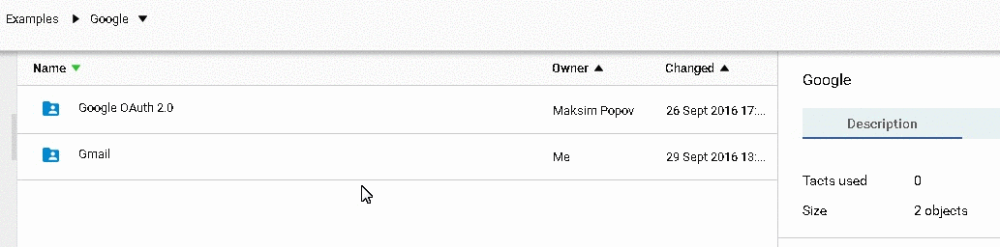
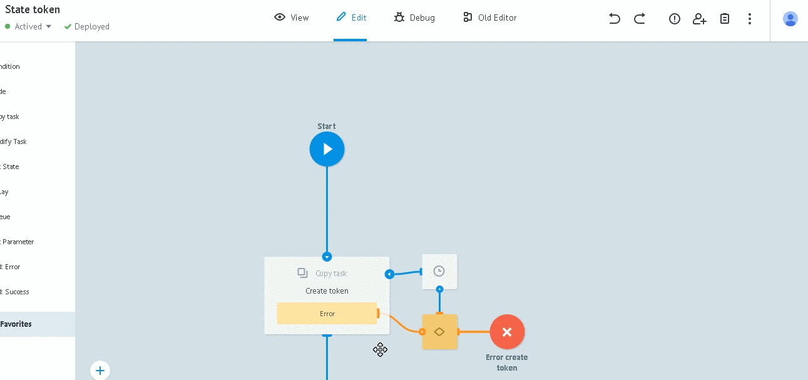
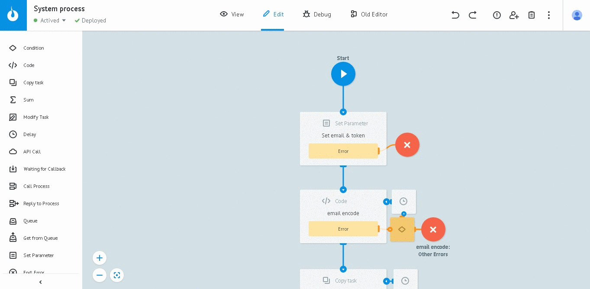
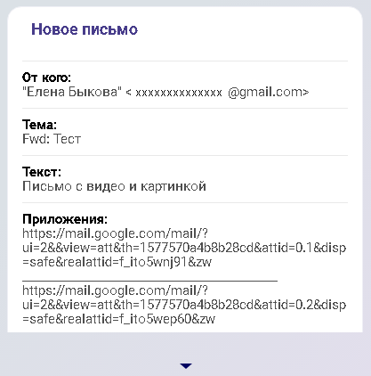
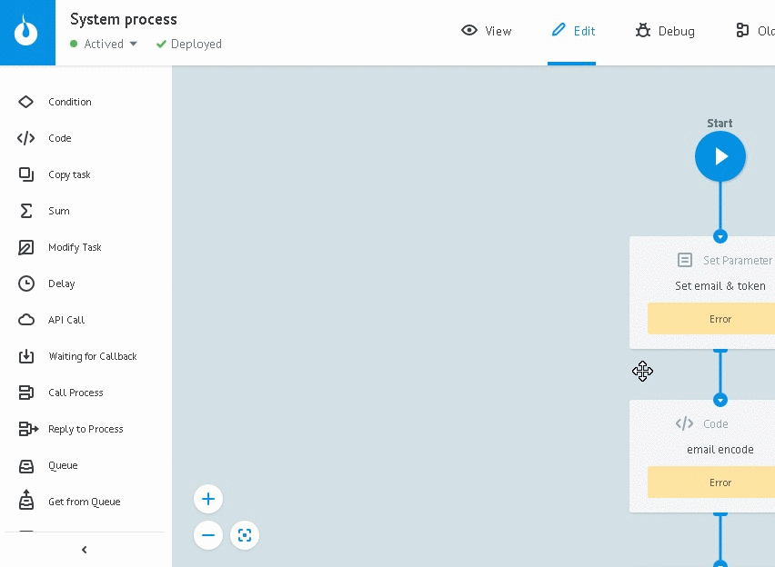

# Gmail

In order to read Gmail messages, clone folder [Gmail](https://admin.corezoid.com/folder/conv/105609) into your environment.




##Process description

[**System process**](https://admin.corezoid.com/editor/105962/163610)

Generates regular signal to [Reading] process (https://admin.corezoid.com/editor/105962/163613) to get unread messages.

In the example - once in 10 min. (value is set in `Wait` node).


[**Reading**](https://admin.corezoid.com/editor/105962/163613)

Gets unread messages and send its ID one by one to [Message info](https://admin.corezoid.com/editor/105962/163612) to get more detailed information.

[**Message info**](https://admin.corezoid.com/editor/105962/163612)

Gets unread information by message ID.

Forms parameters for notifications about new message:
* `message_text` - text of the message
* `subject` - message subject
* `from` - sender
* `attachments` - links to download attachments

Transmits data in [Mark messages as READ] process(https://admin.corezoid.com/editor/105962/163611) to mark message as read.


[**Mark messages as READ**](https://admin.corezoid.com/editor/105962/163611)

Marks messages as read.
And to be precise, removes "UNREAD" label from message.

##Launch

**1)** Customize processes and get `ACCESS_TOKEN`, as it was written in [OAuth authentication](oauth.md) section.

>On step 8 of instruction, create request for getting access_token with **Reference = gmail**

**2)** Copy state diagramm ID `State token`(ID_DIAGRAM) from the start node's information block. 



You will need this value below.

**3)** In [System process] process (https://admin.corezoid.com/editor/105962/163610) set required values and press `Deploy`:

* `email` - gmail address
* `token` - construction  for getting ACCESS_TOKEN from State diagram

```
{{conv[ID_DIAGRAM].ref[gmail].access_token}}
```




**4)** In [Message info] process (https://admin.corezoid.com/editor/105962/163612) set logic for sending and processing the notification about new messages.

>For example, in [Sender](https://sender.mobi/ru/) through `Sender form logic` (available for process, placed in company)

>


**5)** Switch to `View` mode of [System process] process (https://admin.corezoid.com/editor/105962/163610), press `New task`, and then `Add task`.



