# Gmail  
  
**Gmail** is a free email service provided by Google.  
  
**Gmail** permits the use of [REST API](https://en.wikipedia.org/wiki/Representational_state_transfer) that helps working with mailboxes, including receiving unread incoming emails.  
  
**Gmail** API provides access to such resources as **[Threads](https://developers.google.com/gmail/api/v1/reference/users/threads), [Messages](https://developers.google.com/gmail/api/v1/reference/users/messages), [Labels](https://developers.google.com/gmail/api/v1/reference/users/labels), [Drafts](https://developers.google.com/gmail/api/v1/reference/users/drafts)** or **[History](https://developers.google.com/gmail/api/v1/reference/users/history)**. For example, a third-party application may request access only to send emails, but without reading; or to read only, but without sending.  
  
Before customizing the process, we recommend that you read and understand **Gmail API** documentation at [https://developers.google.com/gmail/api/v1/reference/users/drafts?](https://developers.google.com/gmail/api/v1/reference/users/drafts?)  
  
This tutorial will help you learn how to use **Gmail API** to get unanswered emails and their details from the mailbox. To do this, you need to create 3 processes: This tutorial will help you learn how to use **Gmail API** to get unanswered emails and their details from the mailbox. To do this, you need to create 3 processes: **Init, Reading,** and  **Message Info.**  
  
- **Init** is the process that launches Reading subprocess which will read email. Init will cycle to get new messages from the mailbox every X minutes.  
   
- **Reading** process gets unread messages and forwards their IDs (one-by-one) in **Message Info** process to get detailed information and marks the message as read (removes the "UNREAD" label from the message).  
   
- **Message Info** gets detailed information about an email by ID.  
   
The figure below shows interaction of Corezoid processes and **Gmail API.**  
  
  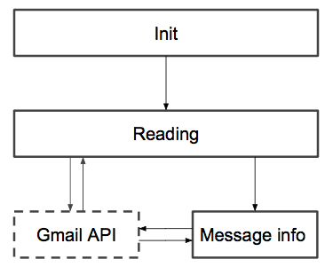 
  
  Before you start, make sure you have a valid @gmail mailbox or Google account. If you don’t have an @gmail mailbox or Google account, you can create one at [http://gmail.com](http://gmail.com).  
  
Like other Google APIs, to call the **Gmail API** you need to log in using ACCESS_TOKEN. You can view an example of obtaining **ACCESS_TOKEN** in the [Google OAuth 2.0](../ouath/README.md). 

> To complete this tutorial you need to pass [Google OAuth 2.0](../ouath/README.md) tutorial first.
  
### How to view a list of unread emails  
1. Before you start building a process of receiving unread messages, create a **Gmail** folder for your convenience.
  
    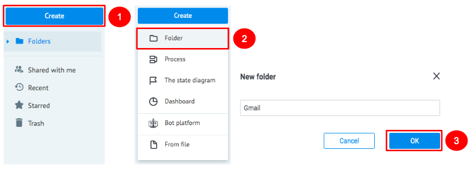  
    
    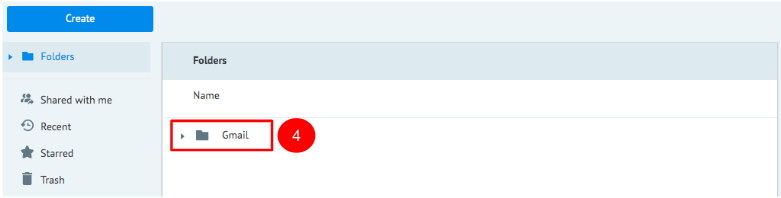   
  
2. Enter the **Gmail** folder you have created and create **Reading** process. It will call the **Gmail API** to get a list of unread emails.
    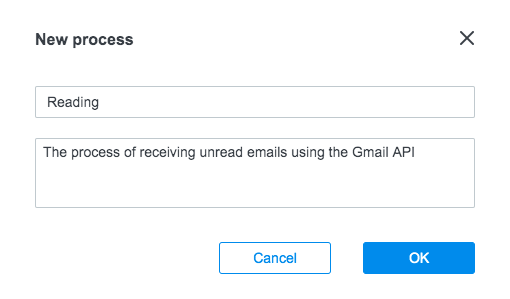    

3. Add an **API Call** node in the **Reading** process and name it **Get UNREAD message IDs**

    3.1. To do this, in the **Call API** node, fill in the following link in the URL field: 
    `https://www.googleapis.com/gmail/v1/users/{{email}}/messages?q=is%3Aunread`
     
    3.2. Set up the following values in the **API Call** node settings:  
    ```
    Request format: Default  
    Request method: GET  
    Content-Type: Application/Json  
    ```
    3.3. In the ***Additionally*** section, set up a checkmark opposite Header parameters and add **Authorization** parameter with the ***Bearer {{token}}*** value.   
    
     ```  
     {  
        "Authorization": "Bearer {{token}}"  
     }  
     ```
     It is the **{{token}}** variable where you will transfer **ACCESS_TOKEN** from the **Token Storage** state diagram from the [Google OAuth 2.0](../ouath/README.md). 
     
     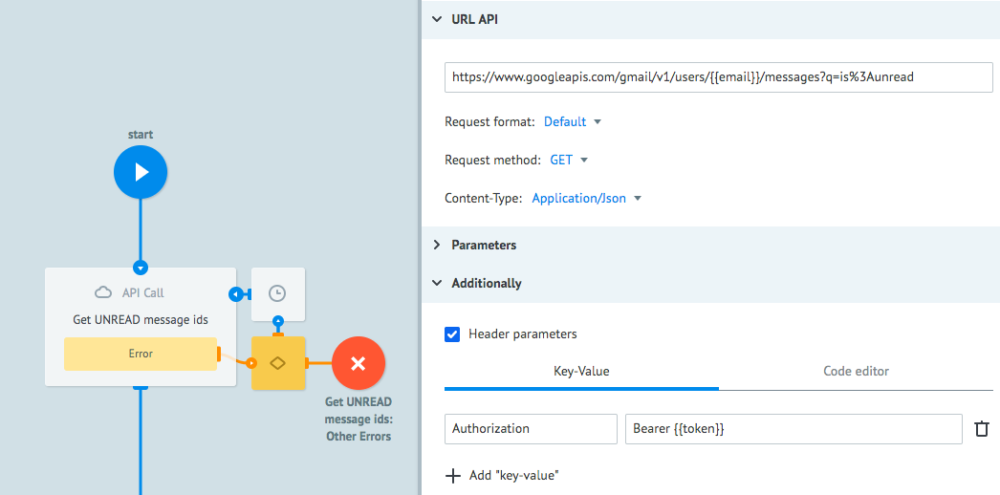
 
    3.4. To process **Gmail API** response about the absence of unread messages, add a **Condition** node named **Is UNREAD?** which will transfer a request to the final node if there are no unread messages in the mailbox. To do this, add a ```resultSizeEstimate == 0``` condition. 
     
    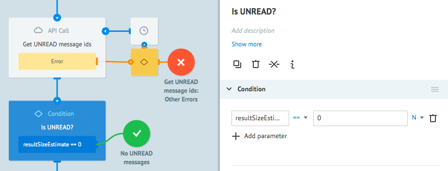  
  
    3.5. To get IDs of unread messages, go to the VIEW mode and create a request with two parameters: **email** and **token.**   
  
    3.6. In the email parameter, transfer the mailbox address from the **Google** account for which you have generated the **ACCESS_TOKEN**. In the token parameter, enter ```ACCESS_TOKEN```  
  
    3.7. In case positive response from **Gmail API** is received, your request will be in the **Final** node. Upon clicking on it, you can look through the array of unread message IDs in the **messages** parameter.   
    Example of the array:  

    ```
    messages": [  
        { "id": "16c24fa1a4eedf28", "threadId": "16c24fa1a4eedf28" }, 
        { "id": "16c24fa196122fc3", "threadId": "16c24fa189a65201" }, 
        { "id": "16c24fa189a65201", "threadId": "16c24fa189a65201" }
    ]  
     ```
    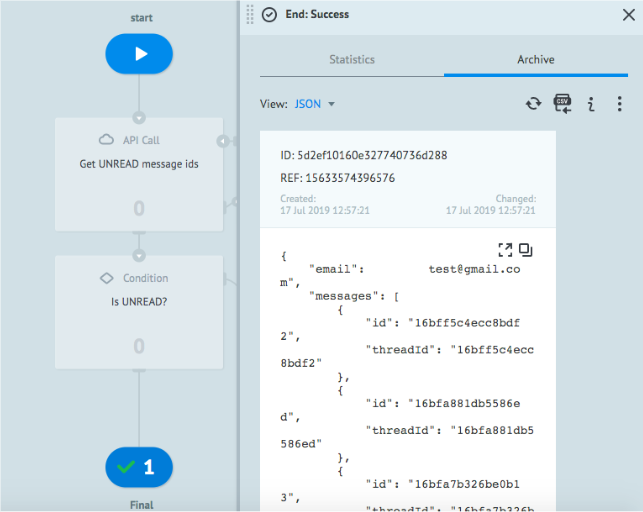
  
The process to get unread message IDs is ready!  
  
### How to get message information by ID  
  
1. Сreate **Message Info** process to get information by ID of an unread message via **Gmail API**.
    
    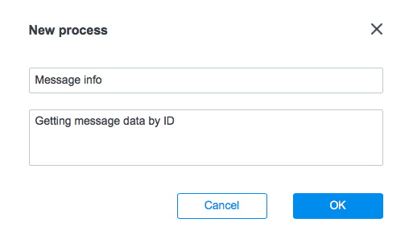

    1.1. To do this, in the **Message Info** process create an **API Call** node named **Getting Info** in which you will call **Gmail API** as well as transfer an email address for reading in the **{{email}}** variable and send an unread message ID in the **{{message_id}}** variable.  
  
    1.2. Add the following link in the **API URL** field:
     `https://www.googleapis.com/gmail/v1/users/{{email}}/messages/{{message_id}}`  
    
    1.3. Assign the following values in the API Call node settings:  
    
    ```
    Request format: Default  
    Request method: GET  
    Content-Type: Application/Json  
    ```
  
    1.4. In the ***Additionally*** section, set a checkbox opposite **Header parameters**. In the appeared field, add an ***Authorization*** parameter with the ***Bearer {{token}}*** value.  
    
    ```  
    {  
        "Authorization": "Bearer {{token}}"  
    }  
    ```
 
    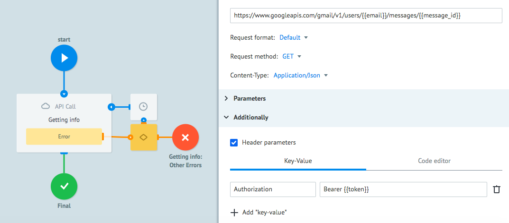  
  
2. After you set up **Gmail API**, you may send a request for getting message details.   
  
    2.1. Click the **New Task** button in the **View** mode.  
  
    2.2. In the **Task** window, fill in the fields below and click **Add task**:  
  
    - **message_id –** copy it from the final node of the **Reading** process  
    - **token –** token for Gmail API call.  
    - **email –** enter the email which you have used to get unread message IDs.  
  
    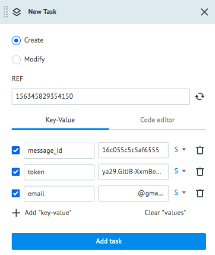 
  
    If **Gmail API** returns a successful response, the request with message details will appear in the **Final** node.   
  
    2.3. Go to the **View** mode to look through the message info.   
  
    2.4. Click the **Final** node. In the appeared window, you can see the structure of the message parameters.  
  
    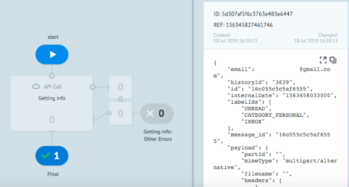  
  
### How to change a message status to “Read”   
1. To check the message as read after information about it is received, add **API Call** node next to the **Getting Info** node in the **Message Info** process.  
  
    1.1. Add the following link in the ***API URL*** field  
    ```
    https://www.googleapis.com/gmail/v1/users/{{email}}/messages/{{message_id}}/modify
    ```
      
    1.2. Add the following parameters to the API Call node settings:
    ``` 
    Request format: Default  
    Request method: POST  
    Content-Type: Application/Json  
    ```
   
    1.3. Add the following parameters in the ***Parameters*** section:  
    ```
    {  
        "removeLabelIds": [ "UNREAD" ]
    }  
    ```
    
    1.4. In the ***Additionally*** section, set up a checkbox opposite **Header parameters** and add **Authorization** parameter with the ***Bearer {{token}}*** value. It is the ***{{token}}*** variable where you will pass ***ACCESS_TOKEN*** from the **Token Storage** state diagram from the [Google OAuth 2.0](../ouath/README.md) tutorial.  
    ```
    {  
        "Authorization": "Bearer {{token}}"  
    }  
    ```
    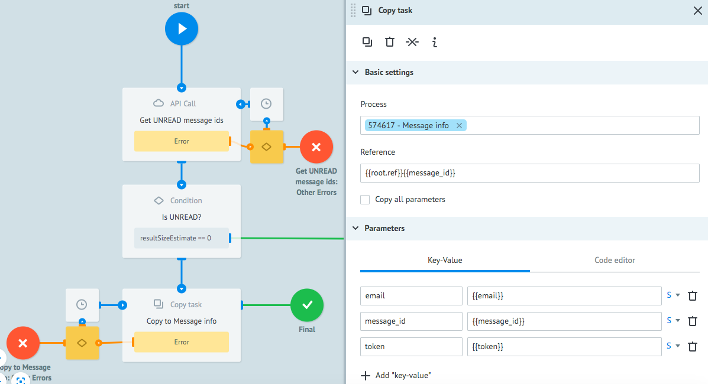  
  
    When a request with message ID is received in the **Message Info** process, you will receive the message details and change its status to “Read.”.     
    
   
### How to process unread messages  
  
1. To eliminate the need for creating a request for message details manually each time, attach the **Message Info** process to the **Reading** process. This will allow launching the **Message Info** process to get message information immediately after receiving the list of unread messages in the **Reading** process.  
  
    1.1. To do this, go to the **Reading** process   
  
    1.2. Add a **Copy** task node after the **Condition** node and attach the **Message Info** process thereto in order to send copies of requests with a list of message IDs.  
  
    Enter the following in the Reference field: 
    
    ``` 
    {{root.ref}}{{message_id}} 
    ```

    Add the following in the Parameters section:  
    ```
    {  
        "email": "{{email}}",  
        "message_id": "{{message_id}}",  
        "token": "{{token}}"  
    }  
    ```

      
  
2. As you have already seen in [How to view a list of unread emails](#how-to-view-a-list-of-unread-emails) section, a request with a list of messages is received from Gmail API as an array.   

    To get information on each message, you should forward messages from the received list to the **Message info** process on the one-by-one basis.  
    
    2.1. To do this, create a **Code** node between the **Condition** and **Copy Task** nodes where a JavaScript code should be added which will collect messages from the list on the one-by-one basis and forward them to the **Message info** process:  
    
   ```
    if (data.index === undefined) {  
        data.index = 0;  
    } else {
        data.index = data.index+1;  
    }   
    data.length_list = data.messages.length-1;  
    data.message_id = data.messages[data.index].id;  
    ```
   
    When you finish iteration of all messages, the request will be automatically passed to the **Final** node.
    
    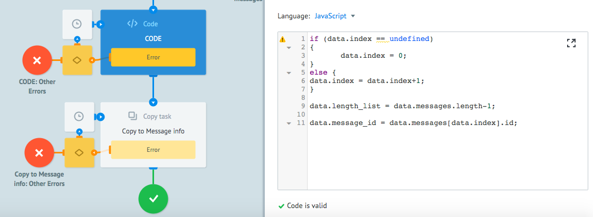
    
    2.1. In order to ensure that the request be passed to the **Final** node after the iteration of messages is finished, add a **Condition** node named **Messages** ended? with a condition of ```{{index}} == {{length_list}}```
     
     next to the **Copy** task node,   
    **where**:  
    - **index** is the sequence number of the message being forwarded to the Message info process.  
    - **length_list** is the total number of messages in the list.   
  
    If the current sequence number of a message is lower than the total number of messages in the list, the request goes back to the **Code** node and collects the next message; if the sequence number is higher than the total number of messages in the list, the request goes to the final node.  
  
    2.2. Attach the **Condition** node to the **Code** node as shown in the figure below.  
  
    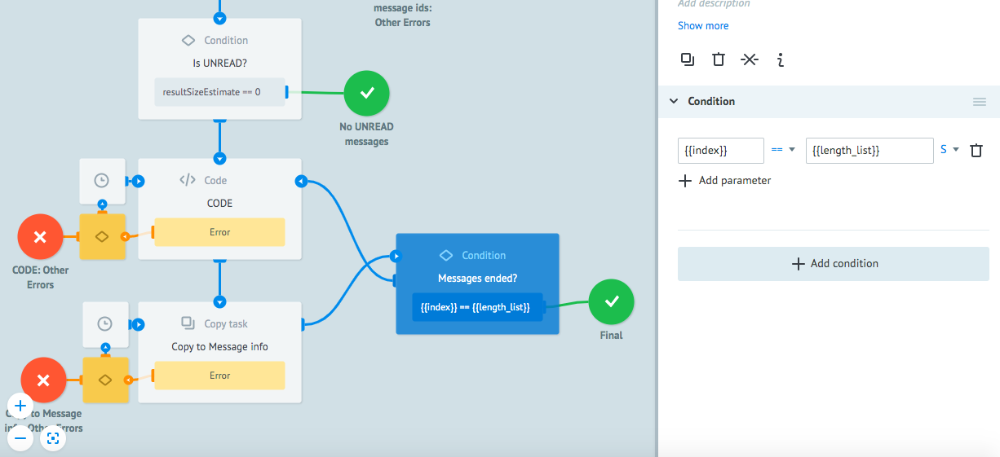  
  
Now you have a ready-to-use process with the following functions:  
- Getting a list of unread message IDs   
- Transfer of each individual message ID to the **Message Info** process  
- Getting message info by its ID using the **Message Info** process  
  
### How to set up an email processing cycle  
  
1. If you have new unanswered messages in your email-address, they will be passed to Corezoid process only if you manually create a request in the **Reading** process. This requires specifying an email for reading and **ACCESS_TOKEN** each time you do it. In order to ensure automatic loading of unread messages, create a process named **Init**.  
  
    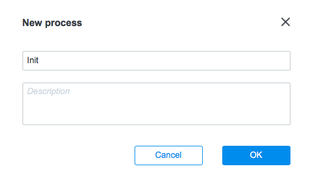  
  
2. In the **Init** process, create a **Set Parameter** node named **Set email & token** and add two parameters, ***email*** and ***token***, in this node.   
    
    2.1. In the ***email*** parameter, transfer the address of a mailbox for reading.  

    2.2. In the ***token*** parameter, enter a path to the process request parameter where **ACCESS_TOKEN** is stored.  
  
    Example:  
    ```
    {  
        "email": "enter email address here",  
        "token": "***{{conv[DIAGRAM_ID].ref[REFERENCE].access_token}}***"  
    }  
    ```
    where: 
    - ***DIAGRAM_ID*** – ID of the **Token Storage** state diagram.   
    - ***REFERENCE*** – reference of the request containing active **ACCESS_TOKEN**  
    - ***access_token*** – request parameter where active **ACCESS_TOKEN** is stored  
  
    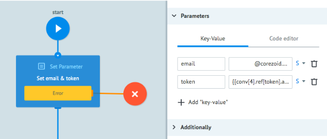  
  
3. For **Gmail API** call, all characters except the Latin alphabet, decimal digits and - _ . ! ~ * ' ( ). from an email-address must be converted to UTF-8 Unicode for more compact data transfer. This helps a server with **Gmail API** to avoid receiving incorrect requests from users.  
  
    To do this, you may use an **encodeURIComponent** method from JavaScript for encoding of characters in UTF-8.

    3.1. Add a **Code** node and enter the following code into it:     
    ```
    data.encoded_email = encodeURIComponent(data.email);  
    ```
 
    Thus a new parameter named ***encoded_email*** is created in which the character “@” will be replaced with “%40”. This will allow seamless forwarding of requests to **Gmail API.**  
  
    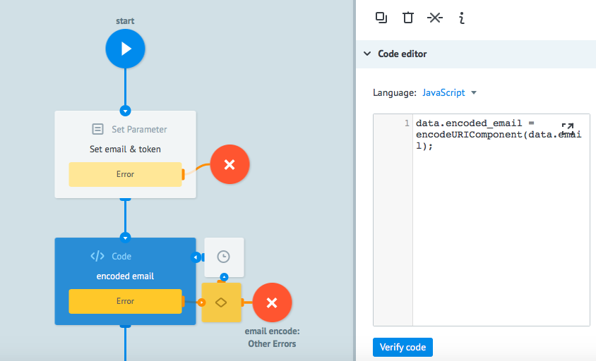  
  
    After **ACCESS_TOKEN** is obtained and email is converted in the request, these data should be forwarded to the **Gmail API** call process.  
  
4. In the **Init** process, add a **Copy** task node and attach the **Reading** process to it to send a request.   
  
    Specify the following in the ***Reference*** field: 
    
     ```
    {{root.task_id}}  
     ```
    Add the following in the ***Parameters*** section:  
    ```
    {  
        "email": "{{encoded_email}}",  
        "token": "{{token}}"  
    }  
    ```
       
    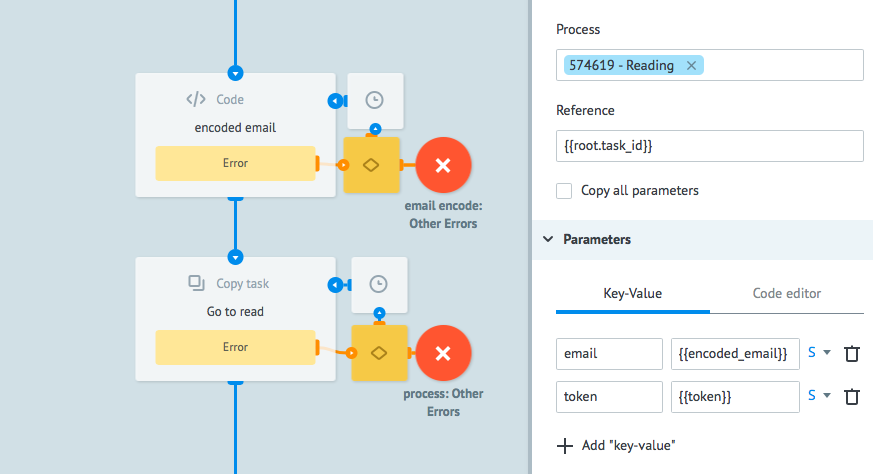  
 
5. Set a planned call frequency for the **Reading** process to receive unread messages. 

    5.1. To do this, add a **Delay** node and name it **Wait** and a **Copy Task** node named **Recursion**.  
    
    In the figure below, you can see the interaction of logics for cyclic motion of the request within the process.    
    
    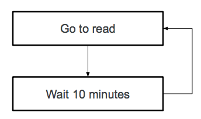
  
    5.2. In the **Wait** node, click ***Additionally*** and set up a checkmark next to the ***Limit the time of the task in the node***. In the appeared input field, assign a value for the timer, for example, 10 minutes.
      
    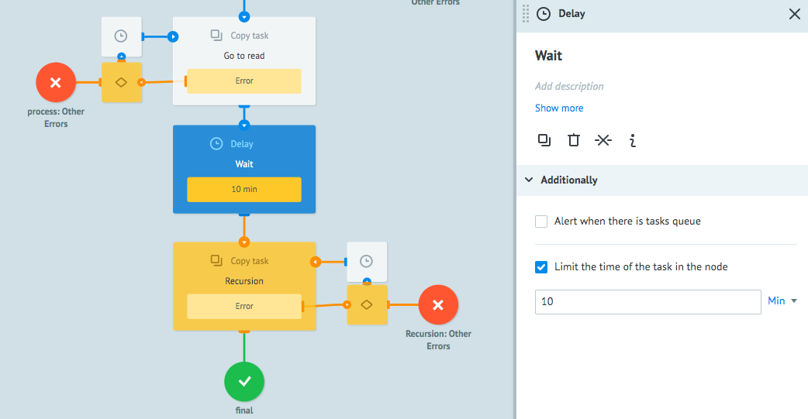
  
    5.2. To ensure cyclic motion of the request within the process each 10 minutes, enable forwarding the copy of the request to the same **Init** in the **Copy task** node. The recursive approach will permit to look through the total number of requests for mail reading for a selected period of time in the final node.  
  
    Specify the following in the **Reference** field: 
    ``` 
    {{root.task_id}},  
    ```
      
    Add the following in the ***Parameters*** section:   
    ```
    {  
        "email": "{{email}}"  
    }  
    ```
    
    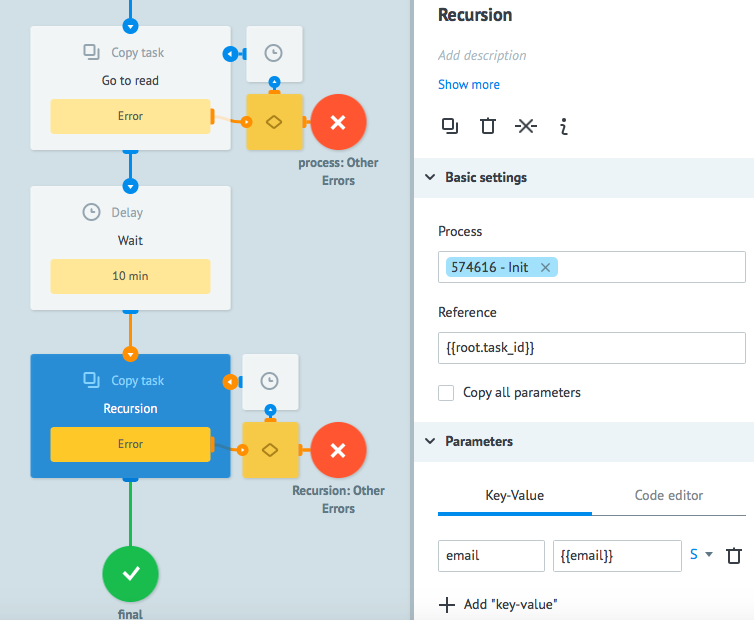  
      
    The **Init** process to send a signal for mail reading is ready.   
  
    Go to the **View** mode, click the **New Task** button and send an empty request.   
  
    When sent, your request will provide for loading of unanswered messages to the **Message Info** process. Thus, you can build further mail processing logics using Corezoid at your own discretion.  
  
**Congratulations! You have learned to create processes with Gmail API call.**