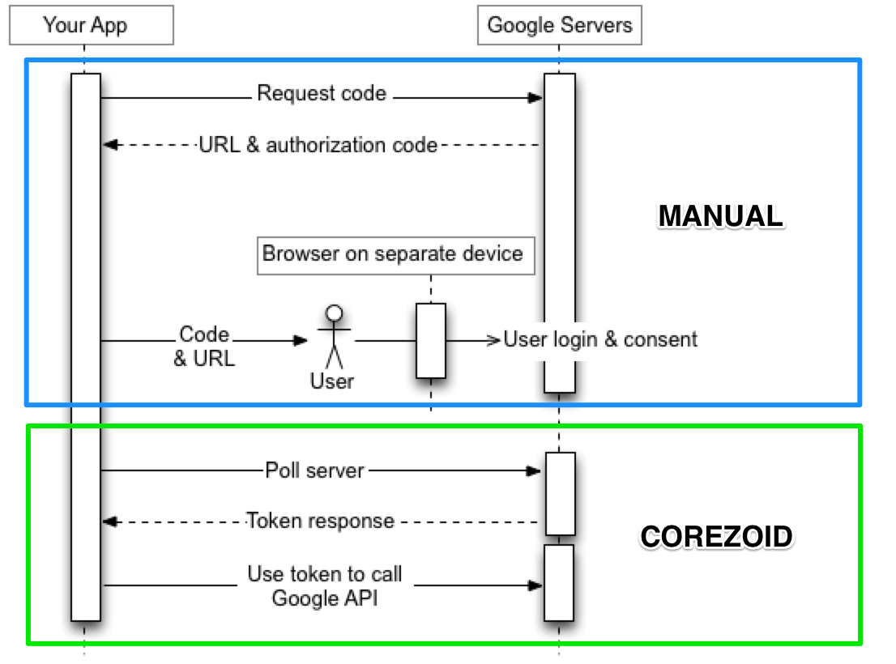
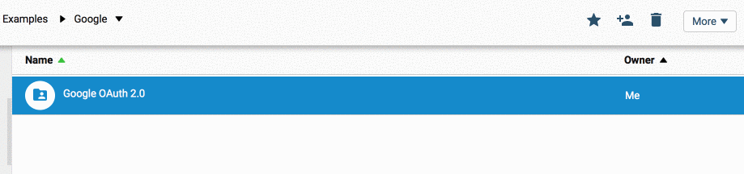
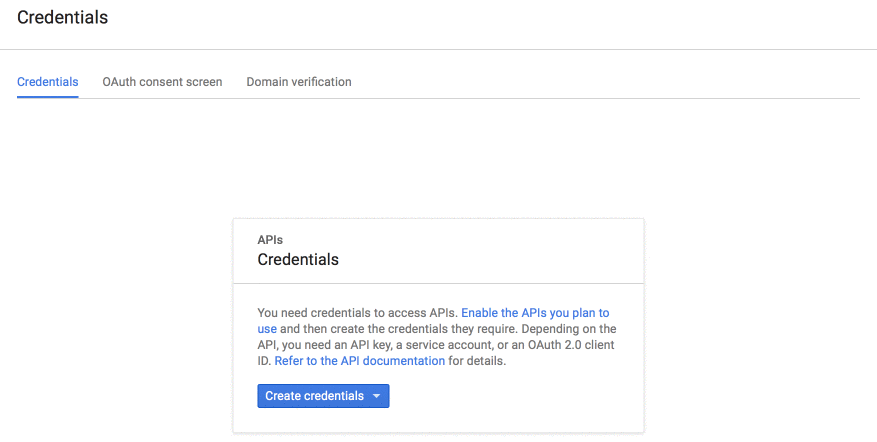
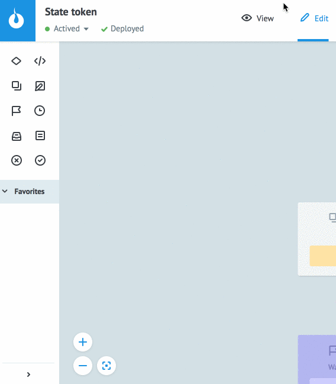

# OAuth authentication

All requests to Google API support only OAuth2.0 authorization.
The general scheme looks as follows:



Every request to API must contain in `Header`: 
```
Authorization : Bearer {{ACCESS_TOKEN}}
```

In order to get `ACCESS_TOKEN` you need to do the following: 

**1)**  Copy [Google OAuth 2.0](https://admin.corezoid.com/folder/conv/105609) folder from `Examples` to your environment.



**2)**  Open [console.developers.google.com](https://console.developers.google.com), `Credentials` section


**3)**  Create `Client ID` and `Client Secret`




**4)**  Put parameters in URL and run it in browser 
https://accounts.google.com/o/oauth2/v2/auth?redirect_uri=urn%3Aietf%3Awg%3Aoauth%3A2.0%3Aoob&response_type=code&access_type=offline&scope={{SCOPE}}&client_id={{CLIENT_ID}}

    where
    *   **{{CLIENT_ID}}** - Client's ID recieved on Step 2
    *   **{{SCOPE}}** - API Google (encode format is required) that you want to get acces to. For example, for adWords it is `https://www.googleapis.com/auth/adwords`

**5)**  In appeared window, choose the account you want to get access to. Press button "Agree" in next window. Copy `CODE` that appeared on the page, you will need it on step 7.

**6)**  Go to  `State token` diagram, to View mode and press button `New task`




**7)**  In `Task` window, in `Reference` field, add it by "token" value, fill in below and press `Add task`

    *   client_id - You got it on Step 3
    *   client_secret - You got it on step 3
    *   code - You got it on Step 5

**8)**  In `Task` window fill the fields below and press `Add task`
    *   **Reference** - give a name to the key that you've got. For example, if it is a key for `gmail`, then specify it in field `Reference` = `gmail`. You will receive `access_token` from other processes with this key.
    *   **client_id** - You got it on Step 3
    *   **client_secret** - You got it on step 3
    *   **code** - You got it on Step 5
>378b3cf1a534ac0e5c990fbab3f2a7fdb26917f6

In case of successful creation `ACCESS_TOKEN`, your request would be located in `Active token` node. By pressing on this node, you will see all request content,  where `access_token`is one of parameters.

You can use received `access_token`  in order to work with any Google API by adding it to Header as:
```
Authorization : Bearer {{conv[ID_DIAGRAM].ref[REFERENCE].access_token}}
```
where:
*   `ID_DIAGRAM` - Diagram ID `State token`. You can get this ID:
    1.  Choose process in browser diagram mode
    2.  Choose `Start` node inside diagram
*   `REFERENCE` - You set on Step 7, when `Add task` was made and `access_token` was generated.
