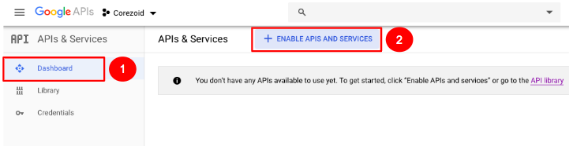
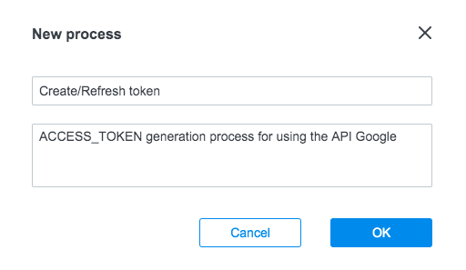
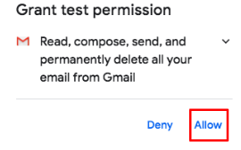
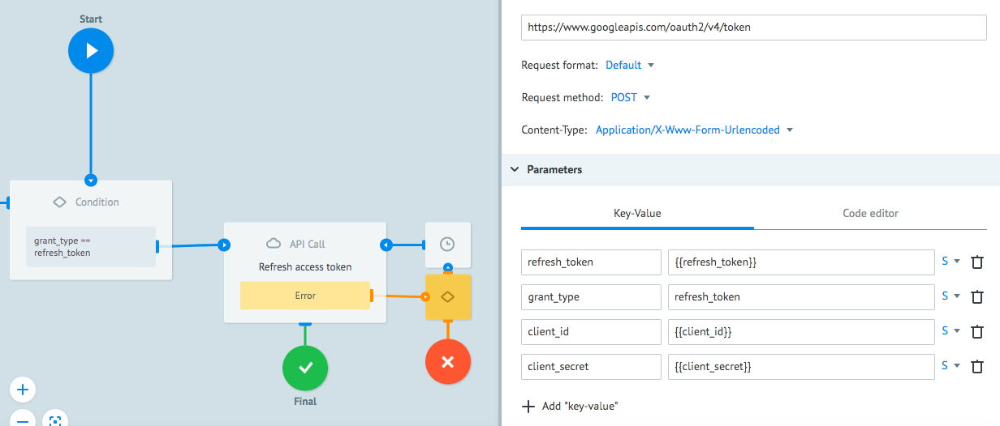

# Google OAuth 2.0


**Google OAuth 2.0** is an authorization protocol allowing a service (application) to be granted access rights to user resources located at another service. The protocol can obviate the need for login and password to be entrusted to the application as well as grant only restricted set of rights rather than all of them at once.


Before making any process setup, we recommend you to read and understand Google OAuth 2.0 documentation available at [https://developers.google.com/identity/protocols/OAuth2](https://developers.google.com/identity/protocols/OAuth2)

Before you start, let’s create a project that uses OAuth 2.0 to connect to Google API under the user’s authority.  


## Creating a project in Google

1. Go to [console.developers.google.com](console.developers.google.com) and create a new project.

    
    

2. Assign a name to your project.

    

3.  Go to the Library, find Google APIs which you would like to use in your application and activate them.  

    

    We will use Gmail API as an example.  

    
    

    All queries to Google APIs require authorization via OAuth 2.0 protocol.

    A general flowchart illustrating interactions between Google services via OAuth 2.0 is as follows:

    

    Each request to API must contain the following parameters in the **Header**:

    `Authorization: Bearer {{ACCESS_TOKEN}}`

    **ACCESS_TOKEN** is used for authorization of queries and storage of additional information about user (user_id, user_role or any other; this information is also called payload). In other words, token is required for verification of your account data before making request to the Google API.

    **ACCESS_TOKEN** storage process should be made unified so that you could use the **ACCESS_TOKEN** in other projects.
 
    You will be able to obtain **ACCESS_TOKEN** by adding a **Set Parameter** node with a structure of `{{conv[process id].ref[reference of request].name of the parameter the ACCESS_TOKEN is located in}}` in the process required, for example: `{{conv[4].ref[gmail].ACCESS_TOKEN}}`. To do this, 2 unified processes must be created in Corezoid:
 
    - **Token Storage**: a state diagram to store and refresh **ACCESS_TOKEN** obtained
    - **Сreate/Refresh Token**: a process of calling API to create/refresh **ACCESS_TOKEN**.
 
    Their interaction with Google OAuth 2.0 is shown in the figure below:

    

    You have completed the preparation stage for creation of a project in Google. Now you will learn how to set up processes in Corezoid to obtain **ACCESS_TOKEN** following the instruction below.


## Obtaining an Access Token

1. Create a folder named **Google OAuth 2.0** for more convenient work with projects. 

    

2. Go to the folder and create a **Create/Refresh Token** process which will generate and refresh **ACCESS_TOKEN** using Google API.

    

3. In the process created, add an **API Call** node, which will call Google OAuth 2.0 API for generating **ACCESS_TOKEN**.

    

    3.1. After you have added the node, click it and fill in a **URL** field as well as required request parameters in the **Parameters** section.

    Values of parameters `{{client_id}}, {{code}}, {{client_secret}}` will be generated in section **[Google API call setup](#google-api-call-setup)** of this tutorial when you obtain access keys to the Google account.

    ```
    URL: https://www.googleapis.com/oauth2/v4/token
    Request format: Default
    Request method: POST
    Content-Type: Application/X-Www-Form-Urlencoded
    ```
  
    3.2. Add the following in the **Parameters** section:
    ```
    {
        "redirect_uri": "urn:ietf:wg:oauth:2.0:oob",
        "grant_type": "authorization_code",
        "client_id": "{{client_id}}",
        "code": "{{code}}",
        "client_secret": "{{client_secret}}",
        "access_type": "offline"
    }
    ```

    
  
4. To ensure automatic entry of parameters upon manual request for **ACCESS_TOKEN** generation, click the **Task parameters** icon and add 3 parameters: `client_id, code, client_secret`.
 
    
    
 
5. The **API Call** you have set up in step 3 is ready to request a call which will result in obtaining **ACCESS_TOKEN** from Google OAuth 2.0 API. 

After you have created a Corezoid process with an **API Call** node, you can set up a Google API call for obtaining **ACCESS_TOKEN**.
 

## Google API call setup

1. Go to a **Credentials** section in [console.developers.google.com](console.developers.google.com).

    

2. Create **Client ID** and **Client Secret**.

    

3. Enter parameters in **URL** and call it in the browser: [https://accounts.google.com/o/oauth2/v2/auth?redirect_uri=urn%3Aietf%3Awg%3Aoauth%3A2.0%3Aoob&response_type=code&access_type=offline&scope={{scope}}&client_id={{client_id}}](https://accounts.google.com/o/oauth2/v2/auth?redirect_uri=urn%3Aietf%3Awg%3Aoauth%3A2.0%3Aoob&response_type=code&access_type=offline&scope={{scope}}&client_id={{client_id}})

    where:

    - `{{client_id}}` - is a client id obtained at step 2.
    - `{{scope}}` -  is the Google API you would like to gain access to. For example, for Gmail it would be `https://mail.google.com/`.

    List of available Google APIs: [https://developers.google.com/identity/protocols/googlescopes](https://developers.google.com/identity/protocols/googlescopes)

4. In the appeared window, select an account you would like to gain access to.  

    4.1. Click the **Allow** button in the following window.  

    

    4.2. Copy CODE, appearing on the page. You will need it at the next step.

5. Go to the Create/Refresh Token process, and click the New task button in the View mode.
    
    5.1. Fill in the fields below in the **Task** window and click the **Add task** button:
    - `Reference` - assign a name to the key you are going to get. <br/>For example, if this is a key to “gmail”, enter `Reference` as `gmail` in the field.
    - `client_id` - you obtained it at step 2
    - `client_secret` - you obtained it at step 2
    - `code` - you obtained it at step 3

    

    If **ACCESS_TOKEN** is created successfully, your request will be in the **Final** node. Click it to look through the contents of the request that contains **“access_token”** as one of its parameters
 
 
 
## Refreshing the token

According to the Google OAuth protocol, token expiration time is 1 hour, therefore a Google API call needs to be set up for token refresh.

1. In order to refresh **ACCESS_TOKEN**, add 2 nodes - **Condition** and **API Call** - in the **Create/Refresh Token** process.

    **Condition** is required to transfer a request to the **API Call** node for the token to be refreshed under condition `grant_type == refresh_token`
    
    To do this, add `refresh_token` receipt verification to the `grant_type` parameter in the **Condition** node.

    

2. The **API Call** node is required to call Google API for token refresh after this condition.

    To do this, enter `https://www.googleapis.com/oauth2/v4/token` in the **API URL** 
and set the following values in the **API Call** node settings:

    ```
    Request format: Default  
    Request method: POST
    Content-Type: Application/X-Www-Form-Urlencoded
    ```

    Add the following in the **Parameters** section:
    ```
    {
        "refresh_token": "{{refresh_token}}",
        "grant_type": "refresh_token",
        "client_id": "{{client_id}}",
        "client_secret": "{{client_secret}}"
    }
    ```

    

    The process for generation and refresh of the **ACCESS_TOKEN** is created successfully!
 

## Token Storage State Diagram setup

1. To avoid calling **Create/Refresh Token** process for **ACCESS_TOKEN** generation each time when making a request to Google API, a mechanism for storage of the generated/refreshed **ACCESS_TOKEN** should be created. You can use a state diagram for this purpose.

    1.1. Create a state diagram named **Token Storage** 

    

    **Token Storage** state diagram is designed for storage of a request with active **ACCESS_TOKEN**.
     
    You will call a **Create/Refresh Token** process for **ACCESS_TOKEN** refresh from this state diagram.

    1.2. Add a **Copy Task** node for calling the **Create/Refresh Token** process in the **Token Storage** state diagram.

    1.3. Enter the following in the **Reference** field: `{{root.ref}}`
    
    1.4. Add the following in the **Parameters** section:

    ```
    {
        "refresh_token": "{{refresh_token}}",
        "grant_type": "refresh_token",
        "client_id": "{{client_id}}",
        "client_secret": "{{client_secret}}",
        "code": "{{code}}"
    }
    ```
    
    
    
    You will create a request for **ACCESS_TOKEN** generation in the **Create/Refresh Token** process, and a copy of this request will be transferred to the Token storage state diagram. 
    
    When it is time to refresh **ACCESS_TOKEN** during the Token storage process, the request will be passed through the **Copy Task** node for **ACCESS_TOKEN** refresh and wait for modification in the next **Set State** node.
     
    
     
    1.5. In the **Set state** node, add **Condition** `access_token == ` to check the presence of the access token parameter after modification of the request. If an empty parameter is received, the request will be transferred to the final node Token is not refresh (you may assign another name to the node). 
    
    
    
    1.6. Add wait-for-response timer in the same **Set state** node. To do this, click Additionally and set up a checkmark next to the **Limit the time of the task in the node**. Set a minimal time of 30 seconds as shown below. If a response from the **Create/Refresh Token** is not received in the state diagram within 30 seconds, the request will be passed to the Final node called **Timeout create token**.
    
    
     
    According to the Google OAuth protocol, token expiration time is 1 hour, therefore it is necessary to set up a token refresh cycle in the prescribed time. 


2. To do this, click the **Limit the time of the task in the node** in the **Active token** node and set a timer for 1 hour.

    Final view of the **Token Storage** process with nodes involved is shown below 

    

3.  In order to transfer the **ACCESS_TOKEN** generated, go to the **Create/Refresh Token** process in the **Token Storage** state diagram. Add the **Copy Task** node after the **Create access token** node.

    3.1. In the **Copy Task** node, activate the **Token Storage** state diagram in the **Process** field.    

    3.2. In the **Reference** field, enter the following: `gmail`

    3.3. Add the following in the **Parameters** section:
    ```
    {
        "access_token": "{{access_token}}",
        "expires_in": "{{expires_in}}",
        "client_secret": "{{client_secret}}",
        "code": "{{code}}",
        "client_id": "{{client_id}}",
        "refresh_token": "{{refresh_token}}"
    }

    ```

    

4.  In order to refresh **ACCESS_TOKEN** in the **Token Storage** state diagram, add the **Modify Task** node next to the **Create access token** node in the **Create/Refresh Token** process.

    4.1. In the **Modify Task** node, activate the **Token Storage** state diagram in the **Process** field.
    
    4.2. In the **Reference** field, enter the following: `{{root.ref}}`

    4.3. Transfer the following in the **Parameters** section 
    ```
    {
        "refresh_token": "{{refresh_token}}",
        "access_token": "{{access_token}}",
        "expires_in": "{{expires_in}}"
    }
    ```
    where: 
    - `refresh_token` - token to refresh **ACCESS_TOKEN**.
    - `ACCESS_TOKEN` -  token to access Google API.
    - `expires_in` - **ACCESS_TOKEN** expiration time.
    
    

    

    
After the entire project consisting of 1 process and 1 state diagram is assembled, you can work with active **ACCESS_TOKEN**.

To do this, repeat point of getting **CODE** and create a new request for **ACCESS_TOKEN** generation in the **Create/Refresh Token** process, thereby launching a process of the token storage and refreshing in the **Token Storage** state diagram.

If **ACCESS_TOKEN** is created successfully, your request will be in the **Active token** state. Click it to look through the contents of the request that contains `access_token` as one of its parameters.


Interaction of the Corezoid processes with the unified **Token Storage** state diagram and Google APIs is shown in the figure below
 


You can use the **ACCESS_TOKEN** obtained in all the processes of your company to work with any Google APIs by adding it to the Header as follows:

`Authorization: Bearer {{conv[DIAGRAM_ID].ref[REFERENCE].access_token}}`,
 
where:
 
 `DIAGRAM_ID` -  ID of the **Token Storage** state diagram. 

**To obtain the `DIAGRAM_ID` proceed as follows:**

1. Go to the Edit mode in the **Token Storage** state diagram 
2. Click the **Start** node inside the diagram 
3. Copy the number in the **ID process** line in the **Connection data** section 


 

**REFERENCE** - assigned by you at step 5. In our case, this will be “gmail”.

Example of Google API call via **API Call** node using Google OAuth 2.0:


**Congratulations! You have learned to create processes for Google OAuth 2.0 authorization using state diagram.**

 
