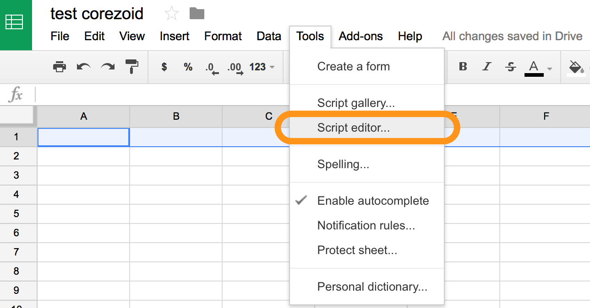
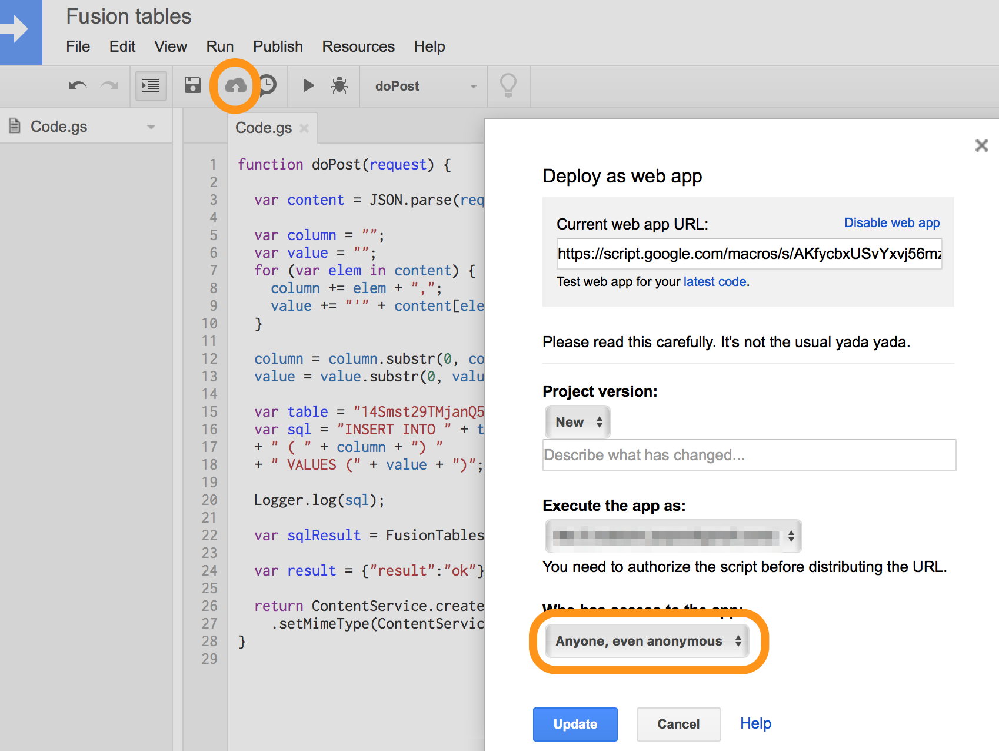
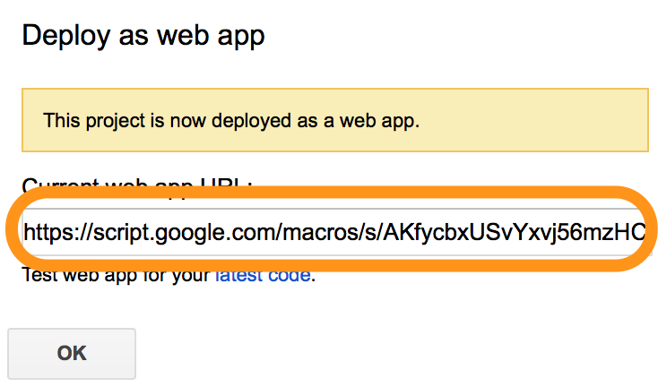

# Sheets

Example of adding records in previously created table.

For this, let's create a script inside the table.

For this, open editor


And put the following script in appeared window.
```javascript
function doGet(request) {

  var content = JSON.parse(request.postData.contents);

  var row = [];
  for (var elem in content) {
    row.push(content[elem]);
  }

  var ss = SpreadsheetApp.openById("Insert ID Sheet")
  var sheet = ss.getSheetByName("Sheet1");
  sheet.appendRow(row);

  var result = {"result":"ok"};

  return ContentService.createTextOutput(JSON.stringify(result))
    .setMimeType(ContentService.MimeType.JSON);
}
```

Now we can replace text `Insert ID Sheet` by your table ID.

For this let's copy ID from your table URL (highlighted in yellow)


Script for data record in table is done.

Publish it and run from Corezoid.

###Script publication


Now we can publish your code as web-application with public access:



After publication we have an access for URL, where it's required to sent JSON with data for save using GET method


You can transmit any data sets to JSON, values will be automatically added to your Google Sheet.

For example:

```json
{
  "Name":"Tea",
  "Price":40
}
```


