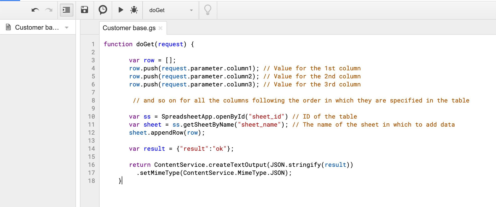
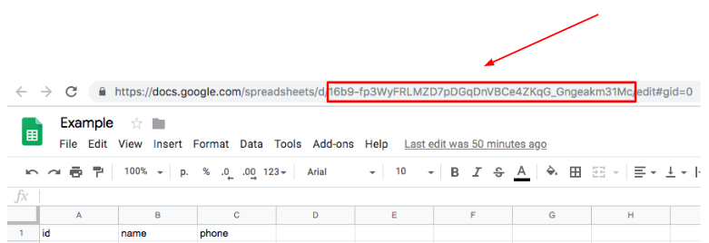

# Google AppScripts

**Google AppScripts** is a JavaScript-based service that ensures automatic performance of Google tools. It enables to achieve wider functionality of such Google Suite services as Docs, Sheets, Forms, etc.

**Google AppScripts**  allows you to create applications which can interact with other Google services and external services. 

In this tutorial, you will learn how to add entries to a **Google Sheets** table using the Google AppScripts API call from Corezoid.

Before setting up the process, we recommend that you read and understand [**Google AppScripts** documentation](https://developers.google.com/apps-script/quickstart/macros). 

Let us set up a **Google Sheets** table for data receipt from Corezoid.

### How to create and set up a Google Sheets table

1. Go to [https://drive.google.com/drive](https://drive.google.com/drive)

    1.1. Create a new **Google Sheets**.  table or use the table previously created. In our instance, we will create a new table and name it **Example**.
    
    

    1.2. In the created google-table named **Example**, add names of the columns you will fill in by transferring data from Corezoid to the first line. In our instance, it will be a table with customer parameters: `id`, `name` and `phone`, where:
    - `id` - customer’s ordinal number;
    - `name` - customer’s name;  
    - `phone` - customer’s mobile phone number.
    
    

    1.3. Next, click the **Tools** section and open a **Script editor** menu item.
    
    

    1.4. In the appeared script editor window, insert the following code:
    
    ```  
    function doPost(request) {
    
       var row = [];
       row.push(request.parameter.column1); // Value for the 1st column
       row.push(request.parameter.column2); // Value for the 2nd column
       row.push(request.parameter.column3); // Value for the 3rd column
    
        // and so on for all the columns following the order in which they are specified in the table
    
       var ss = SpreadsheetApp.openById("sheet_id") // ID of the table
       var sheet = ss.getSheetByName("sheet_name"); // The name of the sheet in which to add data
       sheet.appendRow(row);
    
       var result = {"result":"ok"};
    
       return ContentService.createTextOutput(JSON.stringify(result))
         .setMimeType(ContentService.MimeType.JSON);
    }
    ``` 
    
    1.5. To be able to fill in the created columns of your table, change the names of parameters `column1`, `column2`, `column3`, etc. to the names of your parameters: `id`, `name`, `phone` to get a script as illustrated below.

    

    1.6. Assign a name to the script, for example, **Сustomer base**
    
    

    1.7. Copy an ID of the created table. You can find the ID in the browser address bar.
    
    

    1.8. In the script editor, change `"sheet_id"` in the `var ss = SpreadsheetApp.openById("sheet_id")` line to the `id` of your table.
   
    1.9. Copy the name of the table sheet where you will add data using **Google AppScripts**

    

    1.10. In the `var sheet = ss.getSheetByName("sheet_name");` line, insert the name of the sheet you have copied instead of the `sheet_name`.

You should get a script as follows:

   

You have made all Google-script settings necessary for filling the table. Your next step is to publish the created **Google AppScript** to enable its call as an API from Corezoid.


### How to publish your web application

1. Click the **Publish** in the **Script Editor** menu.
    
    1.1. Click **Deploy as web app...** in the drop-down list.
        
    

2. In the appeared window, add a project version, for example, 1, in the **Project version** field.

    2.1. In the **Execute the app as** drop-down list, select a name on whose behalf you will run the application. Select the name of your account.
    
    2.2. In the**Who has access to the app** drop-down list, select “Grant access to everyone, including anonymous users”.

    2.3. Click the **Deploy** button.
  
    

    2.4. Click the **Review Permission** button in the next window appeared.

    

    2.5. After publication, you will have a URL available for use as an API to transfer data in JSON format to save them in Google Sheets.
    
     

Congratulations! Your first **Google AppScripts** is ready for entering data into the table.

### How to set up Corezoid process to save data in Google Sheets

1. Create a **Google AppScripts** folder.

    

2. In the **Google AppScripts** folder, create a **Post data to Google Sheets** process which will generate requests via **Google AppScripts**.

    

    2.1. In the created process, add an **API Call** node which will call **Google AppScript** for entering data into Google Sheets.
    
     

    2.2. Click at the create **API Call** node and fill in the ***URL API*** with the following value:

    ```
    https://script.google.com/macros/s/{{api_id}}/exec
    ```
    
    where: `URL` - is a url of the script you have received at step 2.5 of the [How to publish your web application](#how-to-publish-your-web-application) section.
 
    2.3. Set the following values in the **API Call** node settings:
    ```
    Request format: Default
    Request method: GET
    Content-Type: Application/Json
    ```
 
    2.4. In the **Parameters** section add `id`, `name`, `phone` parameters with the values you want to save in the table.
    
    ```
    {
        "id": "1",
        "name": "Taras",
        "phone": "380671234567"
    }
    ```
     
     

    The names of the parameters must be the same as those specified in the script and match the names of the columns in the Google table.

    To make sure you have set up the **API Call** node coccectly, make a **Google AppScript** call which will be followed by the reply about data transfer to **Google Sheets**.

3. To do this, go to the **View** mode
    
    3.1. Click the **New task** button.
    
    3.2. Click the **Add task** button.
    
If the data are successfully saved in Google Sheets, the request will be in the **Final** node. 
When you click it, you will see the request containing a `result` parameter with the `ok` value which confirms that the data have been saved successfully.


   

When you go to the **Example** table created, you will see the columns filled with the data from the Corezoid request.

   

Congratulations! You have learned how to save data to **Google Sheets** tables using Corezoid and **Google AppScript**.
