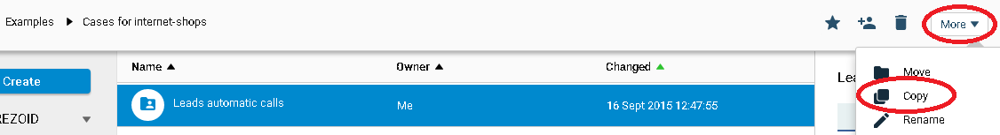
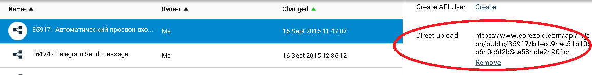
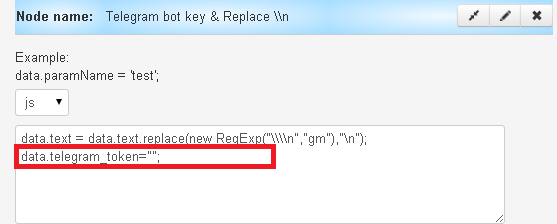
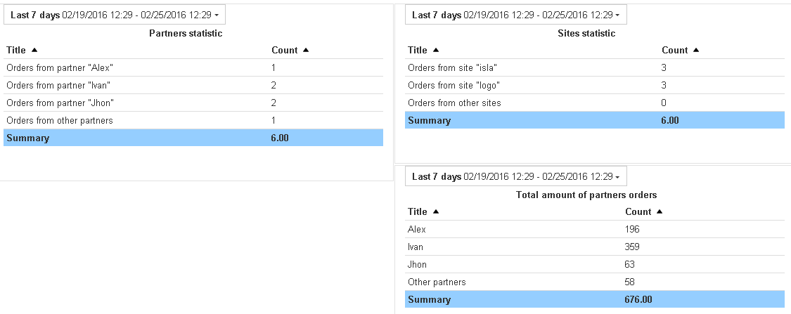

# Automatic calling of incoming leads

1. Template copying in your account
2. Main process
2. Creation of a new Bitrix lead
3. Making calls through VoxImplant
4. Sending a message in Telegram
5. Process for dashboard
6. Dashboard

###Template copying in your account

Process templates for automatic call to the incoming leads are available in folder ["Examples" / "Cases for internet-shops" / "Leads automatic calls"](https://admin.corezoid.com/folder/conv/11445).

Copy the folder in your account



###Main process

Main process receives input data and takes actions as below:

* API calling to get the list of partners from Bitrix
* RPC-process calling to create a new lead Bitrix
* RPC-process calling to make calls through VoxImplant
* RPC-process calling to send a message in Telegram
* Copying data in the process for the dashboard

Data on the lead from web-form on site is sent to the input of main process `"Leads automatic calls (MAIN)"`

Example of API-request from php-script:

```
$data = (object) array('server'=>$_SERVER,'cookies'=>$_COOKIE,'post'=>$_POST );
$full = (object) array('ops'=> array( (object) array( 'ref'=>$ip,'type'=>'create','obj'=>'task','conv_id'=>'31754','data'=> $data)) );

$cmd = ( json_encode( $full ) );
$str = "curl 'https://www.corezoid.com/api/1/json/public/31754/e4203ff8f55f17595a46549d35dbd00d51d0879d' -H 'Accept: application/json, text/javascript, */*; q=0.01' --data '".$cmd."' --compressed";
```

Object `$data` is formed of data which needs to be transferred to Corezoid for processing.

Object `$ops` includes `ref` (reference) parameter, i.e. unique id number for recording a request in Corezoid. If in the process of work the request with the same `ref` is currently present, another request is not added. For example, ip-address of the customer can be used as `ref`

Parameter `conv_id` is responsible for generating a task in the definite process (ID Process).

You can get URL where you will send data and `conv_id` in admin panel:



Values of parameters listed below are not specified in the main process:
* `{{portal}}` - name of your portal on Bitrix,
* `{{chat_id}}` - id number of Telegram chat
* `conv_id` - in `auth` parameter id of process of access_token Bitrix generation and updating
* etc.

These parameters are unique for each user of Bitrix and Telegram. List specific values and other fixed values of parameters in your cloned processes.

###Creation of a new Bitrix lead

The process creates new lead in Bitrix and returns its ID.

[Description](../bitrix/new_lead.md) of the process of new lead creation.

[Description](../bitrix/autorizatoin.md) of access_token Bitrix generation and updating process.


###Making calls through VoxImplant

If phone number is not longer than 11 characters and time of the day is appropriate for the call, VoxImplant calls the customer and plays the prepared recording for him/her. In addition, the answering service detection function is built in the code - [script code](http://jsfiddle.net/jqdr9npr/).

When Callback is received from VoxImplant, we analyze the answer and distribute the request to the relevant nodes.

If there is no answer, something goes wrong, and the request "falls", it is possible to configure the manual processing of the request.

###Sending a message in Telegram

Message in Telegram is sent to the seller in two cases:
* there is an invalid token in the main process, when the list of partners is received in Bitrix, and the request should be processed manually
* the leas is successfully created – the message will contain information about it.

In the process of sending a message in Telegram, your access key in the node with the Logic CODE should be specified in the value of "telegram_token" parameter



###Process for dashboard

This process allows to get statistics for:
* partners
* web-sites
* total amount of orders from each partner

Using the Logic IF, requests are distributed by the relevant nodes according to criteria which define a partner / web-site.

Using the Logic SUM, the value of parameter, which contains the order amount, is summed.

###Dashboard


