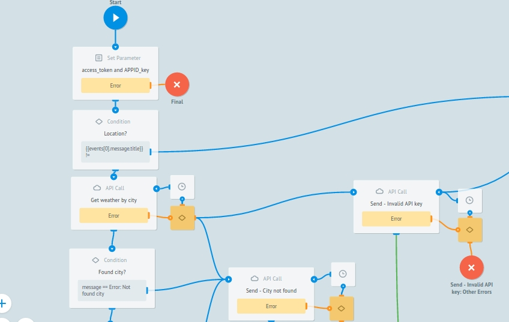

# WeatherBot in Line

* [Log in Line](#auth)
* [Webhook and Access token](#connect)
* [WeatherBot](#weatherbot)
* [Webhook instal](#webhook) 
* [What Weatherbot does](#doing)
* [Integration with OpenWeatherMap](#openWeatherMap)
* [Testing and launch](#test)

### Log in Line {#auth}

1. Register your Line@ account in Line business Center, select Messaging API in the Services category:   
   

2. Then you choose **Start using Messaging API**.

3. Put required information about your Bot \(account name, business type\) for your LINE@ account.
4. And then select LINE@ MANAGER.
   
5. Next, press **Enable API** on **“Bot Settings”** page 
6. Customize your bot with [Your Bot Settings](https://developers.line.me/messaging-api/getting-started#set_up_bot) by making next additional parameters: click on "Allow" for "Send event notifications" and "Bot access in group chats" and also "Forbid" for "Answering machine messages" and "Greeting messages" 
   

### Webhook and Access token {#connect}

1. In [**“LINE Business Center"**](https://business.line.me/en/), in Accounts section, choose **LINE Developers** to go to **Channel Console**.
2. In order to get **Channel access token** for API access, press **ISSUE** near “Channel access token” area. 
3. Press EDIT and setup webhook URL.
   
4. After making this steps, your bot will interact with your users using API provided by Messaging API and you can go on and [customize your bot](#weatherbot).

### WeatherBot {#weatherbot}

Clone [template "WeatherBot"](https://admin.corezoid.com/folder/conv/121756)  
   
WeatherBot - receives webhooks  with city name or your coordinates, receives air temperature and sends a message.

In case if message does not contain city name or city is specified incorrectly and also if there is an error occurred in process, bot sends an appropriate message.

Next, in the **"Set access\_token and APPID\_key"** node, in the values of the variables:

* **access\_token** put your personal **Channel Access Token**, that you recieved when created Bot in [**“LINE Business Center"**](https://business.line.me/en/) in sections **Accounts** - **LINE Developers** - **Channel Console**.
* **APPID\_key** put test access key for OpenWeatherMap API.

### Webhook instal {#webhook}

For getting webhook-url of WeatherBot process, select "Connect to messenger":

Get webhook-url of WeatherBot for LINE Messenger. Then there is the empty field where you should put your personal **Channel Access Token**, that you get when created Bot in [**“LINE Business Center"**](https://business.line.me/en/) in section **Accounts** - **LINE Developers** - **Channel Console**.

Specify received process webhook-url  in your bot's settings at [**“LINE Business Center"**](https://business.line.me/en/) in section **Accounts** -**LINE Developers**-**Channel Console**, more details described [here](#connect).

### What Weatherbot does {#doing}

It will be enough to specify city name or your coordinates and  this information your Bot receives air temperature and sends a message.  

In case if  city or coordinates are specified incorrectly and also if there is an error occurred in process, bot sends an appropriate message.  

### Integration with OpenWeatherMap {#openWeatherMap}

For user's comfort, we added test access key for OpenWeatherMap API into ["WeatherBot" template](https://admin.corezoid.com/folder/conv/121756). In order to get your access key for OpenWeatherMap API, follow [link](https://home.openweathermap.org/) and register there.   
  
In "Set access\_token and APPID\_key" node, replace test OpenWeatherMap API key to the one that you received in value of the APPID\_key parameter.   

### Testing and launch {#test}

In order to test your bot, add it to your friendlist with ID Line - @zvm1764c or QR code:  

Just add your bot in Line and start a chat:

Switch to **View** or **Debug** modes to see the stream of requests, how it is moving and distribute to all process nodes.  

