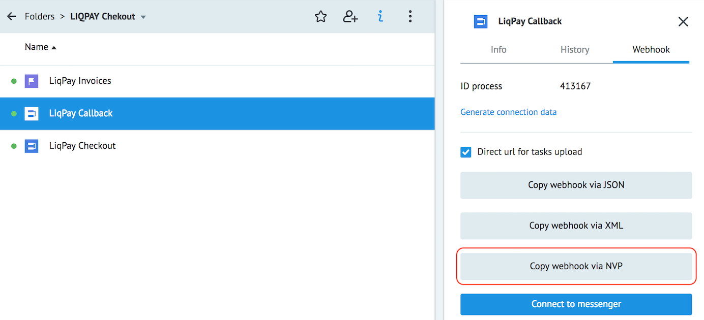

# Checkout

Copy [folder "LIQPAY Chekout"](https://admin.corezoid.com/folder/conv/215972) to your workspace.

Process **LiqPay Checkout** calls **API Checkout** according to [documentation](https://www.liqpay.ua/documentation/api/aquiring/checkout/doc).
In the case of a successful API call a response will contain a URL (`href`) to redirect customer to a separate LiqPay page for confirming payment .

When customer pays for goods or services, LiqPay sends a secure POST request to process **LiqPay Callback** with a payment status.

The state diagram **LiqPay Invoices** saves all invoices until final payment status is received.

Open process **LiqPay Checkout**.

Specify the parameters in **LiqPay parameters**:
* **order_id** - unique ID of shopping in your store, by default task ID is specified - `{{root.task_id}}`
* **public_key** - public key from [settings](https://www.liqpay.ua/ru/admin/business)
* **private_key** - private key from [settings](https://www.liqpay.ua/ru/admin/business)
* **server_url** - DirectURL of process **LiqPay Callback** (format NVP)

> To get DirectURL select the process **LiqPay Callback**, click View details and switch to tab Webhook. Press **Copy webhook via NVP** and direct URL will be copied to clipboard:

> 

Press **Deploy** to commit changes.

To test processes switch mode to **View** and press button **+ New task**.

Enter values for parameters:
* `amount` - payment amount, e.g. 5, 7.34
* `currency` - payment currency. Possible values: USD, EUR, RUB, UAH, GEL
* `description` - payment description
* `email` - customer's email for sending invoice
* `language` - customer's language. Possible values: ru, uk, en

and press **Add task**.

As a result of successful execution, the task will pass through the process and go to the final node **Invoice sent**.
The URL (`href`) to redirect client redirect to LiqPay chekout page will be returned to the main process.

In case of an error, the task will go to one of the final nodes for errors.