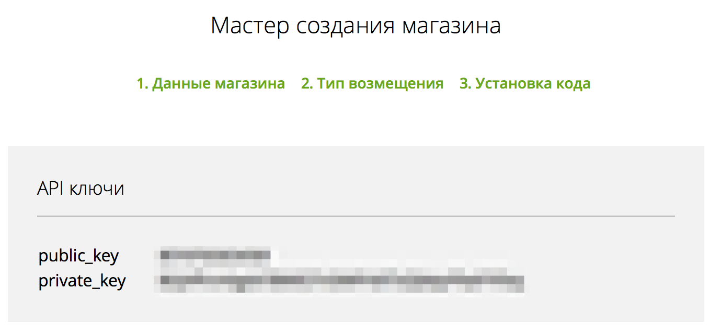

# LiqPay

In order to start working with LiqPay, you need to register online https://www.liqpay.com and get:
*   public key - ID of your online shop on LiqPay
*   private key - a secret key, by which all your sent requests to LiqPay system will be undersigned.

Available methods from process:
*   [Invoice sending to email and payment status checking](invoice_email.md)
*   [p2p](p2p.md)
*   [Buying in the shop with the card](pay.md)
*   [Blocking funds on customer’s card](hold.md)
*   [New shop registration](shop_create.md)
*   [Transaction confirmation using OTP password](otp_verify.md)
*   [Buying in the shop on card_token](paytoken.md)
*   [Transfer from shop account to receiver’s card](p2p_credit.md)
*   [Blocked amount writing-off](hold_completion.md)
*   [Payment status checking](status.md)
*   [De-subscription (cancelation of regular payment)](unsubscribe.md)
*   [Refunding of the Customer](refund.md)
*   [Invoice cancellation](invoice_cancel.md)

And also [multiplatform Bot](invoice_multi_platform_bot.md) to receive payments from your clients via Facebook, Telegram and Viber.
