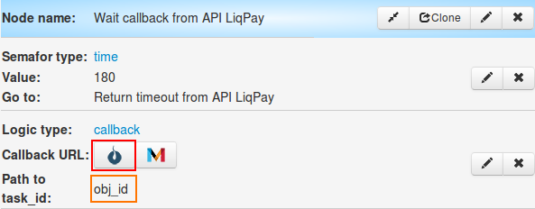
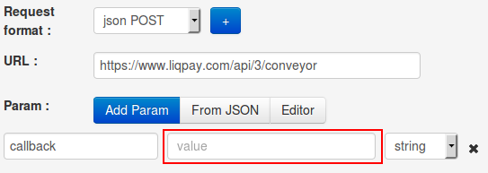
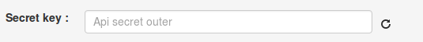
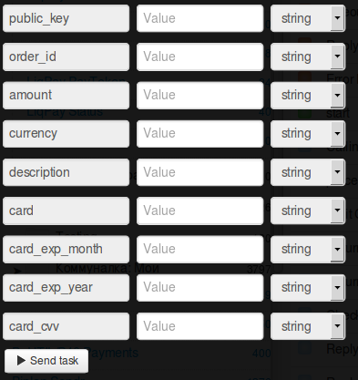

# Blocking funds on customer’s card

Clone [folder "Blocking funds on customer’s card"](https://admin.corezoid.com/folder/conv/1923) to get the process and dashboard.

Go to the process.

In the process **generate a link to get callback from LiqPay** - in the node with the Logic Callback `"Receive Callback"` click on the icon "Corezoid" and the link will be copied into the clipboard.
In the field `Path to task_id` specify `obj_id`.

Obtained URL should be inserted in the value of `callback` parameter of API logic, located in the node `Calling API`.

Insert your `private key` from LiqPay in the node `Calling API` in the field `Secret key`:

For testing the process, go to the mode `dashboard` and click `Add task` - to add the request.

In the opened form specify the required parameters and click on "Send task":

* `phone` - payer’s phone number. OTP password for payment confirmation will be sent to this number. Phone number is stated in the international format (Ukraine +380, Russia +7 )
* `amount` - payment amount. For example: 5, 7.34
* `public_key` - Public key of the shop
* `currency` - payment currency. Possible values: USD, EUR, RUB, UAH, GEL
* `description` - payment description.
* `order_id` - unique ID number of the purchase in your shop. Maximum length is 255 characters.
* `card` - payer’s card number
* `card_exp_month` - payer’s card expiry month. For example: 08
* `card_exp_year` - payer’s card expiry year. For example: 19
* `card_cvv` - CVV/CVV2
* `ip` - customer ip

If necessary, you can use the additional parameters:

* `sandbox` - activates test mode for developers. Funds are not credited to the card. To activate the test mode, you should send value 1. All test payments have sandbox status – successful test payment.
* `prepare` - preliminary preparation of payment. This mode allows determining whether all the data has been properly entered, whether 3DS card verification is needed, or limit is exceeded. The card is not debited. To activate this mode, you should send value 1.
* `product_url` - address of page with the product 
* `server_url` - URL API in your shop for notification of any change in payment status (server->server). Maximum length is 510 characters.
* `result_url` - URL in your shop to which a buyer is redirected after concluding the purchase. Maximum length is 510 characters.
* `sender_first_name` - sender’s first name
* `sender_last_name` - sender’s last name
* `sender_country_code` - sender’s country. Digital ISO 3166-1 code
* `sender_city` - sender’s city
* `sender_address` - sender’s address
* `sender_postal_code` - sender’s postal code

Then press the button `Send task` - to send the request.

**In case of success** the following parameters are added to the request:
* **status**  - payment status:
 * `otp_verify` - OTP verification of the customer is required. OTP password
* **token** - token required to complete the payment with OTP verification of the Customer

Besides, in case of successful call of process, the customer receives **ОТР-password** (one-time password) on its phone number, as a confirmation of the customer’s transaction.
ОТР password is used as the required incoming parameter of the process of [transaction confirmation using OTP](https://www.corezoid.com/admin/edit_conv/28246)

**In case of successful confirmation** the following parameters are added to the request:

* **public_key**  - public key – shop identifier
* **private_key**  - private key – shop access key

**In case of error** the request goes to the escalation node with the parameter below:
* **err_code** - Error code.
* **err_description** - Error description