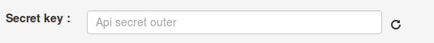

# Blocked amount writing-off

Clone [folder "Blocked amount writing-off"](https://admin.corezoid.com/folder/conv/1923) to get the process and dashboard.

Go to the process.

In the process **generate a link to get callback from LiqPay** - in the node with the Logic Callback `"Receive Callback"` click on the icon "Corezoid" and the link will be copied into the clipboard.
In the field `Path to task_id` specify `obj_id`.

Obtained URL should be inserted in the value of `callback` parameter of API logic, located in the node `Calling API`.

Insert your `private key` from LiqPay in the node `Calling API` in the field `Secret key`:

For testing the process, go to the mode `dashboard` and click `Add task` - to add the request.

In the opened form specify the required parameters and click on "Send task":

* `public_key` - public key of the shop
* `order_id` - unique ID number of purchase in your shop. Maximum length is 255 characters.

Далее нажмите кнопку `Send task` - отправить заявку.

**In case of success** the following parameters are added to the request:

* **status**  - payment status:
 * `success` - successful payment
* **payment_id** - payment ID number in LiqPay

**In case of error** the request goes to the escalation node with the parameter below:
* **err_code** - Error code.
* **err_description** - Error description
