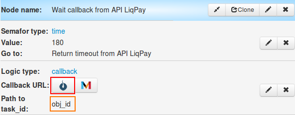

# Sending invoice to the email and verification of payment statuses

###To receive keys from LiqPay:

**1)** Go to the page: https://www.liqpay.com/ru/admin/business


**2)** Put phone number. OTP and Privat24 password . For the simplified authorization use Sender.

Go to store settings. https://www.liqpay.com/ru/admin/business/settings/api/


**3)** On store settings page, copy private and public key.

###Managing process

**1)** Clone ["Invoice sending to email and payment status checking" folder](https://admin.corezoid.com/folder/conv/9329) for receiving process and dashboard.


**2)** Go to process and generate link to receive callback from LiqPay - in node with logic **Callback "Wait callback from API LiqPay"** and **"Receive Callback LiqPay Status"**
press on **"Corezoid"** icon and link will be copied into clipboard. In **Path to task_id** field there's a need to specify **obj_id.**



**3)** Paste received URL into value of callback parameter of API logic, that is in **Call API LiqPay** node and **LiqPay Status process**.


**4)** Paste your **private key** from LiqPay to **LiqPay Status process** node and **Call api LiqPay**  in **Secret key** field:


In {{public_key}}  field put your public key from LiqPay:


###Process testing

**1)** For testing of invoice sending process by the goods/service, go to **dashboard** mode.


press **Add task** button to add task.


In opened form, specify required parameters and press **'Send task"**:


*REquired parameters:*
* `currency` - currency (UAH;
* `amount` - amount to pay (1);
* `order_id` - unique order number;
* `email` - email address, where the invoice would be issued;
* `count` - amount (in the piece);
* `name` - goods name.
* `language` - invoice language (ru,uk,en);

If all data is specified correctly, your clients will receive the invoice to the email:


**2)** In order to send N-th number of goods (services) to the request, `goods` parameter should sontain object array.

Example:

```
"goods":
[
	{
	"amount":100,
	"count":2,
	"unit":"шт.",
	"name":"телефон"
	},
	{
	"amount":5,
	"count":1,
	"unit":"шт.",
	"name":"чехол"
	}
]```

In **dashboard** mode, press **Add task** button to add request.


In opened form, specify required parameters and press **"Send task"**:


*Required parameters*
* `currency` - currency (UAH;
* `amount` - amount to pay (1);
* `order_id` - unique order number;
* `email` - email address where invoice will be sent;
* `language` - invoice language (ru,uk,en);


If all details are trasferred correctly, your clients will receive an invoice to the email:


**In case of success**parameters will be added to the task:
* **status** - payment status
* **payment_id** - payment id


**In case of error** task will go to escalation node and there will be added some parameters:

* **err_code** - error code
* **err_description** - error description

To see sales funnel, open dashboard in the folder with process


