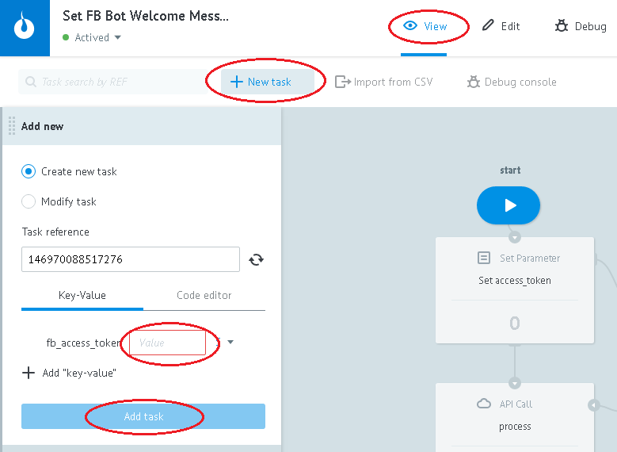

# Invoice Multi Platform Bot

* [Copying the Bot to your account](#copy)
* [Process purpose](#description)
* [Integration with Facebook](#facebook)
* [Integration with Telegram](#telegram)
* [Integration with Viber](#viber)
* [Integration with API Invoice Bot LiqPay](#liqpay)
* [Message texts](#text)
* [Good's image](#img)
* [Bots control](#bot)

##Copying the Bot to your account {#copy}

Clone [folder with "LiqPay invoice DEMO bot" processes](https://admin.corezoid.com/folder/conv/1923)

##Process purpose {#description}

**[Receiver & Route message](https://admin.corezoid.com/editor/98033/149189)**
- accepts all messages from clients as from Facebook so from Telegram
- converts recevied data to the uniform format. For example, message from Facebook (`entry[0].messaging[0].message.text`) message from Telegram (`message.text`) converts to `user_text` parameter
- transfers the converted data to the process, which laid the basic logic - [`MAIN logic`](https://admin.corezoid.com/editor/98033/149183)
- transfers and renews data about users in `Users` state diagram 

**[MAIN logic](https://admin.corezoid.com/editor/98033/149183)**
- manages the main logic: definition of received commands, request initialization for sending appropriate messages to clients

**[Send messages](https://admin.corezoid.com/editor/98033/149193)**
- keeps text messages and messages with buttons for communication with clients
- transmits request for message sending to clients depending on the channel

**Telegram / [Telegram - Send message](https://admin.corezoid.com/editor/98034/149181)**
- sends messages to Telegram chat

**Telegram / [Telegram - Hide inline keyboard](https://admin.corezoid.com/editor/98034/149182)**
- hides buttons in sent message if there was a selection of one of it

**Facebook / [Facebook - Send message](https://admin.corezoid.com/editor/98036/149187)**
- sends messages to Facebook chat

**Facebook / [Set FB Bot Welcome Message](https://admin.corezoid.com/editor/98036/149188)**
- sets "Get started" button for Facebook Bot and if you press this button it will send a message (postback) with "/start" text to the process [`Receiver & Route message`](https://admin.corezoid.com/editor/98033/149189).

**Viber / [Viber - Send message](https://admin.corezoid.com/editor/118537/194287)**
- sends messages to Viber chat, distributes it by sending statuses.

Successful requests are sent to [Message statuses](https://admin.corezoid.com/editor/118537/194288) для получения конечного статуса сообщений.

**Viber / [Viber - Viber - Message statuses](https://admin.corezoid.com/editor/118537/194288)**
- distributes successful requests by states:

"Sent", "Delivered", "Seen", "Not delivered 14 days", "Not seen 14 days", "failed - not delivered Viber".

**Viber / [Viber - Viber events](https://admin.corezoid.com/editor/118537/194286)**
- universal process that leads any message type from user ("event":"message") to `user_text` parameter.

It distributes "event" values to end nodes or modifies messages states to [Viber - Message statuses](https://admin.corezoid.com/editor/118537/194288)

**Config / [State chats](https://admin.corezoid.com/editor/98038/149192)**
- state diagram where the information about user's current state is kept and renewed namely the process id, where it is now. This information sholud always be transferred on first step in processes that are storaged in `Commands` folder.

**Commands / [Create invoice](https://admin.corezoid.com/editor/98037/149191)**
- sets current state of user (current process id)
- creates invoice
- on different steps of invoice creation, transfers the data to [`Send messages`](https://admin.corezoid.com/editor/98033/149193) for message sending to users

**[Users](https://admin.corezoid.com/editor/98033/149190)**
- state diagram that keeps data about users

**[Statistic](https://www.corezoid.com/admin/view_dash/70343/98033)**
- dashboard with information about the amount of sent messages and amount of Bot's users in sectional channels

##Integration with Facebook {#facebook}

**1)** Create facebook [application](https://developers.facebook.com/quickstarts/?platform=web) and [page](https://www.facebook.com/pages/create/). Получите `Page ID`.

**2)** In facebook application settings click on `"+Add product"` and select `Messenger`

**3)** Receive page access marker - `Page Access Token`

**4)** Connect [**Receiver & Route message**](https://admin.corezoid.com/editor/98033/149189) process to FB Messenger by specifying access marker of your page

**5)** Получите webhook-url процесса [**Receiver & Route message**](https://admin.corezoid.com/editor/98033/149189) для FB Messenger

**6)** Set a webhook in settings of facebook application by specifying webhook-url of [**Receiver & Route message**](https://admin.corezoid.com/editor/98033/149189) process in `Reverse, URL-address` field,and page access marker - in `Confirm marker` field

**7)** Subscribe webhook to its events by choosing right page

[ПDetailed instruction on Facebook](https://developers.facebook.com/docs/messenger-platform/product-overview)

**8)** Set "Get started" button for Facebook bot by pressing on which the message (postback) with "/start" text will go to [`Receiver & Route message`](https://admin.corezoid.com/editor/98033/149189) process**

For this :

 - go to `View` mode of [Set FB Bot Welcome Message](https://www.corezoid.com/admin/edit_conv/149188/98036) process.

 - press on `New task` button - new task.

 - in appeared window, specify the values of required parameters 
   - **fb_access_token** - marker of page access (`Page Access Token`)
   - **page_id** - page ID

 - press `Add task` button.

##Integration with Telegram {#telegram}

Connect [**Receiver & Route message**](https://admin.corezoid.com/editor/98033/149189) process to Telegram by specifying your bot key

To receive Bot's key there's a need to send `/newbot` command to chat with **@BotFather**. Next, specify the name and name of Bot's user. You will get:

##Integration with Viber {#viber}

Connect [**Receiver & Route message**](https://admin.corezoid.com/editor/98033/149189) to Viber Webhook:

* go to `Webhook` tab
* press `Connect to messenger`
* select `Viber`
* press on `"Set Webhook"` button and specify the token of your Public Account

####Welcome message

Set a welcome message for your Public Account:

* after selection the `Viber`, press the `"Set Welcome message"` button
* select the type of welcome message - picture with text or text (for example, "Hello! In order to issue the invoice, send "pay" command")
* fill out required fields

Welcome message is sent as a reply to received webhook that contains `"event": "conversation_started"`.

This event indicates that the user came to the chat with your Public Account at the first time (ie no history) or when the chat is opened through deep link.

`"conversation_started"`  is not considered as a subscription and does not allow the Public Account to send messages to users.

But allows to send one welcome.

##Integration with API Invoice Bot LiqPay {#liqpay}

In [`Create invoice`](https://admin.corezoid.com/editor/98037/149191) process (which is in `Commands` folder) **API Invoice Bot LiqPay** call is set for invoice creation.

**1)** Add secret key, received after your store registration in `Sign the request by secret key` field

**2)** Add `public_key` of your store and callback URL into `callback` parameter value in order to receive a reply from  **API Invoice Bot LiqPay**

In order to receive callback URL, click on `Wait for invoice creation result` node and copy URL for Corezoid

##Texts of messages {#text}

[**Send messages**](https://admin.corezoid.com/editor/98033/149193) process keeps text messages and messages with buttons for communications with clients in CODE logic of `Texts of messages` node.

"texts"` object contains objects with names which define message indicators. For example, attributes of welcome message are contained in `"start"` object, message attributes for invoice creation - in `pay_bot_create_invoice` object etc.

Objects with message ID's contain objects with names which deifne language of clinet , for example, "ru".

In turn, the National Objects, defining customer communication language, can contain parameters:

* `"text"` - text message. May be sent to the client with buttons or without it.
* `"telegram"` - object that contains description of Telegram buttons and callback parameter value in case of activation of one of them.
* `"facebook"` - array that contains Facebook button description and callback parameter value in case of activation one of them
* `"viber"` - object that contains description of Viber buttons and callback parameter value in case of activation one of them
* `"photo"` - object that contains goods image ID for Telegram and goods image URL for Facebook

Хранение текстов таким способом позволляет легко управлять ими (редактировать, добавлять, удалять) и не дублировать для каждого нового канала.

##Image of goods {#img}

In invoice message there is a possibility to add its photo

In order to send goods photo to Facebook and Viber messages, add URL with its image in value of `"facebook"` or `"viber"` parameters,appropriate to `"photo"` object for message with `"pay_order"` ID

In order to send photo of goods to Telegram messages:

**1)** send the picture of goods to the chat with your bot

**2)** go to View mode of [**Receiver & Route message**](https://admin.corezoid.com/editor/98033/149189) processand click on `Final` node

**3)** copy value of received `"file_id"` parameter

**4)** add it to the `"telegram"` paramter value of `"photo"` object for message with `"pay_order"` ID

If there's no need to send a photo to the client, remove `"photo"` from CODE logic and press 'Deploy'

##Bot's control {#bot}
Go to `View` or `Debug` mode, for example, main process [**MAIN logic**](https://admin.corezoid.com/editor/98033/149183) or [**Receiver & Route message**](https://admin.corezoid.com/editor/98033/149189) process

in order to see request flow, it's moving and ditributing tby process nodes..

