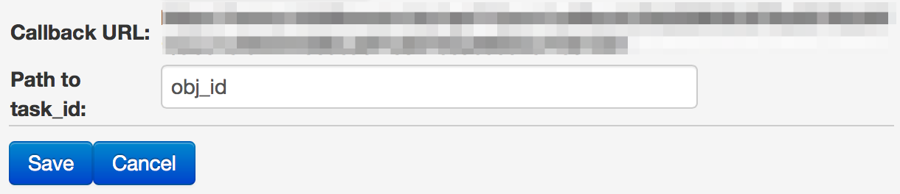

# Moto

*Money withdrawal from client's card*

Result of request execution is money withdraval from client's card.

Clone [process template](https://www.corezoid.com/admin/edit_conv/28236) for money withdrawal from client's card.

Paste your `private key` from LiqPay into `Secret key` field:

Generate `callback URL` to return payment results from LiqPay

Press on "Create callback url" button

You receive URL and there's a need to specify value `obj_id` to the `Path to task_id` field 

After this, copy URL and paste it to the `callback` field of API logic that is in zoid's `Call api LiqPay`.

Go to `dashboard` mode and press `Add task` button - to add request.

In opened form, specify parameters and press "Send task".

* `sandbox` **[optional]** - enables test mode for developers. Mone are not ocming to the card. in order to enable test mode it is required to transfer value 1. All test payments will have a sandbox status - successful test payment.
* `prepare` **[optional]** - payment pretreatment. This mode allows to define whetherall data is specified, is there a 3DS card verification,has the limit been exceeded. Money are not withdrawn from the card. To enable this mode, it is required to transfer value 1.     
* `phone` **[required]** - телефон плательщика. На этот номер будет отправлен OTP пароль подтверждения платежа. Телефон указывается в международном формате (Украина +380, Россия +7 ) 
* `amount` **[required]** - payment amount. For example: 5, 7.34
* `public_key` **[required]** - Store public key 
* `currency` **[required]** - payment currency. Possible values: USD, EUR, RUB, UAH, GEL 
* `description` **[required]** - payment description. 
* `order_id` **[required]** - unique purchase ID in your store. Maximum length - 255 symbols. 
* `card` **[required]** - payer's card number 
* `card_exp_month` **[required]** - month of payer's card expiration date. For example: 08 
* `card_exp_year` **[required]** - year of payer's card expiration date. For example: 19 
* `ip` **[required]** - client ip
* `product_url` **[optional]** - зpage address with goods
* `server_url` **[optional]** - URL API in your store for notifcations about changes of payment status (server>server). Max length - 510 symbols.
* `sender_first_name` **[optional]** - sender's name
* `sender_last_name` **[optional]** - sender's second name
* `sender_country_code` **[optional]** - sender's country. Digital ISO 3166-1 code
* `sender_city` **[optional]** - sender's city     
* `sender_address` **[optional]** - sender's address
* `sender_postal_code` **[optional]** - sender's post code 

Then, press `Send task` button  - send request.

**In case of success** parameters will be added to the task:
* **status**  - payment status:
 * `success` - successful payment
 * `failure` - unsuccessful payment
 * `otp_verify` - OTP client's confirmation required. OTP password
   sent to the client phone number.
 * `3ds_verify` - 3DS verification is required. It is necessary
   to redirect client by link redirect_to
 * `wait_secure` - payment is verified
 * `wait_accept` - money are withdrawn from client but store is still verified
 * `wait_lc` - l/c. Money are withdrawn from client, waiting for goods delivery.
 * `processing` - payment is processed
 * `subscribed` - subscription successfully framed
 * `unsubscribed` - subscription is successfully deactivated
 * `sandbox` - test payment
 * `error` - unsuccessful payment. data is specified incorrectly.
* **token** - token,which is required for payment finishing with client's OTP verification
* **otp** - one time password, which client has received on his phone after initialization request      

**In case of error** task will go to escalation node with parameter:
* **err_code** - error code.     
* **err_description** - error description   

