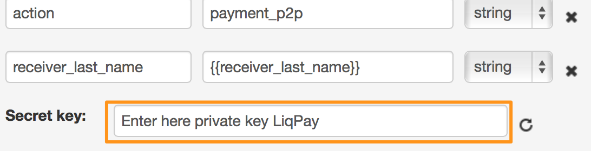
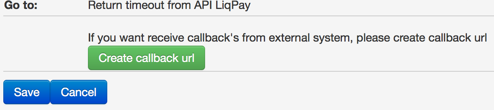
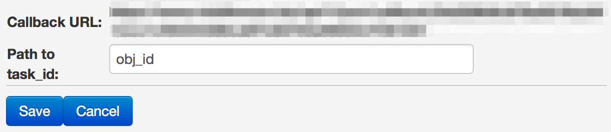
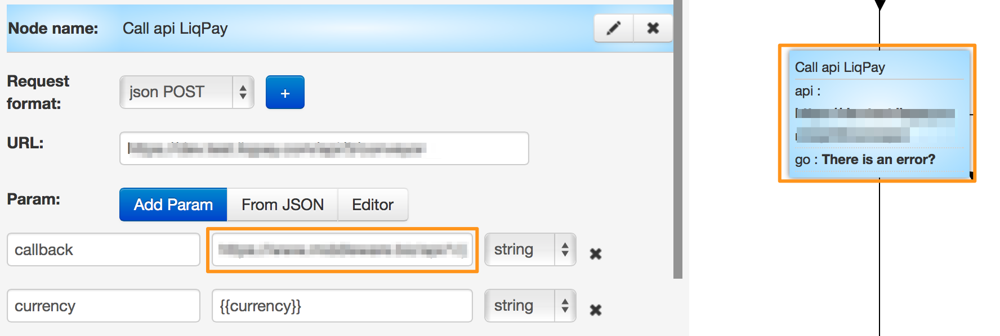

# p2p

The example of  p2p process - [process  11719](https://www.corezoid.com/admin/edit_conv/11719)

It is available in your folder `"Examples - LiqPay - p2p"`.

In order to start working with it, clone the example as follows:

Insert your `private key` from LiqPay in the field `Secret key`:

Generate a callback URL for retrieving the payment results from LiqPay

by clicking on "Create callback URL"

You get a URL, then you need to specify a value `obj_id` in the field `Path to task_id`

Then copy the URL and paste it into the field `callback` of logic API, which is in a node `Call API LiqPay`.

Switch to the `dashboard` mode and click on `Add task` - for sending a test request.

Indicate your payment parameters in the opened form and click on "Send task".

The process is prepared for the use from other processes through logic RPC. The list of output parameters:
*   If  error
    *   `err_description` - error description
    *   `err_code` - error code
*   If successful
    *   `result` - contains the value `success`
