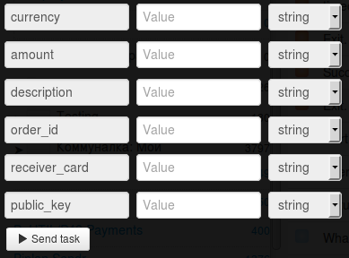

# Transfer from shop account to receiver’s card

Clone [folder "Transfer from shop account to receiver’s card"](https://admin.corezoid.com/folder/conv/1923) to get the process and dashboard.

Go to the process.

In the process **generate a link to get callback from LiqPay** - in the node with the Logic Callback `"Receive Callback"` click on the icon "Corezoid" and the link will be copied into the clipboard.
In the field `Path to task_id` specify `obj_id`.

Obtained URL should be inserted in the value of `callback` parameter of API logic, located in the node `Calling API`.

Insert your `private key` from LiqPay in the node `Calling API` in the field `Secret key`:

For testing the process, go to the mode `dashboard` and click `Add task` - to add the request.

In the opened form specify the required parameters and click on "Send task":

* `amount` - payment amount. For example: 5, 7.34
* `public_key` - Public key of the shop
* `currency` - payment currency. Possible values: USD, EUR, RUB, UAH, GEL
* `description` - payment description.
* `order_id` - unique ID number of the purchase in your shop. Maximum length is 255 characters.
* `receiver_card` - receiver’s card number

If necessary, you can use the additional parameters:

* `sandbox` - activates test mode for developers. Funds are not credited to the card. To activate the test mode, you should send value 1. All test payments have sandbox status – successful test payment.
* `server_url` - URL API in your shop for notification of any change in payment status (server->server). Maximum length is 510 characters.
* `receiver_last_name` - receiver’s last name
* `receiver_first_name` - receiver’s first name

Then press the button `Send task` - to send the request.

**In case of success** the following parameters are added to the request:
* **status** - payment status:
 * `success` - successful payment
* **payment_id** - payment id number in LiqPay

**In case of error** the request goes to the escalation node with the parameter below:
* **err_code** - Error code.
* **err_description** - Error description
