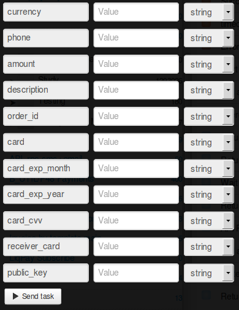

# Transfer from card to card

For transfer from card to card, clone [process template](https://www.corezoid.com/admin/edit_conv/28249/7282).

**Generate link for receiving callback from LiqPay** - in the node with Callback logic `"Receive Callback"` press on "Corezoid" icon and link will be copied to clipboard.
In `Path to task_id` field there's a need to specify `obj_id`.

Received URL needs to be pasted into `callback` parameter value which is in `Calling API` node.

In `Calling API` node, in `Secret key` field, paste your`private key` from LiqPay:

Go to `dashboard` mode and press `Add task` button - in order to add task.

In opened form specify requried parameters and press "Send task":

* `phone` - payer's phone. OTP password will be send to this number to confirm the payment. Phone is specified in international format (Ukraine +380, Russia +7 ) 
* `amount` - payment amount. For example: 5, 7.34
* `public_key` - Store public key 
* `currency` - payment currency. Possible values: USD, EUR, RUB, UAH, GEL 
* `description` - payment description. 
* `order_id` - unique згксрфыу ID in your store. Max length - 255 symbols. 
* `card` - number of payer's card 
* `card_exp_month` - month of payer card's expiration date. For example: 08 
* `card_exp_year` - year of payer card's expiration date. For example: 19 
* `card_cvv` - CVV/CVV2 
* `receiver_card` - receiver card number
* `ip` - client's ip

If it is required, you can use additional parameters:

* `sandbox` - enables test mode for developers. Money are no credited to the card. In order to enable test mode, it is required to transfer value 1. All test payments will have sandbox status - successful test payment.
* `prepare` - pretreatment of payment. This mode allows to define whether all data is specified, is there any need in 3DS card verification and was the limit exceeded. Money are not withdrawn from the card. In order to enable this mode it is required to transfer value 1.
* `server_url` - URL API in your store for notifications about change of payment status (server>server). Max length - 510 symbols.
* `sender_first_name` - sender's name
* `sender_last_name` - sender's surname
* `sender_country_code` - sender's country. Digital ISO 3166-1 code
* `sender_city` - sender's city     
* `sender_address` - sender's address
* `sender_postal_code` - zip code of the sender 
* `receiver_last_name` - recipient's surname    
* `receiver_first_name` - recipient's name    

The, press `Send task` button - send a request.

**In case of success** there will be parameters added to the task:
* **status**  - payment status:
 * `success` - successful payment
 * `failure` - unsuccesfull payment
 * `otp_verify` - it is required to get client's OTP confirmation. OTP password
   sent to the client's phone number.
 * `3ds_verify` - 3DS verification is required. It is necessary
   to redirect the client by link redirect_to
 * `wait_secure` - payment is verified
 * `wait_accept` - money are withdrawn but the store is still verified
 * `wait_lc` - l/c. Money are withdrawn, waiting for confirmation of goods delivery.
 * `processing` - payment is processed
 * `subscribed` - subscription successfully framed
 * `unsubscribed` - subscription is successfully deactivated
 * `sandbox` - test payment
 * `error` - unsuccessful payment. Data are specified incorrectly.
* **token** - token, needed for payment finishing by OTP verification of client 

Also, in case of successful process call, client will receive OTP password to his mobile phone - one time password which will confirm the operation execution. Uses as a required incoming parameter in process of [confimation with OTP](https://www.corezoid.com/admin/edit_conv/28246)     

**In case of error** task will go to the escalation node with parameter:
* **err_code** - error code.     
* **err_description** - error description   

