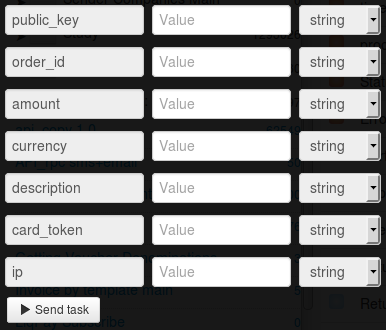

# Buying in the shop on card_token

Clone [folder "Bying in the shop on card_token"](https://admin.corezoid.com/folder/conv/1923) to get the process and dashboard.

Go to the process.

In the process **generate a link to get callback from LiqPay** - in the node with the Logic Callback `"Receive Callback"` click on the icon "Corezoid" and the link will be copied into the clipboard.
In the field `Path to task_id` specify `obj_id`.

Obtained URL should be inserted in the value of `callback` parameter of API logic, located in the node `Calling API`.

Insert your `private key` from LiqPay in the node `Calling API` in the field `Secret key`:

For testing the process, go to the mode `dashboard` and click `Add task` - to add the request.

In the opened form specify the required parameters and click on "Send task":

* `amount` - payment amount. For example: 5, 7.34
* `public_key` - public key of the shop
* `currency` - payment currency. Possible values: USD, EUR, RUB, UAH, GEL
* `description` - payment description.
* `order_id` - unique ID number of the purchase in your shop. Maximum length is 255 characters.
* `card_token` - payer’s card token
* `ip` - customer ip

If necessary, you can use the additional parameters:

* `product_url` - address of page with the product
* `server_url` - URL API in your shop for notification of any change in payment status (server->server). Maximum length is 510 characters.

Далее нажмите кнопку `Send task` - отправить заявку.

Then press the button `Send task` - to send the request.

**In case of success** the following parameters are added to the request:
* **status**  - payment status:
 * `success` - successful payment
 * `failure` - unsuccessful payment
 * `otp_verify` - OTP verification of the customer is required. OTP passwordis sent to the Customer’s phone number
 * `3ds_verify` - 3DS verification is required. The Customer is to be redirected to link redirect_to 
* `wait_secure` - payment check in progress
 * `wait_accept` - customer account has been debited, but the shop is not verified yet
 * `wait_lc` - letter of credit. Customer account has been debited; wait for confirmation of goods’ delivery
 * `processing` - payment processing in progress
 * `subscribed` - you have successfully subscribed
 * `unsubscribed` - you have successfully unsubscribed
 * `sandbox` - test payment
 * `error` - unsuccessful payment. Data entered incorrectly
* **payment_id** - payment ID number in LiqPay

**In case of error** the request goes to the escalation node with the parameter below:
* **err_code** - Error code.
* **err_description** - Error description
