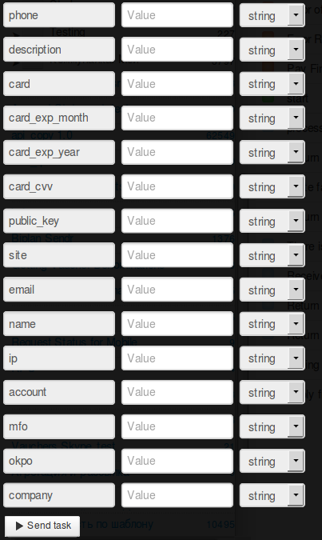

# New shop registration

Clone [folder "New shop registration"](https://admin.corezoid.com/folder/conv/1923) to get the process and dashboard.

Go to the process.

In the process **generate a link to get callback from LiqPay** - in the node with the Logic Callback `"Receive Callback"` click on the icon "Corezoid" and the link will be copied into the clipboard.
In the field `Path to task_id` specify `obj_id`.

Obtained URL should be inserted in the value of `callback` parameter of API logic, located in the node `Calling API`.

Insert your `private key` from LiqPay in the node `Calling API` in the field `Secret key`:

For testing the process, go to the mode `dashboard` and click `Add task` - to add the request.

In the opened form specify the required parameters and click on "Send task":

* `email` - E-mail of the shop
* `public_key` - Public key of the shop
* `description` - payment description.
* `name` - Shop name
* `card` - payer’s card number
* `card_exp_month` - payer’s card expiry month. For example: 08
* `card_exp_year` - payer’s card expiry year. For example: 19
* `card_cvv` - CVV/CVV2
* `phone` - Shop owner phone number
* `site` - URL of shop web-site

If necessary, you can use the additional parameters:

* `ip` - customer IP
* `account` - Account number to receive payments in this shop
* `mfo` - Account MFO
* `okpo` - Account OKPO
* `company` - Account name

Then press the button `Send task` - to send the request.

**In case of success** the following parameters are added to the request:
* **status**  - payment status:
 * `otp_verify` - OTP verification of the customer is required. OTP password
* **token** - token required to complete the payment with OTP verification of the Customer

Besides, in case of successful call of process, the customer receives **ОТР-password** (one-time password) on its phone number, as a confirmation of the customer’s transaction.
ОТР password is used as the required incoming parameter of the process of [transaction confirmation using OTP](https://www.corezoid.com/admin/edit_conv/28246)

**In case of successful confirmation** the following parameters are added to the request:
* **public_key**  - public key – shop identifier
* **private_key**  - private key – shop access key

**In case of error** the request goes to the escalation node with the parameter below:
* **err_code** - Error code.
* **err_description** - Error description
