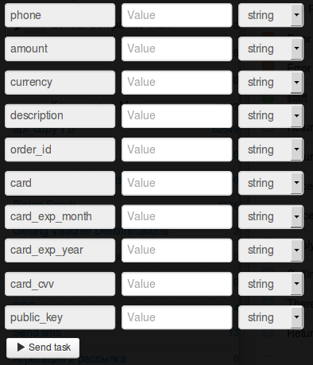

# Subscription in the store (regular payments)

Clone [folder "Subscription in the store"](https://admin.corezoid.com/folder/conv/1923) to receive process and dashboard.

Go to the process.

**Generate link to receive callback from LiqPay** - in the node with Callback logic `"Receive Callback"` press on "Corezoid" icon and link will be copied to the clipboard.
In `Path to task_id` field you need to specify `obj_id`.

Received URL is needed to paste in value of `callback` parameter of API logic, which is in `Calling API` node.

In the `Calling API` node in `Secret key` field, put your `private key` from LiqPay:

For testing process, go to `dashboard` mode and press `Add task` button - to add request.

In opened form, specify required parameters and press "Send task":

* `phone` - payer's phone. This number will receive OTP password for payment confirmation. Phone is specified in international format (Ukraine +380, Russia +7 ) 
* `amount` - payment amount. For example: 5, 7.34
* `public_key` - Store public key 
* `currency` - payment currency. Possible values: USD, EUR, RUB, UAH, GEL 
* `description` - payment description. 
* `order_id` - unique purchase ID in your store. Max length - 255 symbols. 
* `subscribe` - regular payment. Possible values: 1
* `subscribe_date_start` - date of the first payment 
* `subscribe_periodicity` - the frequency of money withdrawal. 
* `card` - payer's card number 
* `card_exp_month` - month of expiration date of payer's card. For example: 08 
* `card_exp_year` - year of expiration date of payer's card. For example: 19 
* `card_cvv` - CVV/CVV2 
* `ip` - client's IP 
* `product_url` - page address with goods  
    
If it is required you can use additional parameters:

* `sandbox` - enables test mode for developers. Money are not credited to the card. In order to enable, it is required to transfer value 1. All test payments will have sandbox status - successful test payment.
* `prepare` - payment pretreatment. This mode allows to define whether all data is specified, is there a need in 3DS card verification, was the limit exceeded. Money are not withdrawn from the card. In order to enable this mode, it is required to transfer value 1.
* `server_url` - URL API in your store for notification about change in payment status (server->server). Max length - 510 symbols.
* `result_url` - URL in your store, where the customer will be redirected after ourchase finishing. Max length - 510 symbols.
* `sender_first_name` - sender's name
* `sender_last_name` - sender's surname
* `sender_country_code` - sender's country. Digital ISO 3166-1 code
* `sender_city` - sender's city     
* `sender_address` - sender's address
* `sender_postal_code` - sender's zip code 
* `type` - payment type. Possible values: buy - purchase; 

then, press `Send task` button - send a request.

**In case of success** parameters will be added in task:
* **status**  - payment status:
 * `success` - successful payment
 * `failure` - unsuccessful payment
 * `otp_verify` - need an OTP confirmation from client. OTP password is sent to the client phone number.
 * `3ds_verify` - 3DS verification is needed. It is required to redirect the client by the link redirect_to
 * `wait_secure` - payment is verified
 * `wait_accept` - money are withdrawn from the client, but store is still verified
 * `wait_lc` - l/c. Money are withdrawn from client, waiting for delivery address confirmation
 * `processing` - payment is processed
 * `subscribed` - subscription is successfully created
 * `unsubscribed` - subscription is deactivated
 * `sandbox` - test payment
 * `error` - unsuccessful payment. Data specified incorrectly
* **token** - token is neededto finish the payment with oTP verification of client
* **otp** - ome time password that client received on his phone after initialization request, который Клиент получил на свой телефон, после запроса инициализации      

**In case of error** task will go to escalation node with parameter:
* **err_code** - error code.     
* **err_description** - error description   

