# MessageBird

**MessageBird** is a cloud service that enables integration of various means of communication, such as calls, SMS, email, or two-factor authentication.

In this tutorial, you will learn how to set up a process with calling a **MessageBird API** to send SMS and then check the delivery status of your SMS. 

Before setting up the process, we recommend that you read and understand **MessageBird** documentation available at [https://developers.messagebird.com/#messaging-send](https://developers.messagebird.com/#messaging-send)

Before we start, let us register at the **MessageBird** service to get **API** keys to be able to send test SMS for free. 

### How to get an API key

1. For registration, go to [https://dashboard.messagebird.com/en/sign-up/](https://dashboard.messagebird.com/en/sign-up/), fill out the form as follows and click the **Sign up with email** button.

    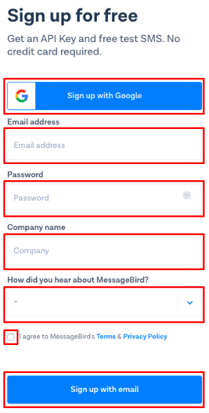
    
    If the registration is successful, you will see the form with an offer to select between the ***REST APIs*** and ***Dashboard solutions***.

    1.1. Select ***REST APIs***
    
    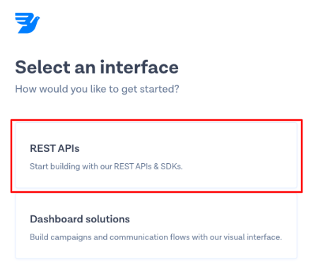

    1.2. Select **SMS APIs** to use the **API** for sending SMS
    
     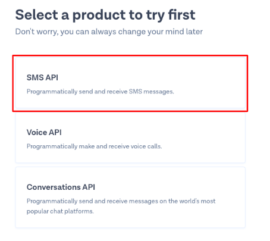

    1.3. To complete your registration, request authorization at the site using your mobile phone number
    
     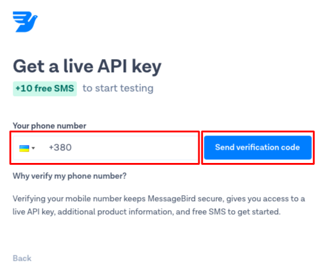

    1.4. After successful authorization by the mobile phone number, you will see the window with a request for SMS sending. If you select a ***Show Live API Key*** checkbox, you will see a key to call the **MessageBird API**.
    
     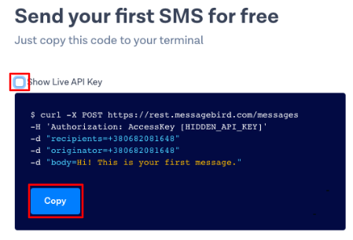

    Now we need to set up the process in Corezoid for sending SMS and receiving an SMS delivery status via the **MessageBird API**.
    
### SMS sending

1. For convenient work with your projects, create a folder named **MessageBird** 

    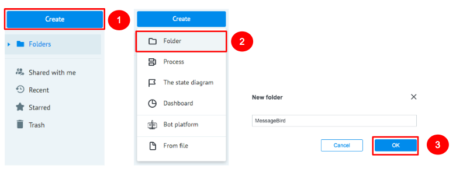

2. Go to the **MessageBird** folder and create a **Send & check SMS** process which will send SMS and check their delivery status.

    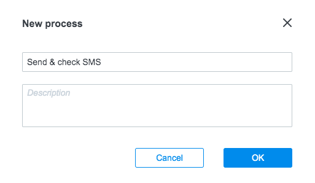

3. In the created process, add an **API Call** node which will call the **MessageBird API** for sending SMS to a mobile phone number.

    

   3.1. After you have added the **API Call** node, click it and fill in the ***API*** URL field: 
    ```
    https://rest.messagebird.com/messages
    ```
    ```
    Request format: Default
    Request method: POST
    Content-Type: Application/X-Www-Form-Urlencoded
    ``` 
    Add the following in the **Parameters** section:
    ```    
    {
        "originator": "{{originator}}",
        "recipients": "{{recipients}}",
        "body": "{{text}}"
    }
    ```
    where :
    -  originator is the sender’s   mobile phone number (you may enter your number for the test)
    - recipients are the recipients’ phone numbers
    - body is the text of SMS
    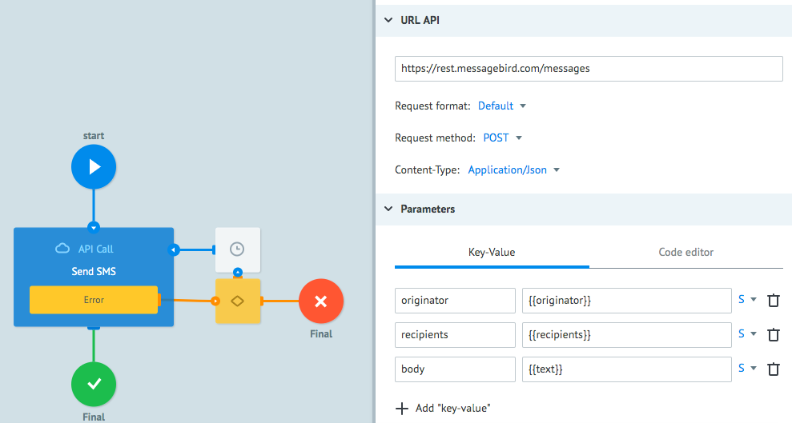  
   
    3.2. In the ***Additionally*** section, set a checkbox opposite ***Header parameters***
    
    3.3.  For authorization using the key from step 1.4 from [How to get an API key](#how-to-get-an-API-key) chapter , add the following: 
    ```    
    {
        "Authorization": "AccessKey {{key}}"
    }
    ```
    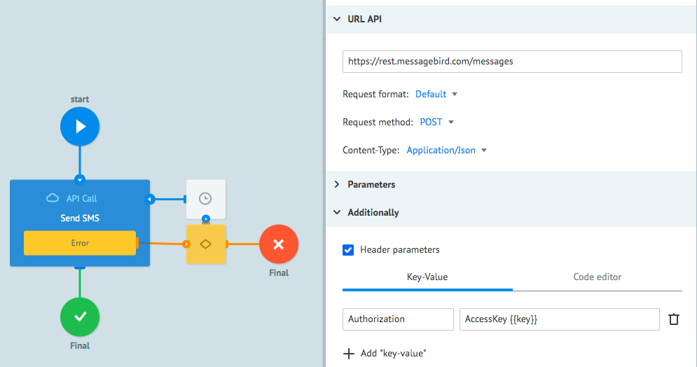

    3.4. In order to ensure that the parameters are filled in automatically each time when you manually create a request for SMS sending, click the **Task parameters** icon.
    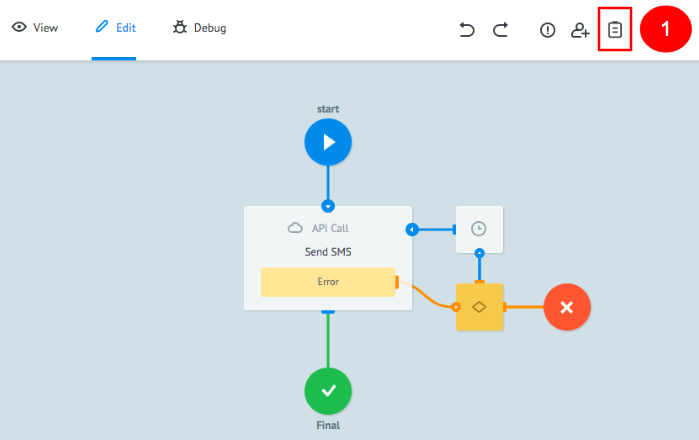

    3.5. In the appeared window, add 3 parameters: `key`, `recipients`, `text`.
    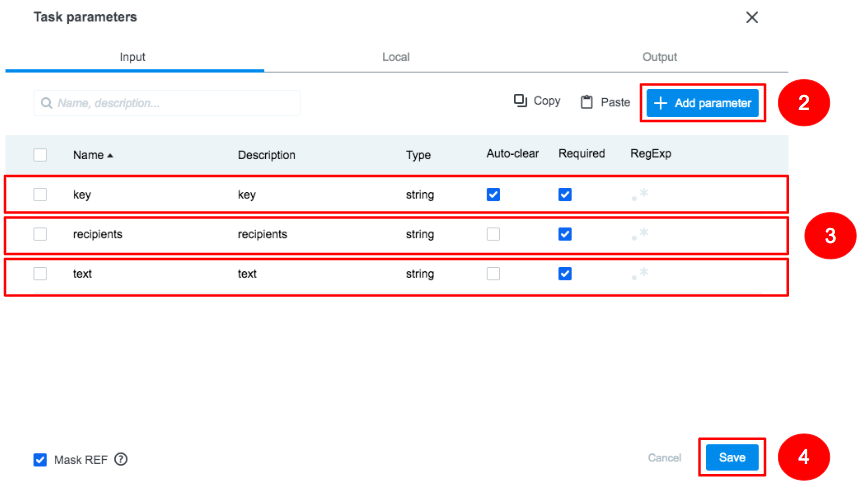 
    You have set up an **API Call** process (step 3 of this section) and it is now ready for sending SMS.
    
4. To send SMS, go to the **View** mode in the **Send & check SMS** process 

    4.1. Click the **New task** button
     
    4.2. In the **Task** window, fill in the fields as specified below and click the **Add task**:
    
    - **key**: key you got at step 1.4. from [How to get an API key](#how-to-get-an-API-key) chapter
    - **recipients**: your mobile phone number
    - **text**: text of SMS
    
    If the **API** call is successful, your request will be in the **Final** node. When you click it, you can look through the contents of the request that has ***href*** as one of its parameters. This parameter indicates the ***URL*** of the service to check the delivery status of your SMS.
 
### Checking SMS delivery status

1. To check on the delivery status of your SMS, you need to attach one more **API Call** node; but since it takes a few seconds to deliver a message, add a **Delay** node with a minimal waiting time of 30 seconds before the call.

    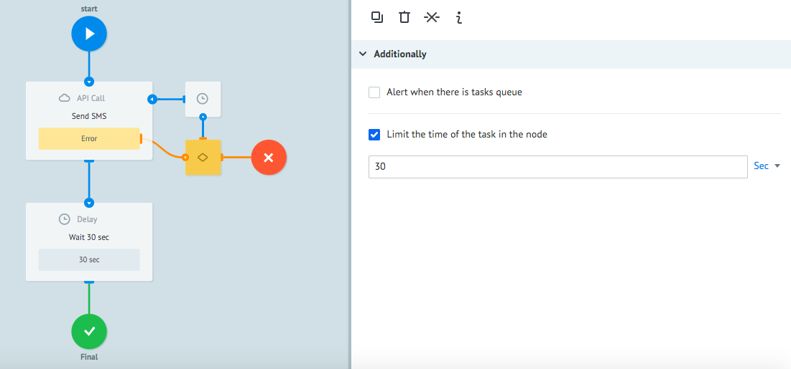

2. Next to the **Delay** node, add an **API Call** node named **Check status** which will call **MessageBird API** for checking an SMS delivery status.
 
    2.1. Click the **API Call** node and enter the `{{href}}` variable in the ***API URL*** field
    
    2.2. Set the following values in the ***API URL*** section settings:
    ```    
    Request format: Default
    Request method: GET
    Content-Type: Application/Json
    ```
    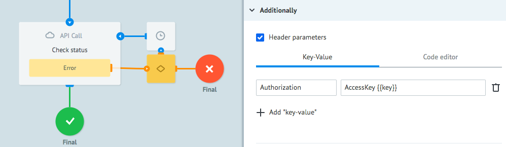
     
    2.3. In the ***Additionally*** section, set a checkbox opposite ***Header parameters*** and add the following:
    ```    
    {
        "Authorization": "AccessKey {{key}}"
    }
    ```

3. To check the **Check status** logic, create another request.

    3.1. Go to the **View** mode 
    
    3.2. Click the **New task** button 

    3.3. In the **Task** window, fill in the fields as specified below and click **Add task**:
    
    - **key**: key you got at step 2 from [How to get an API key](#how-to-get-an-api-key) chapter
    - **recipients**: your mobile phone number
    - **text**: text of SMS

    3.4. Click the **Final** node to see the contents of your request with a reply about the delivery status in the ***status*** parameter.

    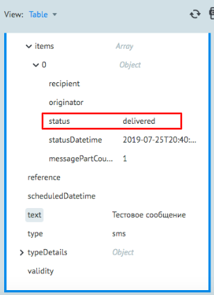

    Your process is ready for making **API** calls to send SMS and check the delivery status of your SMS. Let us now make this process unified so that it can be reused within other business processes. To do this, we need to use a **Reply to Process** node that will return a result of **MessageBird API call** to the calling process. 
 
### How to create the unified process

1. In the unified process, add the **Reply to Process** logic before each final node to inform you about success or failure to perform the process.

    Let us start with error processing. Add the **Reply to Process** node between the **Condition** node for processing errors from an API call and the **final node** where all failed API calls are forwarded. An example is shown in the screenshot below:

    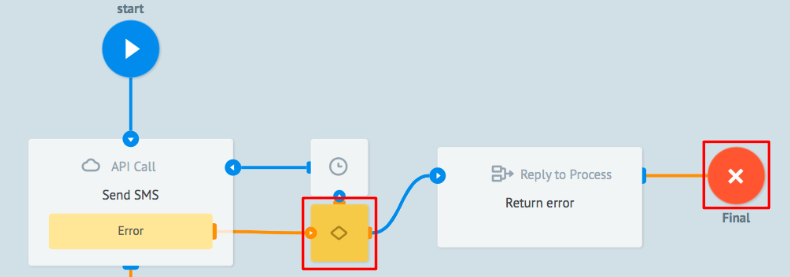

    1.1. Click the **Reply to Process** node and set a checkbox opposite **Throw exception**  

    1.2. In the appeared field, enter the following error text: **SMS was not sent via API**.

    1.3. The error text from the **MessageBird API** will be in the first object of the **errors** array which we receive from the MessageBird API, therefore add the transfer of the parameter containing error information in the ***Parameters*** section using the following format:
        
    ```
    {
        "error": "{{errors[0]}}"
    }
    ```
    
     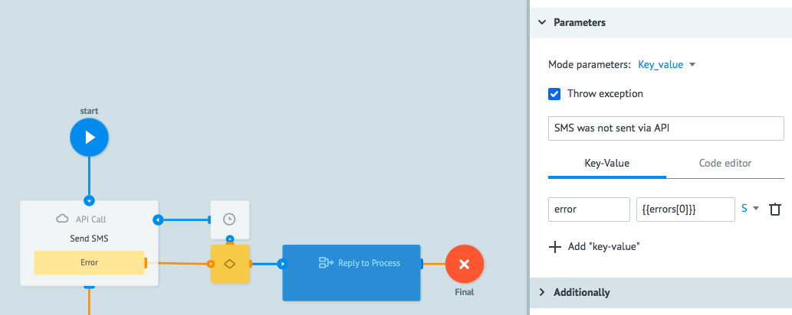

    Now, if you call this process from another process via the **Call Process** node and the MessageBird API returns an error response, the calling process will receive a reply containing the “**SMS was not sent via API**” error text and explanation of the error from API.
 
2. To inform you about errors of the API Call **Check status** node, add the **Reply to Process** node between the **Condition** and **Final** nodes.

    2.1. Click the **Reply to Process** node and set a checkbox opposite **Throw exception** 
    
    2.2. In the appeared field, enter the following error text: **API error of checking delivery status**
 
     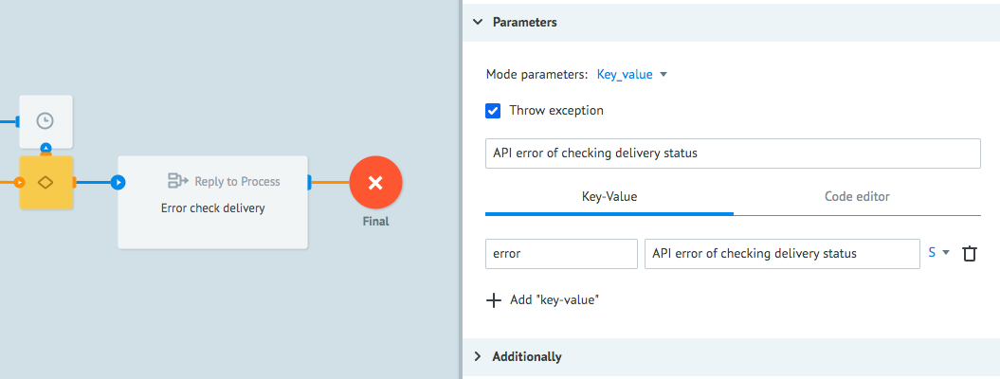

3. Add the **Reply to Process** node named **Return delivery status** before the final node that receives a request with information about an SMS delivery status.

    If the SMS delivery status check is successful, you will get an object in the **Final** node that will look as follows:
    ```
    {
        "body": " ",
        "createdDatetime": "2019-07-25T20:39:57+00:00",
        "datacoding": "plain",
        "direction": "mt",
        "gateway": 10,
        "href": "https://rest.messagebird.com/messages/72fd97fa48e7444b946b7972c0b8d6f1",
        "id": "72fd97fa48e7444b946b7972c0b8d6f1",
        "key": "***",
        "mclass": 1,
        "originator": "+380xxxxxxxxx",
        "recipients": {
            "totalCount": 1,
            "totalSentCount": 1,
            "totalDeliveredCount": 1,
            "totalDeliveryFailedCount": 0,
            "items": [
                {
                    "recipient": 380xxxxxxxxx,
                    "originator": null,
                    "status": "delivered",
                    "statusDatetime": "2019-07-25T20:40:00+00:00",
                    "messagePartCount": 1
                }
            ]
        },
        "reference": null,
        "scheduledDatetime": null,
        "text": "test sms",
        "type": "sms",
        "typeDetails": {
            
        },
        "validity": null
    ```

    As can be seen from the reply, an **ID** massage is transferred in the **id** parameter.
    The delivery **status** text is in the status parameter of the **items** array zero object which is wrapped with the **recipients** object.
 
    3.1. To transfer the **ID** message and its status, add parameters with delivery status information in the ***Parameters*** section:
    ```
    {
        "idMessage": "{{id}}",
        "status": "{{recipients.items[0].status}}"
    }
    ``` 
    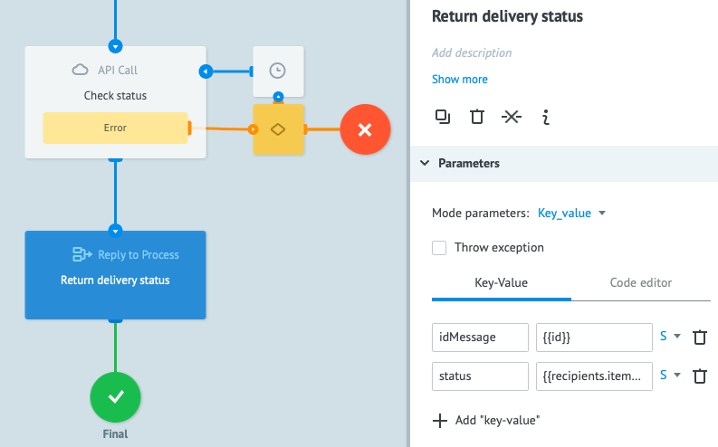
  
    Interaction of nodes within the created **Send & check SMS** process is illustrated in the figure below.

     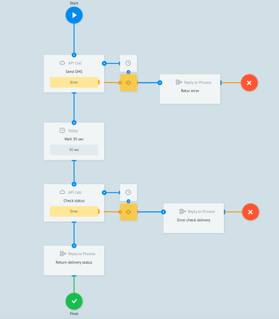

    3.2. To test the performance of the entire process, repeat step 3.6 from [SMS sending](#sms-sending) If the **API** call is successful, your request will be in the **Final** node.
     
    3.3. Click the **Final** node to look through the contents of your request with information about SMS sending and its delivery status.
 
**Congratulations! You have learned how to create a unified process for sending SMS and checking the delivery status of your SMS via MessageBird API.**
 


