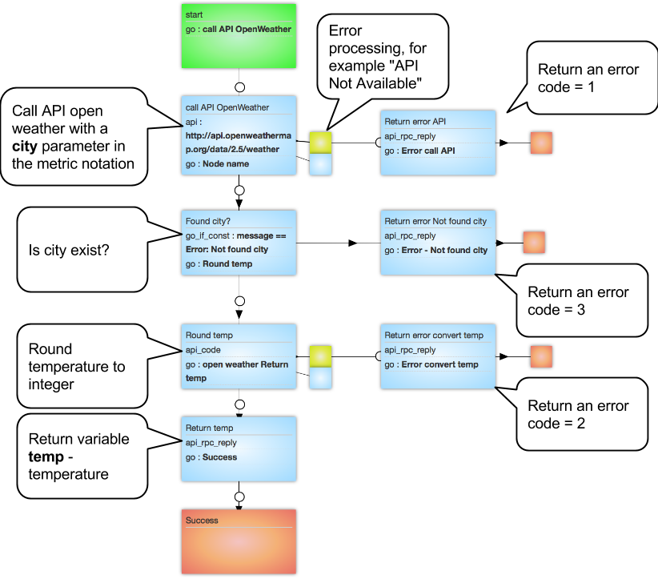

#Getting the temperature by city name

http://openweathermap.org/api - full description of API capabilities.

[Process template](https://www.corezoid.com/admin/edit_conv/136510/92753) for getting air temperature by the city name is accessible in the folder `"Examples - Open Weather"`.

###Process description

###Process testing
To start working with the process, clone the template as follows

Go to `dashboard` and click `Add task` - to add the request.

In the opened window specify the required parameter:
*   `city` - city in Latin letters. For example, London

After the parameters of the request are specified, press the button `Send task`.

As a result of process work the request will be passing along the process and then will be transferred to one of the final states (red color node):

|State|Description|Return variables|
|-|-|-|
|Success|Temperature by city name received successfully|`temp` - temperature|
|Error call API|Error of API call OpenWeather|`code` = 1 and error text|
|Error convert temp |Could not convert the resulting temperature into a number|`code` = and error text|
|Error - Not found city |Specified city is not found|`code` = 3 and error text|

