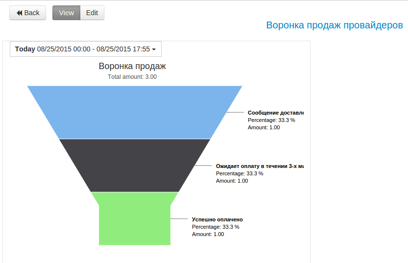

#Bonus Plus Promotions

**Promotion as part of "Bonus Plus" loyalty programm** - this is the offer from partner of "Bonus Plus" programm to client with PrivatBank card to receive increased personal rate of bonus вthe agreed terms of the promotion period in case of payment for goods/service in outlet which is specified in conditions. 

**Client connection to the promotion can be made in two ways:**
**1)**self registration of client in promotion on BonusPlus website

**2)** registrationd in promotion by client's partner. For example, partner created the promotion, registered his clients there and notified, for example, via SMS.

For registration by client's partner it is required to receive **Код акции** and **Ключ**:

Clone Bonus Plus folder. **Client's registration in promotion**

In order to register the client in promotion it is required to use "Registration in action Bonus Plus" process and trasfer next parameters:
* promo - promotions code
* phone - client's phone number (format: 38 or +38)
* key_promo - key 

Reply for RPC:
* status_promo = “Y” (client is registered in promotions)
* status_promo = “N” (client is NOT registered in promotion, main reason - client does not have PrivatBank's card)

**Receiving promotion parameters**

In order to receive promotion parameters it is required to use "Details of the action Bonus Plus" process and transfer next parameters:
* promo - promotion's code

Reply:
**url_details_ukr** - page url with promotions of client's region (ukrainian language),
**url_details_rus** - url страницы с акциями региона клиента (russian language),
**url_promo_ukr** - url to the promotion (ukrainian language),
**url_promo_rus** - url to the promotion (russian language),
**category_rus** - promotions category (russian language),
**category_ukr** - promotions category (ukrainian language),
**end_time** - time of promotion's end,
**start_time** - time of promotion's start,
**date_end** - date of promotion's end,
**date_start** - date of promotion's start,
**bonus_old** - standart bonus amount,
**bonus** - promotional bonus amount,
**name_rus** - promotion's name (russian language),
**full_name_rus** - promotion's full title (russian language),
**name_ukr** - promotion's name (ukrainian language),
**full_name_ukr** - promotion's full title (ukrainian language),
**image_new** - url to promotion's banner

**Example of registration in promotion and sending SMS to the client**

For example, "Bonus Plus" promotion's partner has his own client's base which he wants to connect to "Bonus Plus" promotion and notify the clients about that via SMS. For this, firstly, it is required to register the client in promotion, after successful registration - make communication. Example of such process in template “Example of registrationin Bonus Plus promotionand sending SMS to the client via UniSender”

not for instruction

Process **35644** - for client's registration in promotion.
Process **35645** - for receiving promotion's parameters (received parameters can be used further for communication with clients)
Example of registration in promotion and sending SMS to the client - **38727**

If all your data was transferred correctly, your clients can receive the invoice to the email:

**In case of success** some parameters can be added to the task:
* **status** - payment status
* **payment_id** - payment's id

**In case of error** task will go to the escalation nodeand the parameters will be added:

* **err_code** - error code
* **err_description** - error description

To view the sales funnel, open the dashboards in a folder with the process.

