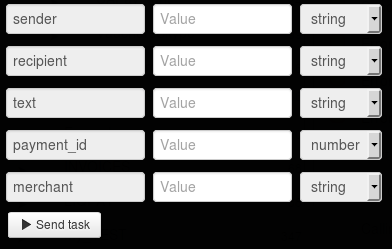

# Sms sending

To send sms, [register the merchant](https://api.privatbank.ua/api-privat24/p24registration.md) in Privat24 system.

**Privat24 Merchant** is an additional account of Privat24 which allows to make online payments in the automatic mode.
As a result of registration, you’ll get `merchant id` and `merchant password`, which allow to integrate payment and information services of Privat24 to you web-site.

Cost of sending one sms for the merchant is **UAH 0,2**.

Clone [folder "Sms sending"](https://admin.corezoid.com/folder/conv/6081) to get the process and dashboard.

Go to the process.

In the node "Calling API" add merchant password in the field "Secret key"

For testing the process, go to the mode `dashboard` and click `Add task` to add the request.

In the opened form specify parameters of the request and click on "Send task".

* `merchant` - merchant id
* `sender` - sender phone number
* `recipient` - recipient phone number
* `payment_id` - unique payment identifier assigned by merchant
* `text` - message text

Then press the button `Send task` - to send the request.

**In case of success** the following parameters are added to the request:
* `currency`  - currency of operation
* `commission` - bank commission amount for the given payment type
* `message` - extended message on payment status
* `amount` - payment amount (without commission)
* `state`  - payment state (1 - successful, 0 - rejected)
* `ref` - internal reference of payment in Privat24

**In case of error** the request goes to the escalation node with the parameter below:
* `Error` - Error description
