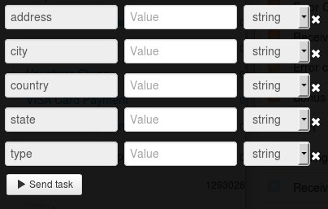

# Partners of Bonus+ Program

Clone [folder "Partners of Bonus+ Program"](https://admin.corezoid.com/folder/conv/6081) to get the process and dashboard.

Go to the process.

For testing the process, go to the mode `dashboard` and click `Add task` to add the request.

In the opened window specify:
*   `country` - country where the partner of Bonus+ Program is located. Two values are acceptable: UA (Ukraine) , RU (Russia)
*   `state` - region where the partner of Bonus+ Program is located
*   `city` - city where the partner of Bonus+ Program is located
*   `address` - address where the partner of Bonus+ Program is located
*   `type` - type of products sold by partners of Bonus+ Program

Then press the button `Send task` - to send the request.

**In case of success** the following parameter is added to the request:

* `Partners`- list of addresses of PrivatBank branches

**In case of error** the request goes to the escalation node with the parameter below:
* `Error` - Error description