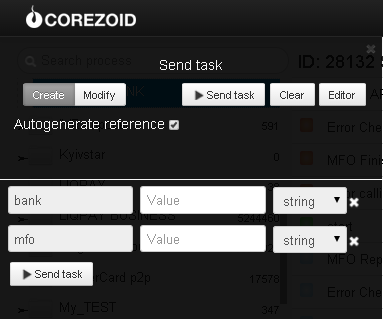

# Searching for bank by its name of MFO

Clone [folder "Searching for bank by its name or MFО"](https://admin.corezoid.com/folder/conv/6081) to get the process and dashboard.

Go to the process.

For testing the process, go to the mode `dashboard` and click `Add task` to add the request.

In the opened window specify both or one of parameters:
*   `bank` - bank name
*   `mfo` - bank MFO code

Then press the button `Send task` - to send the request.

**In case of success** the following parameter is added to the request:

* `Result`- list of addresses of PrivatBank branches

**In case of error** the request goes to the escalation node with the parameter below:
* `Error` - Error description