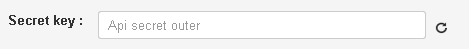

# Checking status of payment for mobile communication account recharging

Clone [folder "Checking status of payment for mobile communication account recharging"](https://admin.corezoid.com/folder/conv/6081) to get the process and dashboard.

Go to the process.

In the node "Calling API" add merchant password in the field "Secret key"

For testing the process, go to the mode `dashboard` and click `Add task` to add the request.

In the opened window specify:
*   `merchant` - merchant id
*   `payment_id` - unique payment identifier assigned by merchant

Then press the button `Send task` - to send the request.

**In case of success** the following parameters are added to the request:

* **state** - payment status:

`snd` - sent; `ok`- successful; `err` - rejected; `no` - not found.

* **message** - extended message on payment status, it may contain a description of reasons because of which the payment is rejected

**In case of error** the request goes to the escalation node with the parameter below:
* `Error` - Error description
