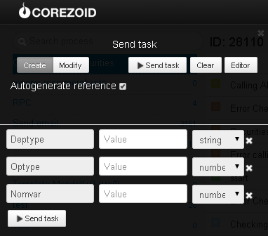

# Calculating the cost of operations with securities

**Calculation is made on operations below:**

* Operation of securities’ transfer between securities accounts opened with the Depositary institution, based on the nominal value of the block of securities;
* Operation of crediting securities account opened with the Depositary institution, based on the nominal value of the block of securities;
* Operation of debiting securities account opened with the Depositary institution, based on the nominal value of the block of securities;
* Accounting of securities on the securities account, based on the nominal value of the block of securities;

Clone [folder "Calculating the cost of operations with securities "](https://admin.corezoid.com/folder/conv/6081) to get the process and dashboard.

Go to the process.

For testing the process, go to the mode `dashboard` and click `Add task` to add the request.

In the opened window specify:
*   `Deptype` - deponent type:

**LE** – Legal entity
**IN** – Individual

*   `Optype` - type of operation:

**1** - transfer operation; **2** - crediting operation; **3** - debiting operation; **4** - securities accounting

*   `Nomvar` - nominal value

Then press the button `Send task` - to send the request.

**In case of success** the following parameter is added to the request:

* `Res`- cost of operation

**In case of error** the request goes to the escalation node with the parameter below:
* `Error` - Error description
