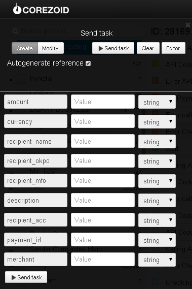

# Creation of payment in Ukraine

To create a payment, [register the merchant](https://api.privatbank.ua/api-privat24/p24registration.md) in Privat24 system.

**Privat24 Merchant** is an additional account of Privat24 which allows to make online payments in the automatic mode.

As a result of registration, you’ll get `merchant id` and `merchant password`, which allow to integrate payment and information services of Privat24 to you web-site.

Clone [folder "Creation of payment in Ukraine"](https://admin.corezoid.com/folder/conv/6081) to get the process and dashboard.

Go to the process.

In the node "Calling API" add merchant password in the field "Secret key"

For testing the process, go to the mode `dashboard` and click `Add task` to add the request.

In the opened window specify:
*   `recipient_acc` - recipient account
*   `recipient_mfo` - recipient bank MFO
*   `recipient_okpo` - recipient bank OKPO
*   `recipient_name` - recipient name
*   `amount` - payment amount
*   `currency` - payment currency
*   `description` - description of payment purpose
*   `merchant` - merchant id
*   `payment_id` - unique payment identifier assigned by merchant. It is repeated in response to the request, stored in Privat24 database, and serves for unambiguous comparison of operations on payment partner side with operations in Privat24.

Then press the button `Send task` - to send the request.

**In case of success** the following parameters are added to the request:

* `state`- payment state (1 - successful, 0 - rejected)
* `ref` - internal reference of payment in Privat24 assigned in the banking system. Payment identifier in Privat24. (In case the payment is rejected, the field is left blank)
* `message` - extended message of payment status which may contain a description of the reasons because of which the payment was rejected
* `commission` - bank commission amount

**In case of error** the request goes to the escalation node with the parameter below:
* `Error` - Error description
