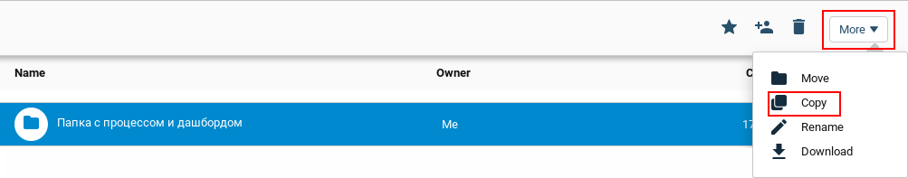
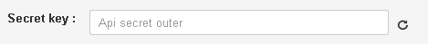
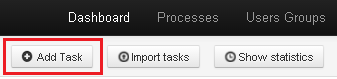
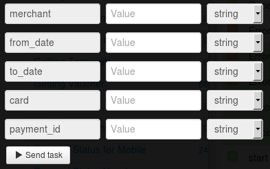

# Individual merchant account statements

To get the statement, [register the merchant](https://api.privatbank.ua/api-privat24/p24registration.md) in Privat24 system.

**Privat24 Merchant** is an additional account of Privat24 which allows to make online payments in the automatic mode.

As a result of registration, you’ll get `merchant id` and `merchant password`, which allow to integrate payment and information services of Privat24 to you web-site.

Clone [folder "Individual merchant account statements"](https://admin.corezoid.com/folder/conv/6081) to get the process and dashboard.

Go to the process.

In the node "Calling API" add merchant password in the field "Secret key"

For testing the process, go to the mode `dashboard` and click `Add task` to add the request.

In the opened window specify:
*   `from_date` - beginning of the period (dd.mm.yy)
*   `to_date` - ending of the period (dd.mm.yy)
*   `card` - card number
*   `merchant` - merchant id
*   `payment_id` - unique payment identifier assigned by merchant.

Then press the button `Send task` - to send the request.

**In case of success** the following parameters are added to the request:

* `Result`- merchant account statements

**In case of error** the request goes to the escalation node with the parameter below:
* `Error` - Error description
