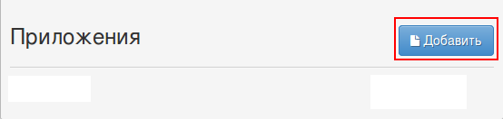
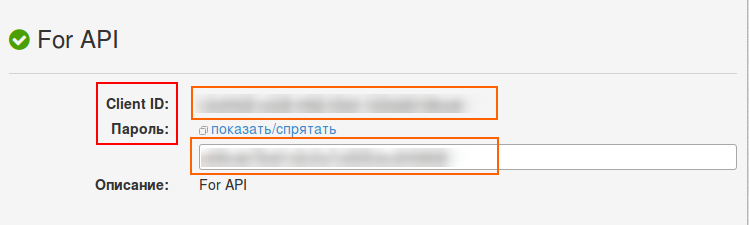
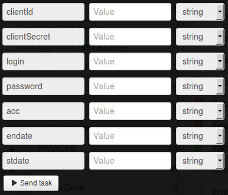

# Merchant legal entity account statements

To get access to this service, log in on the page https://link.privatbank.ua/console/auth/p24business/start.

Add new application:

and get **clientId** and **clientSecret**. 

Clone [folder "Merchant legal entity account statements"](https://admin.corezoid.com/folder/conv/6081) to get the process and dashboard.

For testing the process, go to the mode `dashboard` and click `Add task` to add the request.

In the opened window specify:
*   `clientId` - customer id obtained after adding the application
*   `clientSecret` - customer password obtained after adding the application
*   `login` - Privat24 login for business
*   `password` - Privat24 password for business
*   `acc` - account number
*   `stdate` - starting date (e.g.: 04.04.2013)
*   `endate` - ending date (e.g.: 04.04.2013)

Then press the button `Send task` - to send the request.

**In case of success** the following parameters are added to the request:

* `Result`- merchant account statements

**In case of error** the request goes to the escalation node with the parameter below:
* `Error` - Error description
