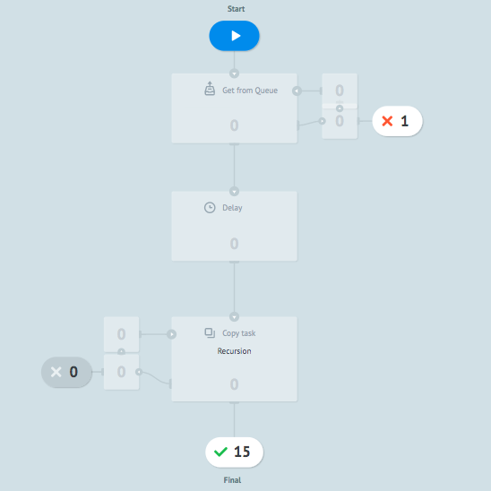

# Creating and Managing a Request Queue

With Corezoid, you can set up and process request queues.
A request queue may serve as interlink among various processes in your applications, for example, receipt of orders and their subsequent processing.

There are 2 nodes for operating queues in Corezoid: **Queue and Get from Queue**.
1. A **Queue** node provides for creation of a request queue.
2. A **Get from Queue** node provides for getting requests from the queue for reading.

Within this tutorial, we are going to build 2 processes:

1. A **Tasks Queue** process which will receive requests and save them in the queue.
2. A **Get tasks from Queue** process which will take each request from the queue of the **Tasks Queue** process and deliver it for reading.

### Receiving and arranging requests in a queue

1. Create a **Queue** folder

    

    1.1. Go to the folder and create a process named **Tasks Queue** which will collect requests to be arranged in a queue.

    

    1.2. In the created process, add a **Queue** node which will create a queue of requests

    

    After the **Queue** logics is enabled, your process can accumulate requests from other processes for their subsequent processing.

   

    1.3. To test operation of the **Queue** node, go to the **View** mode 
 
    1.4. Click the **New task** button
 
    1.5. For example, make a request with the following parameters:
    ```    
    {
        "id": "1",
        "name": "John",
        "phone": "+3801234567"
    }
    ```
    1.6. Click the **Add task** button

    

    1.7. After the request is sent, click **Queue** to see the contents of the node

    

    1.8. Create more test requests to get a clear view of how the queue is collected (for example, 15 items).

   

Thus, you have got a ready-to-use process for collecting requests you want to see in the queue (the **Queue** node).
 
### Getting requests from the queue for processing

1. Now that you have a process with a node for queue collection, it is necessary to set up a process of getting requests from the queue to read them. To do this, create a process named **Get tasks from Queue** 

    1.1. In the created process, add a **Get from Queue** node which will get requests from the queue.

     

    1.2. After the node is added, click it and in the ***Process*** field of the **Basic settings** section, select a process where your queue is stored. In our case, this process is called **Tasks Queue**. 
 
    1.3. Click the **Node** field. In the appeared window, select the **Queue** node where the queue is stored. 
 
    
 
2. Test operation of the process for getting requests from the queue. To do this, go to the **View** mode. 
 
    2.1. Click the **New task** button.
 
    2.2. In the **Task** window, click the **Add task** button
 
    2.3. If the request queue management process is activated correctly, you can view a request from the **Queue** logics when you click the **Final** node.

     

3. Thus, you have processed one request from the queue. However, there are still 14 requests that remain in the queue of the **Tasks Queue** process. To process the remaining requests, you should set up a cycle in the **Get tasks from Queue** process.
 
    3.1. To set up the cycle, add a **Delay** node next to the **Get from Queue** node and set a timer for 30 seconds. Thereby you will set a schedule of processing 1 request each 30 seconds.
 
    3.2. Add a **Copy task** node named **Recursion** after the **Delay** node
 
    3.3. In the ***Process*** field of the ***Basic settings*** section, enable the **Get from Queue** process so that a new request is created in the process as soon as the current request gets to the **Final** node. Each time a new request is created, the **Get from Queue** node will apply to the **Tasks Queue** process and take 1 request from the queue.

     
 
    3.4. To launch the cycle for reading requests from the queue, go to the **View** mode
 
    3.5. Click **New task**
 
    3.6. Click **Add task**
 
    3.7. After the entire queue is processed, you will see the final node being filled with requests and an error request in the **Get from Queue** node.

    

    3.8. Click the node with error where you will see a ```not_found_task```  message in the ```__conveyor_get_task_return_description__``` parameter, which indicates that there are no requests left in the queue process.
 
4. To prevent your queue processing cycle from stopping and to ensure processing of new requests if appear, add the following condition in the ***Condition*** : if ```__conveyor_get_task_return_description__ == not_found_task``` , the request should not be transferred to the **Error** node.
 
    
 
    4.1. Attach the **Delay** node to the new condition.
 
    4.2. In the **Delay** node, set a timer for the next reading of the queue, for example, for 1 hour.
 
    4.3. Attach the **Delay** node to the **Copy task** node.

     

**Congratulations!** You have set up the process with a cyclic check for the presence of requests in the queue and getting them from the queue for reading. 
 
 


