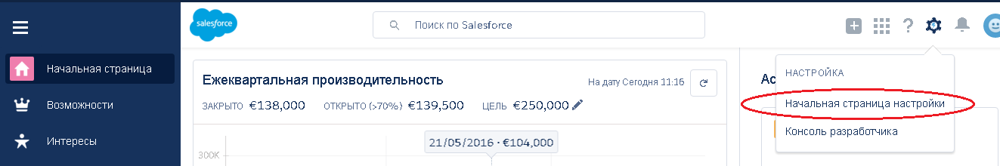
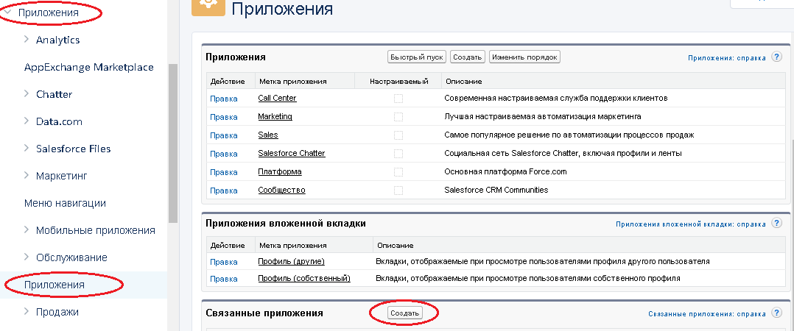
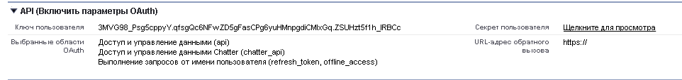
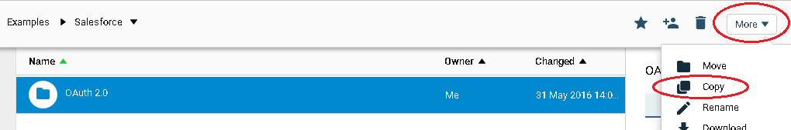
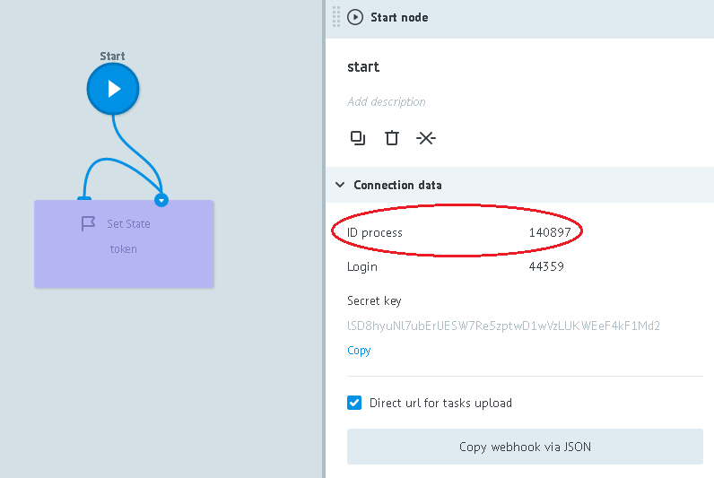
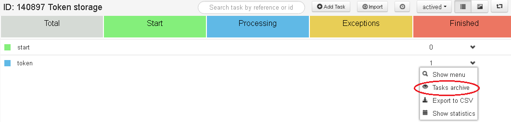
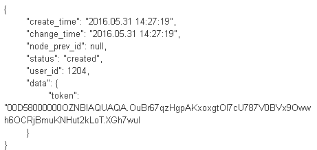

# OAuth 2.0

Register in [developer's community Force.com](https://developer.salesforce.com/signup).

Go to the first page of settings 



Create a linked application:



* Fill out forms: `Name of linked application`, `Contact email address`
* Next to `Enable OAuth parameters` add "tick"
* In `Callback URL-address` field, add callback URL of your applications
* In `OAuth selected areas` add all available
* Press `Save`

You will get **client_id** (user key) and **client_secret** (user's secret).



##Authorization code receiving

In order to receive authorization code, add request to address bar of the browser and follow the link: 

```
https://login.salesforce.com/services/oauth2/authorize?response_type=code&client_id={{client_id}}&redirect_uri={{callback_url}}
```

where,

`{{client_id}}` - user key of your application

`{{callback_url}}` - callback URL of your application

For example,

```
https://login.salesforce.com/services/oauth2/authorize?response_type=code&client_id=
3MVG9lKcPoNINVBIPJjdw1J9LLM82HnFVVX19KY1uA5mu0QqEWhqKpoW3svG3XHrXDiCQjK1mdgAvhCscA
9GE&redirect_uri=https://www.mysite.com
```

User who confirmed access, is redirected to URL specified in redirect_uri parameter with authorization code value in request string. 

For example,

```
https://www.mysite.com/code_callback.jsp?code=aPrxsmIEeqM9&state=mystate
```

The user who confirmed the right to access at least once, will not have to confirm this right again.

##Receiving access_token OAuth 2.0

**Clone ["OAuth 2.0" folder](https://admin.corezoid.com/folder/conv/94689)**




**Run the [Get token](https://admin.corezoid.com/editor/94690/140896) process**

For this:

 - Go to `Debug` mode

 - press `Add task` button.

 - in appeared window, specify required parameters:
*   **callback_url** - callback URL of your application
*   **client_id** - user key of your application
*   **client_secret** - user's secret of your key
*   **code** - authorization code , received in browser

 - after all parameters are specified, press `Send task` button.


##Using access_token OAuth 2.0

In ["OAuth 2.0" folder](https://admin.corezoid.com/folder/conv/94689) there's [Get token](https://admin.corezoid.com/editor/94690/140896) process located and state diagram [Token storage](https://admin.corezoid.com/editor/94690/140897).

`Get token` receives access_token and transfers it to the "Token storage" state diagram.

`Token storage` keeps access_token, which allows to receive it from other processes using construction:

        {{conv[{{diag_id}}].ref[token].token}}

where,
**diag_id** - your state diagram id. For example,

        {{conv[140897].ref[token].token}}


To receive state diagram ID, click on its start node.

All system information will be available in the right side bar.



To make sure that access_token is received, go to `Debug` mode of state diagram [Token storage](https://admin.corezoid.com/editor/94690/140897)

Press `Tasks archive` of `token` node


You will see a received token inside of request.

