# BitcoinBot

* [App ID and Webhook](#appid)
* [BitcoinBot creation](#bitcoinbot)
* [Webhook sets up](#webhook)
* [What BitcoinBot does](#do)
* [Testing and launch](#test)

###  App ID and Webhook {#appid}

1. Create the app in [Microsoft Bot Framework](https://dev.botframework.com/).
2. Go to **"Register a bot"** tab and register your bot.You can get extra info about bot registration in [Documentation](https://docs.botframework.com/en-us/skype/getting-started/#navtitle) tab.
3. Get your personal **Microsoft App ID** application key and **client_secret** password.
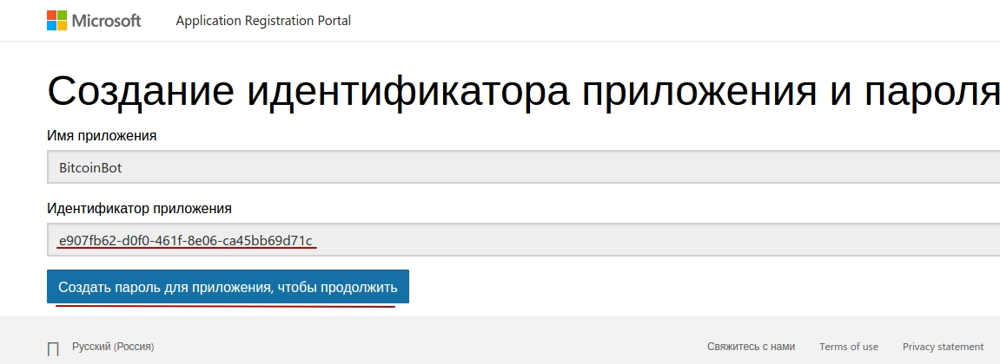

4. Put the received url of WEatherBot process, in **"My bots"** tab, in **Messaging endpoint** field. Instruction how to get webhook-url is [here](#webhook).
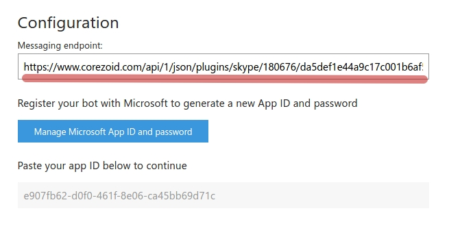

5. Publish your bot by pressing button "Publish".

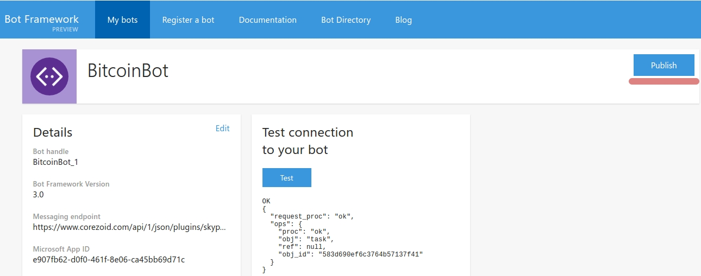

After bot creation you need to publish it, because otherwise the amount of visitors could be limited. 

Pay attention, after bot publication there's a need to disable  using of bot  in group chats.


### BitcoinBot creation {#bitcoinbot}

Clone [the folder "BitcoinBot" with processes](https://admin.corezoid.com/folder/conv/121755).
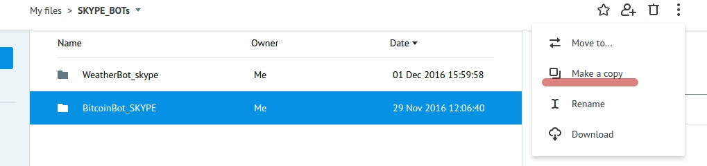

In ```"Skype_sender" process```, in ```Set skype_authorization``` node, in variable value 
**skype_authorization** - put such construction 

```
{{conv[{{process_id}}].ref[{{ref}}].parameter_ID}}
```

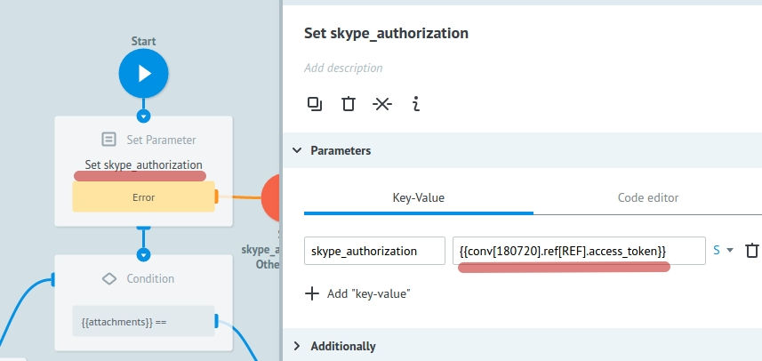

```"Skype authorization" process``` designed to receive **access_token** for Skype API and, as far as expiration time of the key is 3600 sec, so after this expiration time process renews it and transfer valid access_token in ```"Skype storage" state diagram```.

 Using such construction as 
 ```
 {{conv[{{process_id}}].ref[{{ref}}].parameters_ID}}
 ```
 we make a request to "Skype storage" state diagram and receive access_token.
 
 ```Main_skype process```
 receives all messages, that coming to Bot's chat and first of all  defines some action of user. For example, if user add Bot to his contacts, then process sends a greeting message to user. 
 Also, process defines bot's removing action and sends it to ```Bot removed.``` node. 
 
Next, when user sends the message, Main_skype process is trying to renew request in BitcoinBot_SKYPE process and if there is no such request, it is creating new one with reference, equal to (```{{skype_msgs.conversation.id}}```) chat ID.   

Thus we continue to chat with user in unique chat id - - ```{{skype_msgs.conversation.id}}```.


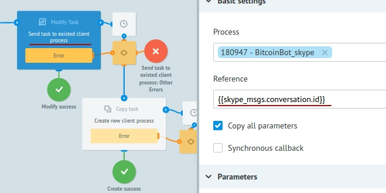
  
Requests come in ```BitcoinBot_SKYPE process``` from Main_skype process (with refrence equal to chat ID). If the user send start command then firstly he gets a message with currency select offer.

It allows to get updates (new commands or messages from user to bot's chat) from Main_skype process, where the request is in the [CALLBACK logic](https://doc.corezoid.com/en/interface/nodes/callback.html) node. So, after sending a message with currency select offer, request goes into waiting of this choice.


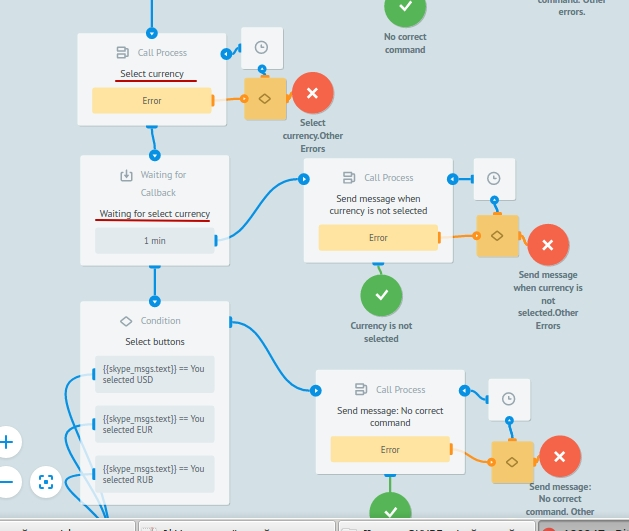

If the choice is not made in 1 minute (request will not be updated from Main_skype process), then we will send a timeout message - "Time expired. Try again. Please write start".

If the currency selection was made, we offer user to choose which currency will be shown - buying or selling and wait again in CALLBACK node.   
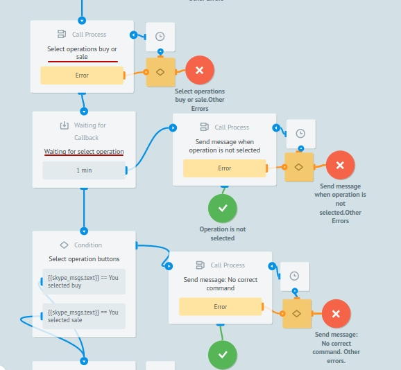

The same if there is no appropriate selection, the timeout message will be sent.

If choice is made, we get the currency and send it in message.

And ```"Skype_sender" process``` sends messages in Skype.

Both processes (Main_skype and BitcoinBot_SKYPE) request to it through [RPC logic](https://doc.corezoid.com/en/interface/nodes/rpc/logic_rpc.html).


 
### Webhook sets up {#webhook}

Connect ```Main_skype process``` to Skype using webhook-url. To get webhook-url of process, select "Connect to messenger":


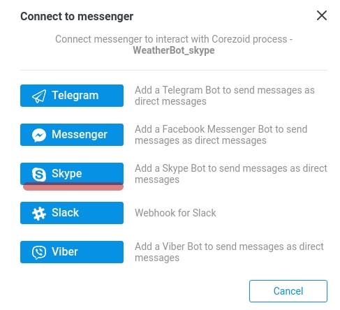

Receive webhook-url of BitcoinBot process for SKYPE.

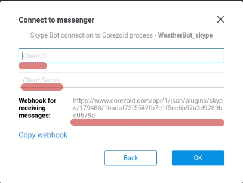

In **Client ID** empty field put your personal code for **Microsoft App ID** application, the one that you received while Bot creation.
In **Client Secret** field put your password for application.

Specify received webhook-url of process in settings of your bot in **My bots** tab, in **Messaging endpoint** field. More details [here](#appid).


### What BitcoinBot does {#do}

BitcoinBot for new contacts sends information about bot to ```Send info about bot.``` node.

Sends message of currency selection by start command. 

After selection of currency for getting converting rates, BitcoinBot makes a request to API blockchain and sends a message with buy and sell currency in selected currency. 

BitcoinBot sends appropriate message in case of getting uncertain command and in case of error in process.


### Testing and launch{#test}

Just add your Bot to Skype by [link]( https://join.skype.com/bot/e907fb62-d0f0-461f-8e06-ca45bb69d71c) of from [bot's catalog](https://bots.botframework.com/) (if bot is published) and start chat.

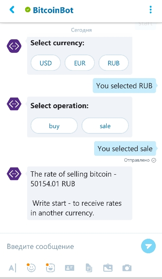


Switch to **View** or **Debug** mode to see request flow, its origin and process nodes  distribution.
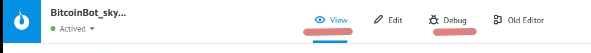


