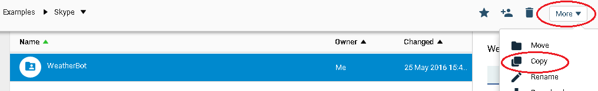
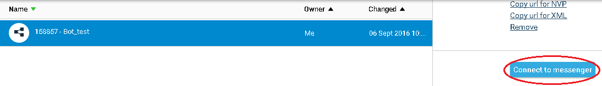
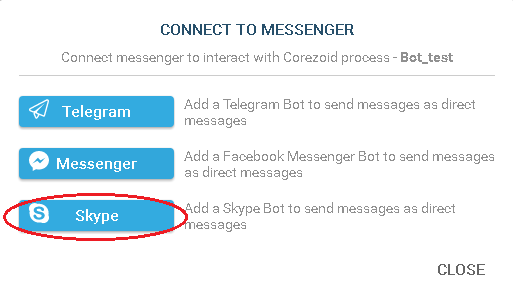
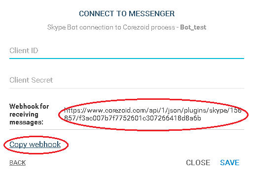
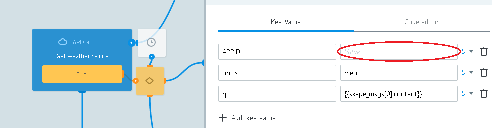
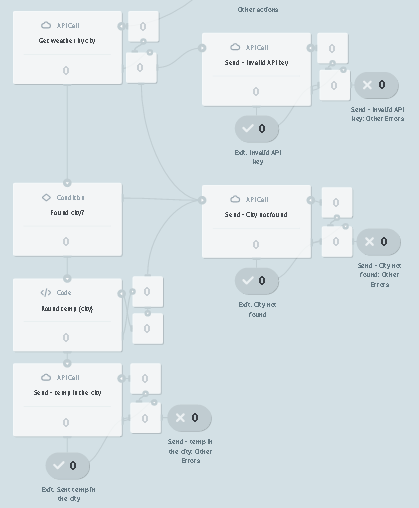

# Skype - Weather bot

Clone ["WeatherBot" folder](https://admin.corezoid.com/folder/conv/94465)




Folder contains [WeatherBot](https://admin.corezoid.com/editor/94465/140307) process. It accepts webhooks.

Sends information about Bot to the new contact.

Receives air temperature by city name and sends a message.

In case if message does not contain city name or city is specified incorrectly, also if there is some error in process, bot sends appropriate message.

Also WeatherBot defines bot remove action and sends to ```Bot removed.``` node.

### Webhook{#webhook} set up

**1)** [Create the app](https://apps.dev.microsoft.com/#/appList). Receive `AppID` and `AppSECRET`.

**2)** Connect WeatherBot process to Skype Bot by specifying `AppID` and `AppSECRET` of your application




**2)** Receive WeatherBot process url for Skype Bot


(if `AppID` and `AppSECRET` are specified correctly) in your Corezoid account will be automatically added `Skype token` folder with two processes - `Get token` and`Get token`

> After successful connection 

> `Get token` - receives access_token for Skype API and renews it after expiration date, transfers valid access_token to Token storage state diagram.

> `Skype Token` - state diagram is designed for receiving access_token through construction:

        {{conv[{{diag_id}}].ref[{{ref}}].parameter_ID}}


**3)** [Create a bot](https://dev.botframework.com/bots)

In `Microsoft App ID` field, specify `AppID`.

In `Messaging endpoint` field - received url of WeatherBot process.

**4)** Publish your Bot (button `Publish`)

> In order to make your Bot puclic, you need to follow the [guideline](https://developer.microsoft.com/en-us/skype/bots/docs/review-guidelines) and [agreement](https://developer.microsoft.com/en-us/skype/agreement).
And also specify the links to your `Privacy statement` and `Terms of service`.

### Integration with OpenWeatherMap{#map}

For user's comfort, we added a test access key for OpenWeatherMap API to ["WeatherBot" template](https://admin.corezoid.com/folder/conv/94465). To get your access key for OpenWeatherMap API, follow [link](https://home.openweathermap.org/users/sign_in) and register.


In `Get weather by city` node replace test OpenWeatherMAP API key by the one you received in **APPID** parameter's value. 


### Testing and launch{#test}
Just add your Bot to Skype by [link](https://join.skype.com/bot/e0a994fb-d527-4122-a92b-b91ae55910c2) or from [bot's catalog](https://bots.botframework.com/) (if bot has been published) and start chatting.


Switch to **View** or **Debug** mode  to see request flow, their transit and process nodes distribution. 


>As long as your Bot is not published (Status = In review), its functionality is available for the limited amount of users.
