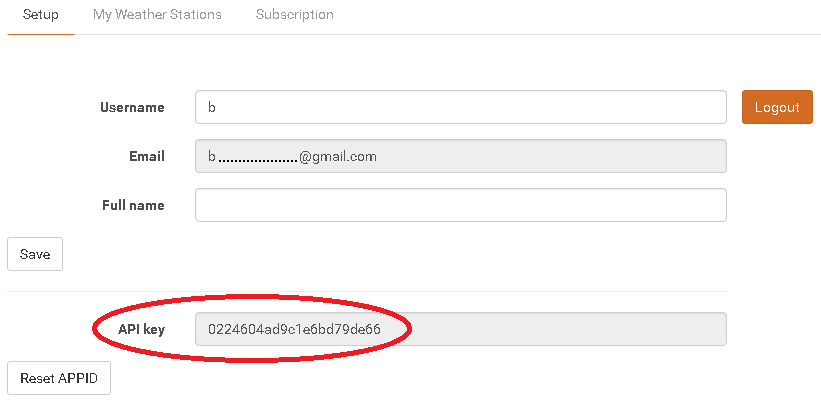
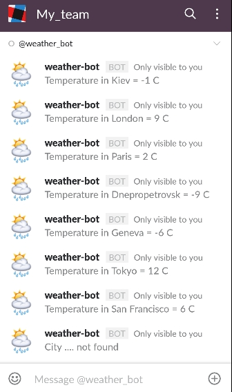

# WeatherBot in Slack

* [Authorization in SLACK](#auth)
* [Url, Slash commands and Webhook](#url) 
* [WeatherBot creation](#weatherbot) 
* [Webhook sets up](#webhook)
* [What WeatherBot does](#do) 
* [Integration with OpenWeatherMap](#map) 
* [Testing and lunch](#test) 

### Authorization in SLACK {#auth}  

1. Create your Slack Team by the [**link**](https://slack.com/)**.**
2. Put your email and press
   **Create New Team**
   . You will receive a confirmation code to the specified email.
3. After this, follow next steps and you will create your **Team domain**.

Next, you can send invitation by specified email to those with whom you want to talk in your team with or invite by pressing **+Invite people** to application.

### Url, Slash commands and Webhook {#url}

1.Then go to [Slack API](https://api.slack.com/)-  select **Start building custom integration**:

Then select **Set up an incoming webhook-Add Configuration**

2.Create new Channel or select from offered list \(two channels by default - \#general and \#random\):

3.You receive Webhook URL, that helps to send messages in Slack from any service

4.Select **Set up a slash command-Add Configuration** and put into field command name  that starts from "/", for example, /weather

When user puts "/weather" command, Slack sends a request to set up URL-address and wait for reply from service by this URL

5.Then, put received webhook to the form [here](#webhook), fill out other forms and press **Save Integration.**

Slack also allows to create your **Bot Set up a bot user- Add Configuration** and specify his username:

Fill out **Integration Settings** for Bot - his short description, what he can do, icon etc. Then you can invite your bot to the channel in settings:

But in this example we used **Slash commands** for our Bot's creation. It can be used for conversation with friend or any \#channel.

### WeatherBot creation {#weatherbot}

Clone ["WeatherBot"](https://admin.corezoid.com/folder/conv/121879) process

In "WeatherBot\_SLACK" process, in Set APPID\_key node, in variable's value:

* APPID - put access test key of OpenWeatherMap API.
  

### Webhook sets up {#webhook}

Connect WeatherBot process to SLACK using webhook-url. In order to get webhook-url of WeatherBot process, select "Connect to messenger":

You will get webhook-url of WeatherBot process for SLACK for Slash Commands or Event Subscriptions. In this case, we select webhook for Slash Commands:

Specify received process' webhook-url in Integration Settings for Command in URL field, more detailed description is [here](#url).

### What WeatherBot does {#do}

WeatherBot - receives webhook-s with city name, receives air temperature by it and sends a message

In case if message does not contain city name or city is not specified correctly and also if the process has a mistake, sends an appropriate message.

### Integration with OpenWeatherMap {#map}

For user's comfort there was test access key for OpenWaetherMap API added to template ["WeatherBot"](https://admin.corezoid.com/folder/conv/121879).

In order to receive your access key for OpenWeatherBot API, go to the [link](https://home.openweathermap.org/users/sign_in) and register.

In "Set APPID_key" node replace test key for OpenWeatherMap API by received one in APPID parameter value.

### Testing and Launch {#test}

Just add your friends to your Slack team and start chatting with any friend or in any \#channel with /weather \[city name\] command.

You can use Bot in Slack mobile app:

Go to **View** or **Debug** mode in order to see request flow, their moving and distribution by the process nodes.

