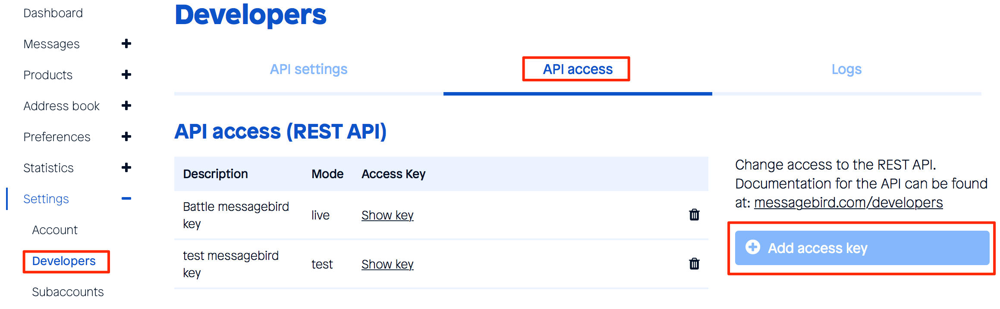
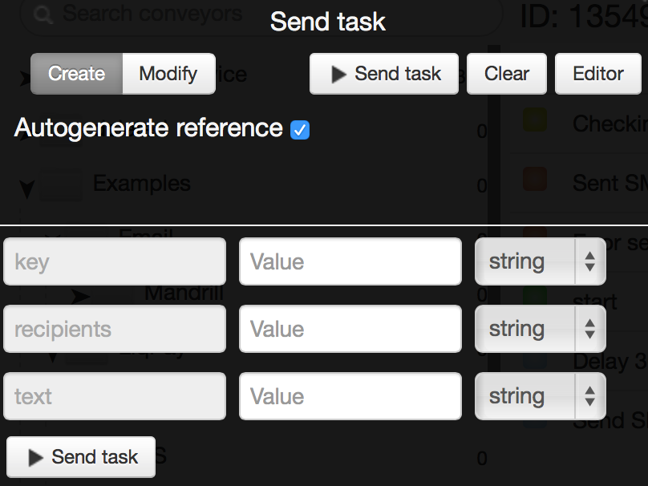

# MessageBird

[https://www.messagebird.com](https://www.messagebird.com)

Register online [https://www.messagebird.com/app/en/sign-up](https://www.messagebird.com/app/en/sign-up)

You only need to specify upon registration:
-   email
-   login
-   password

After registration, go to
`Settings - Developers - API access` and through the button `Add access key`, add the two keys:
-   `live` for real SMS sending.
-   `test` for testing. SMS will not be sent.

[Clone process template](https://www.corezoid.com/admin/edit_conv/14546) for sending SMS via API MessageBird.

Switch to the `dashboard` mode and click on `Add task` - for sending the request.

Then select in the opened window:
*   `key` access key to API, which we generated before
*   `recipients` phone number(s) of SMS recipients
*   `text` SMS text

After the parameters of request are specified, click on `Send task`.

You can find the full list of available parameters API MessageBird here: [https://www.messagebird.com/developers#messaging-send](https://www.messagebird.com/developers#messaging-send).
