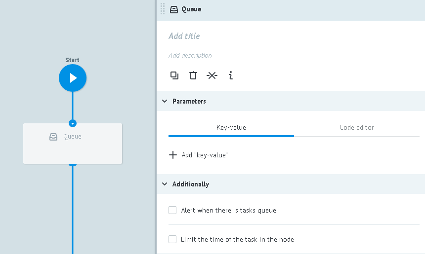

# QUEUE logic

**QUEUE Logic** allows storing tasks (create a queue of tasks) in that node to which it is added.

The tasks may be stored in the queue before occurrence of two circumstances:
* before the request for their release from the GET TASK Logic queue
* before firing of TIME Logic, provided that it was added to the node with QUEUE Logic

**Upon release from the queue:**

**1)** the task moves to the next node and continues in the process with the help of GO Logic

**2)** calling task will be added with the following parameters:

* `__queue_task_id__` - ID of the task from the node with QUEUE Logic
* `__queue_task_data__` - json object of the task parameters from the node with QUEUE Logic

Using the button **Add Param** the object `__queue_task_data__` may be added with new parameters which were not stored in the task from the node with QUEUE Logic.

