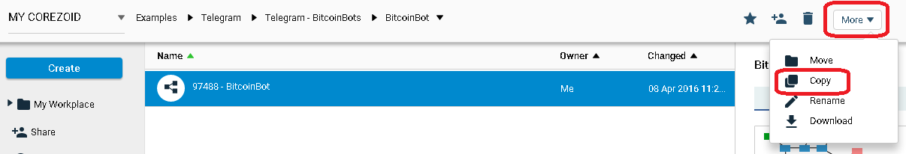
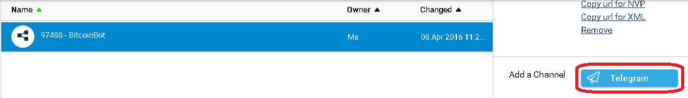
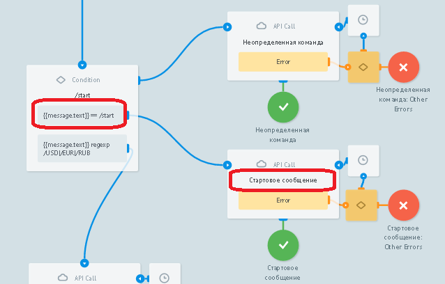
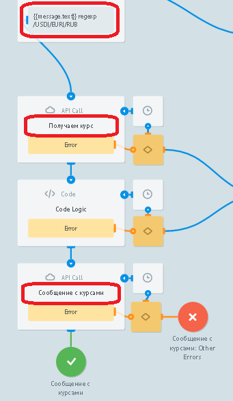
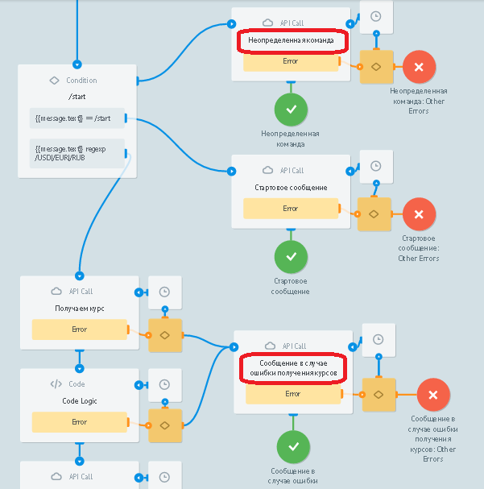
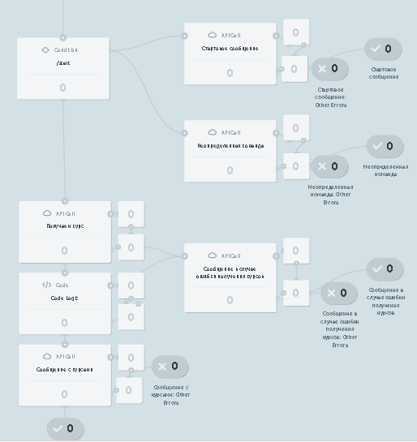

# BitcoinBot

Clone ["BitcoinBot" template](https://admin.corezoid.com/folder/conv/59749)

Connect to Telegram by specifying your Bot's key

To receive Bot's key there's a need to send `/newbot` command to the chat with BotFather. Then specify name and bot's user name. You will got:

##What BitcoinBot does 

By `/start` command it sends message with Bot's information to chat

After choosing the currency to receive bitcoin convertation rates, it makes a request to blockchain API and sends a message with purchase and sell rate in selected currency.

Sends appropriate message, in case if  uncertain command was received and if the error appears in process.

##Testing and launch

Just add your Bot to Telegram and start chat.

Go to `View` or `Debug` mode,

to see task flow, their moving and distributing by process nodes.

