# BitcoinBot (multistage)

Clone ["BitcoinBot (multistage)" folder](https://admin.corezoid.com/folder/conv/59748)

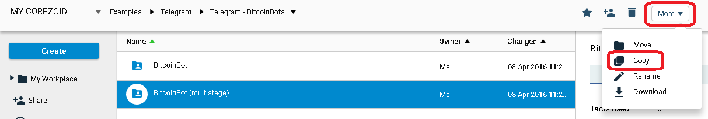

Connect Main (major) process to Telegram by specifying your bot's key

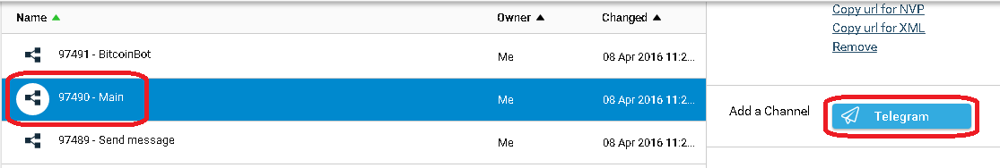

After receiving bot's key there's a need to send `/newbot` command to a chat with BotFather. Then specify the name and Bot's user name. You will get:

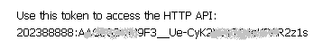

##How does multistage BitcoinBot work

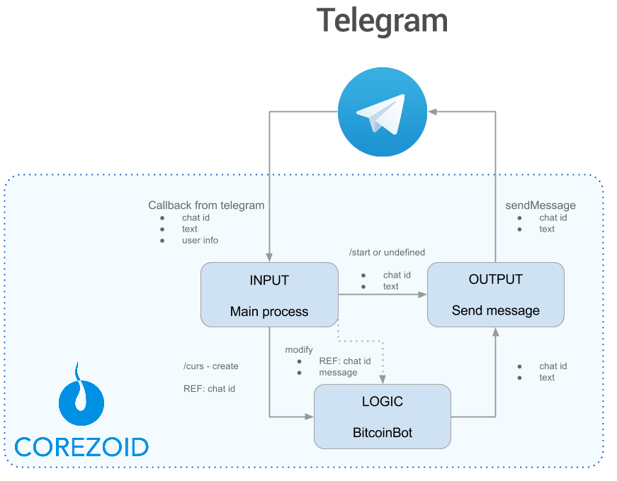

**Main process**

Receives all messages that are coming to Bot's chat and firstly will try to renew the task in BitcoinBot process.

Renew task in BitcoinBot = continue chat with user within unique ID chat.

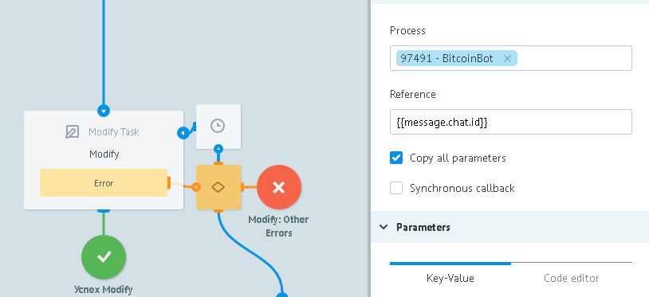

It becomes possible because of creation of new request to BitcoinBot process when user sends `/curs` command. This request is created with reference equal to chat's ID (`{{message.chat.id}}`).

If we are upgrading an application for such a chat id and it was not found, then we do not have an open dialogue in this chat - no request process BitcoinBot. Then, verify which command is received from user.

In case of receiving `/start` command, we send message with Bot's information. In case of receiving `/curs` command - create request in BitcoinBot process (as it was described above).

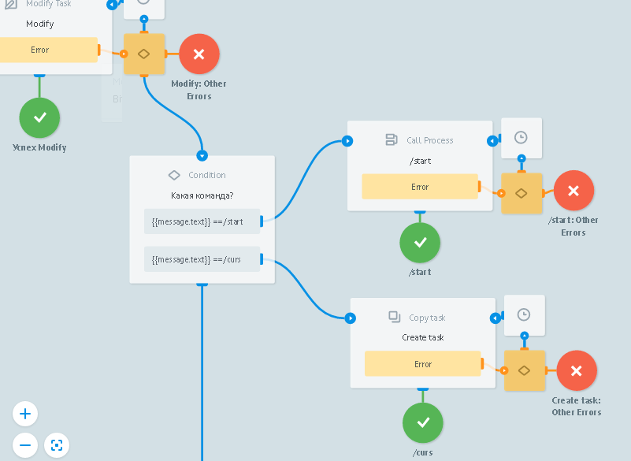

If there's received something different from `/start` or `/curs`, define command and alert the user about it with appropriate message.

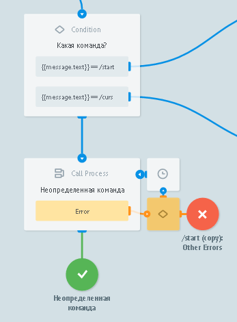

**"BitcoinBot" process**

Here come the requests from Main process if the user sent `/curs` command and firstly there's a message sent with offer to select currency.

>Don't forget that request reference in this process is unique chat ID.

It allows to receive updates (new commands or messages from user to Bot's chat) from Main process, when request  is in the node with [CALLBACK logic](https://doc.corezoid.com/en/interface/nodes/callback.html).

So, after sending message with offer to choose the currency, request goes into waiting for this choice.

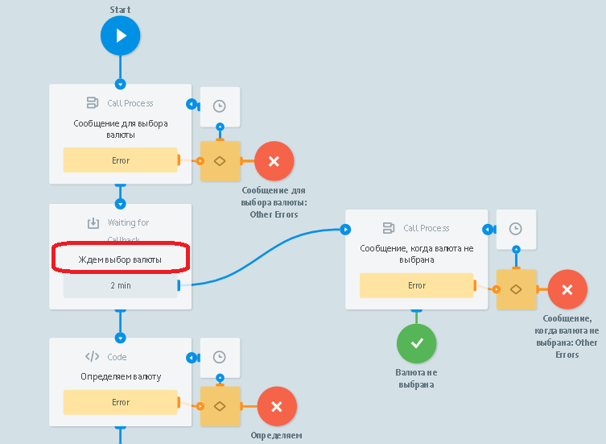

If the choice will not be made in 2 minutes (request will not be renewed from Main process), then we will send message about waiting time expiration.

If the currency selection was made , we offer for user the rate to show - purchase or sale and wait again in CALLBACK node.

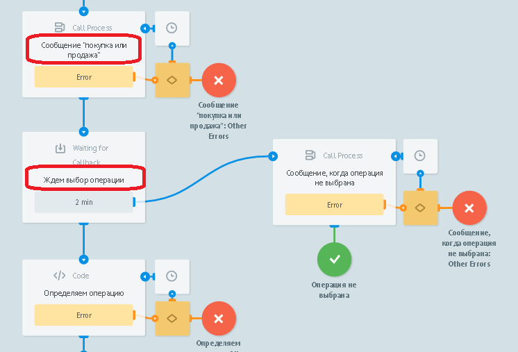

As well as if there are no appropriate selection, we will send a message about waiting time expiration.

If the choice is made, we'll receive rates and send them in message.

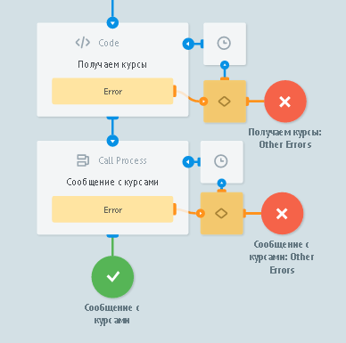

**"Send message" process**

Sends messages to Telegram.

Both process (Main and BitcoinBot) refer to it through [RPC logic](https://doc.corezoid.com/en/interface/nodes/rpc/logic_rpc.html).

##Testing and launch

Just add your bot to Telegram and start chatting.

Go to `View` or `Debug` mode,

to see request flow, its moving and distributing by process nodes.

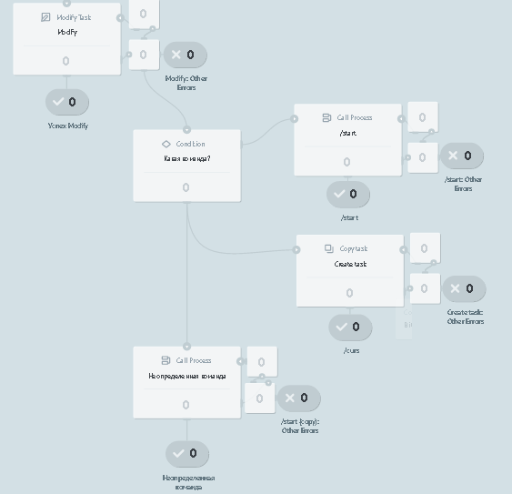
