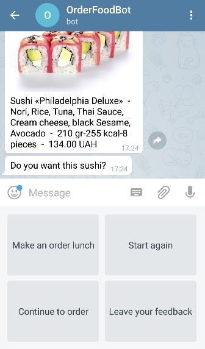

# OrderFoodBot

**OrderFoodBot** in **Telegram** allows ordering food online and see the order statistic in real time mode.

Clone [folder with processes "Telegram_OrderFoodBot"](https://admin.corezoid.com/folder/conv/5837).

Connect **Main** (primary) process to Telegram, by specifying your Bot key:

To receive Bot's key you need to send `/newbot` command into the chat with **BotFather**. Then, specify the name and Bot's user name. You will get:

It is required ti specify the key of your Bot - **telegram_token** in **Main** process, in `Set tokens` node.

## Process description

**Main process**

Receives all messages coming to the Bot's chat and firstly tries to renew task in **OrderFoodBot** process.

Renew task in **OrderFoodBot** process = continue chat with user within unique chat ID.

It becomes possible due to creation of new task in **OrderFoodBot** process, when user sends `/food` command or by pressing buttons `Start again`, `Continue to order`.

This task is created with reference equal to chat ID (`{{message.chat.id}}`).

If nothing was found when updating the application for the chat id, then we still do not have an open dialogue in this chat - no task in **OrderFoodBot** process.

Then check which command was received from user:

* if received `/start` - send message with information about Bot.

* if received `/food`, it was the push of a `Start again` button or `Continue to order`- create task in **OrderFoodBot** process (as described below).

* if you received something different from `/start`,`/food`, `Start again`, `Continue to order`, `Make an order lunch`, `Leave your feedback` define command and notify user about this with appropriate message.

Successful choice of pizza or sushi and orders are transferred to the State Diagram [**Storage orders**](https://admin.corezoid.com/editor/127302/213150) through [Modify task logic](https://doc.corezoid.com/en/interface/nodes/logika_modify_task.html) for getting order statistic.

**OrderFoodBot process**

Tasks from **Main** are coming to this process if user sent `/food` command and firstly there's a message sent with offer to choose the food (pizza or sushi).

Remember, task reference in this process is unique chat ID `{{message.chat.id}}`.

This allows to receive updates (new commands or messages from user to Bot's chat) from **Main** process, when task is in the node with [CALLBACK logic](https://doc.corezoid.com/en/interface/nodes/callback.html).

So, after sending messages with offer to select food, task will wait for this choice.

If the choice is not mode in 2 mins (task will not renew from **Main** process), then send a message about waiting time expiration.

If the operation choice is made was made, we offer the user to choose the type of pizza or sushi.

After every offer to the user, we are waiting in nodes with CALLBACK and just like that, if there is no appropriate choice, we send a message about waiting time expiration.

If there was a `/food` command and food choice was made, send a message with offer to make and order, start over, continue making orders or leave a feedback.

**Send message process**

Send messages and photos to the Telegram.

Both **Main** and **OrderFoodBot** processes apply to this through [Copy task logic](https://doc.corezoid.com/en/interface/nodes/copy.html).

**State diagram** [**Storage orders**](https://admin.corezoid.com/editor/127302/213150)

Storing and distributing orders by states:

* order made -"ordered pizza","ordered sushi"
* waiting 2 minutes for order confirmation - "waiting for ordering pizza","waiting for ordering sushi"
* order was not made - "Pizza wasn't ordered for 2 min", "Sushi wasn't ordered for 2 min"
* feedback received from client - "feedback received"

## Testing and launch

Just add your Bot to Telegram and start chat with `/start` command.

After food selection, you will be offered to create order or to continue or to start creating new order and also to leave a feedback:

Go to `View` mode of [**Main**](https://admin.corezoid.com/editor/127302/213149) process or [**Storage orders** ](https://admin.corezoid.com/editor/127302/213150), to see request flow, its movement and distributing on process nodes.

Go to [**Dashboard orders**](https://www.corezoid.com/admin/view_dash/79533/127302) to see statistic of orders in real time mode:

