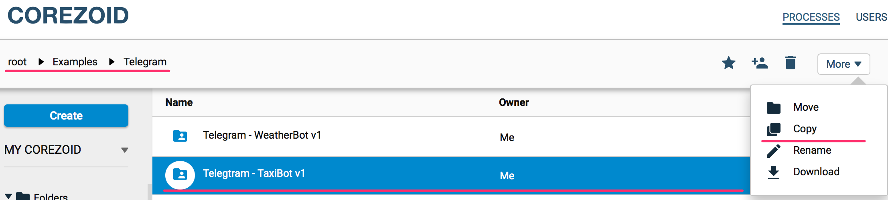
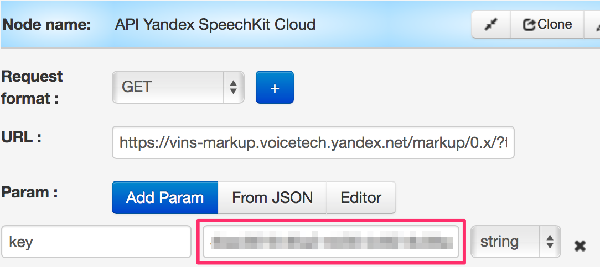

# taxiBot - template for taxi order

1.   Copy bot to your account
2.   Requirements for API taxi
    *   API Calculate the cost of travel & API Order
    *   API Cancellations
    *   API Current order status
3.  Key for API Yandex SpeechKit Cloud
4.  Process description "Geocoding service by Google"

Scheme of process interaction


## Copy bot to your account

Bot's template is available in folder ["Examples" / "Telegram" / "Telegram - TaxiBot"](https://admin.corezoid.com/folder/conv/5837).

It is enough to copy "Telegram - TaxiBot" folder


Select a process with name "TaxiBot - MAIN" and connect to Telegram by specifying the key of your bot.


This will be enough for Telegram messages start coming to Corezoid.

You can check it's receiving and processing through dashboard:


Select start node:


And watch messages coming online:


##Requirements for Taxi API
Parameters mapping is made by "Reply RPC" logic that specifies the parameter which should be returned and which parameter's value should be substituted from request.

Pay attention on "Throw exception" parameter that generates error from process and outputs it to a separate branch for debug error processing branch.

###API Calculate the cost of travel & API Order
Calculation of ride cost and car order 

Incoming parameters:
*   **cityCode** - city code
*   **route** - array of objects with travel route specifying. Object's structure.
    *   name* - street
    *   number* - house number 
    *   lng - length 
    *   lat - latitude

Required parameters are marked with "*"

Example route
```
   "route":[
      {
         "name":"Lenin street",
         "number":"1"
      },
      {
         "name":"Pobeda street",
         "number":"2"
      }
   ]
```

Outcoming parameters in case of error:
*   **code** - reply code:
    *   01 - Error when API called
    *   02 - Error of receiving order price 

Outcoming parameters in case of success:
*   **currency** - currency
*   **cost** - order price
*   **uid** - order ID

###API Cancellations - order cancellation


Incoming parameters:
*   **uid** - order ID
*   **cityCode** - city code

Outcoming parameters:
*   **code** - reply code:
    *   0 - Failed to cancel the order
    *   1 - Order is cancelled
    *   2 - Client's confirmation about cancellation to control room is required.

###API Current order status - status of order
Incoming parameters:
*   **uid** - order ID
*   **cityCode** - city code

Outcoming parameters in case of error:
*   **code** - reply code:
    *   01 - Failed to call API
    *   02 - Failed to receive status by uid

Outcoming parameters in case of success:
*   **driver_phone** - driver's phone number
*   **order_car_info** - information about car
*   **required_time** - the car is delivered

##Key to API Yandex SpeechKit Cloud

In “API Yandex SpeechKit Cloud” node, specify access key to API



Incoming parameters:
*   **text** - text, specified by user

Object transformation from Yandex API to the "street" and "number" fields is made in "Convert address" using CODE logic (JacaScript).


Outcoming parameters in case of error:
*   **text** - message text
*   **code** - reply code:
    *   01 - Error when calling API
    *   02 - Error of address transformation

Outcoming parameters in case of success:
*   **route_point** - object type ```{ "name":"Lenin street", "number":"1" }```

##Process description "Geocoding service by Google"

Receiving address by specified coordinates (Latitude, longitude).

In "Get street and ID City" node, in  `cityArray` array value, add the list of cities where the order will be available.


Incoming parameters:
*   **location** - object that contains coordinates for receiving address: ```{ "latitude":"48.410530", "longitude":"35.086102" }``
*   **key** - Telegram bot key
*   **chat_id** - Telegram chat ID

Outcoming parameters in case of success:

* **city** - city
* **cityCode** - city code
* **route_point** - object type ```{ "name":"Lenin street", "number":"1" }```

Outcoming parameters in case of error:
*   **text** - error text
*   **code** - reply code:
    *   01 - Error of API calling
    *   02 - Error of address transformation 
    *   03 - The city is not served

All questions you can ask using [feedback form](https://www.corezoid.com/ru/about#hcontact) or send an email to `support@corezoid.com`
