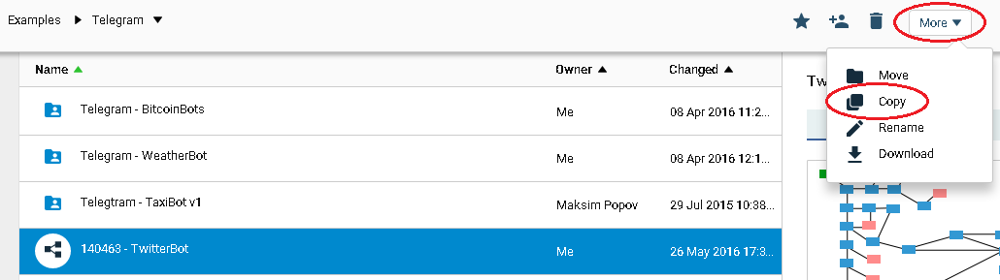
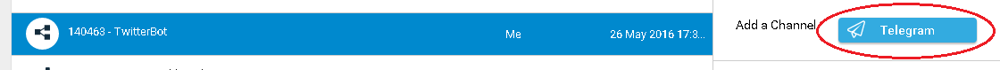
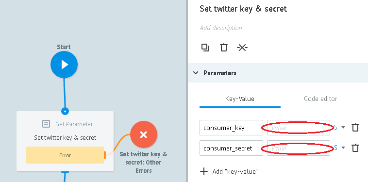
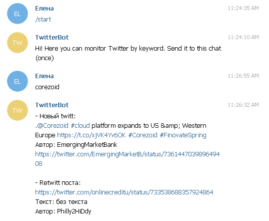
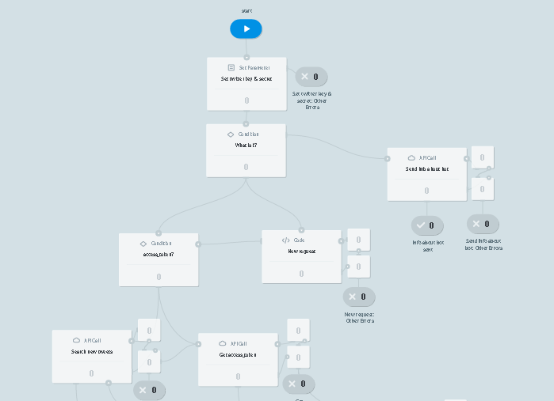

# TwitterBot

Clone ["TwitterBot" template](https://admin.corezoid.com/folder/conv/5837)

Connect to Telegram by specifying your bot key

In order to receive Bot's key you need to send `/newbot` command to chat with @BotFather. Then specify the name and bot's user name . You will get:

##Integration with Twitter

Create Twitter application on [https://apps.twitter.com](https://apps.twitter.com)

After creation you will get a key `consumer_key`) and password (`consumer_secret`) of your application.

In `Set twitter key & secret` node, set received values of `consumer_key` and `consumer_secret`.

##What TwitterBot does

- By `/start` command, sends a welcome message to the chat

- Receives search request that needs to be monitored in Twitter and sends to the chat all founded twits and retwits at the moment of request.

- Further, once a day, searches for new and sends the list to the chat, if found

##Testing and launch

Just add your Bot to Telegram and start chat.

Go to `View` or `Debug` mode,

in order ti see request flow, its moving and distributing by process nodes.

