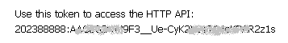

# WeatherBot

Clone ["WeatherBot" template](https://admin.corezoid.com/folder/conv/59753)

Connect to Telegram by specifying your Bot's key.

In order to receive Bot's key, there's a need to send `/newbot` command to chat with @BotFather. Then, specify the name and name of Bot's user. You will get:

##Integration with OpenWeatherMap

For user's comfort, test access key for OpenWeatherMap API was added to [WeatherBot template](https://admin.corezoid.com/folder/conv/59753).

In order to receive your access key to OpenWeatherMap API, go to [the link](http://openweathermap.org/register) and register.

In `Set APPID_key` node replace test key by the one that you received in `APPID_key` parameter value.

##What WeatherBot does

By `/start`  command, it sends a message with Bot's information to the chat. 

Receives city name or user coordinates, by it receives air temperature and sends a message.

In case is city or coordinates are specified incorrectly and also if there's an error occurred in process - it sends appropriate message.

##Testing and launch

Just add your bot to the Telegram and start chat.

Go to `View` or `Debug` mode,

in order to receive request flow, its moving and distributing it by process nodes.

