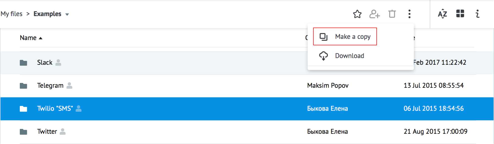
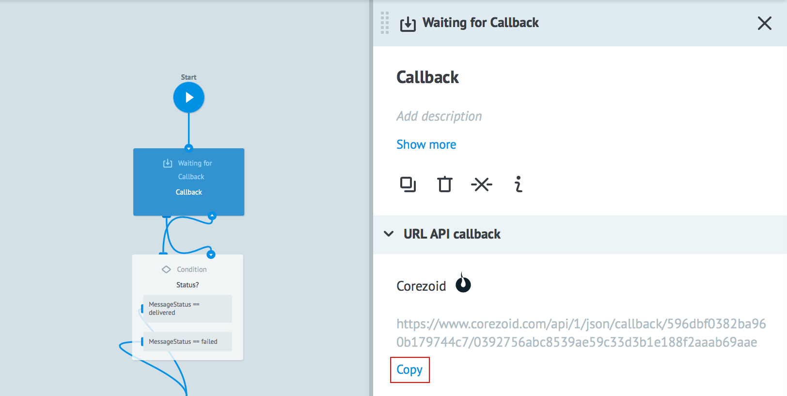
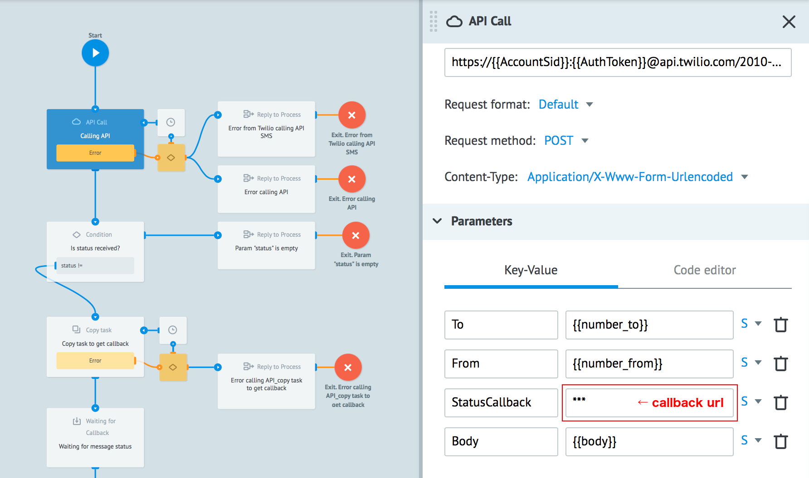
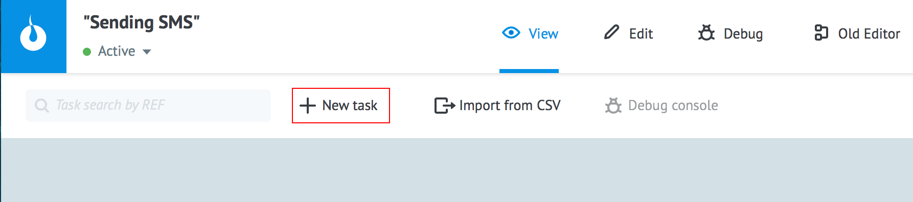
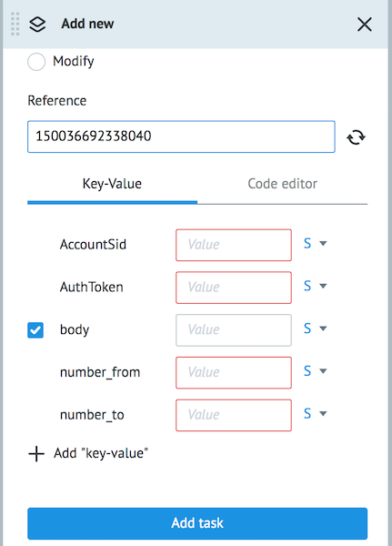

# SMS

Copy [folder Twilio "SMS"](https://admin.corezoid.com/folder/conv/1833) to your workspace.

There are two processes in this folder:

1. **"Sending SMS"** - for sending SMS via Twilio API

2. **"Getting callback"** - for getting callback with the status of SMS

## How it works

The first process sends SMS and copies the request with reference = `{{sid}}` (unique message ID) to the second process for getting callback.

The second process receives a callback from Twilio and modifies the task in the first process by adding a status.

To send SMS via API Twilio and get a callback do the following steps in your processes:

1) Open process **"Getting callback"** and get callback url.

Click the node `Waiting for Callback`, press **Copy** near callback url and it will be copied to clipboard.

2) Open process **"Sending SMS"** and find node "Calling API". In the logic `API Call` settings panel paste callback url as a value for parameter `StatusCallback`

> **Please note:**
> Replace the word **"callback"** with **"plugins/twilio"** in callback URL.

For example, you get callback url -
https://corezoid.com/api/1/json/callback/559a817f4b8ff96bf5000b/cb9f670f5c223ec42e1

The parameter value `StatusCallback` will be -
https://corezoid.com/api/1/json/plugins/twilio/559a817f4b8ff96bf5000b/cb9f670f5c223ec42e1

Press **Deploy** to commit changes.

To test sending SMS switch process **"Sending SMS"** to **View** mode .

Press button **+ New task**.

Enter the parameter values:
*   `AuthToken` - Your AuthToken
*   `AccountSid` - Your AccountSid
*   `Number_to` - recipient's phone number with "+" and the country code
*   `Number_from` - Your phone number Twilio
*   `Body` - text of the message (up to 1600 characters)

and press **Add task**.

As a result, the task will pass through the process and go to one of the final nodes (red or green).

The process is prepared to call from other processes using logic `Call Process.

In case of successful execution the following parameters will be added to the task:

* `status` - message status
* `sid` - unique message identifier

If API Twilio returns an error, the task will go to the escalation node and the following parameters will be added:

* `code` - [error code Twilio](https://www.twilio.com/docs/api/rest/message)
* `message` - text error Twilio
* `url_more_info` - link to the website Twilio, where there is a detailed description of the caused error.

In case of error while calling API Twilio, the task will go to the escalation node and the following parameters will be added:

* `code` - code error
* `message` -  text error

**Useful links Twilio:**
* [Description](https://www.twilio.com/docs/api/rest/sending-messages) of input parameters of Twilio API "Sending SMS"
