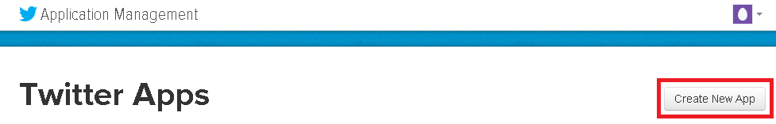
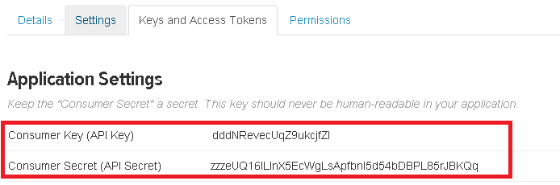
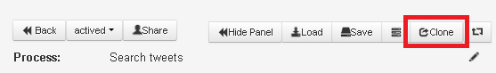
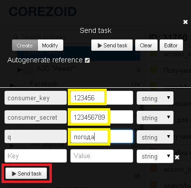

# Searching for and regular monitoring of tweets

Create the Twitter application on web-site [https://apps.twitter.com](https://apps.twitter.com)

After creation you will get the key (`consumer_key`) and password (`consumer_secret`) of your application.

**To search for tweets clone [process template "Search tweets"](https://www.corezoid.com/admin/edit_conv/31750/8494).**

## Description of incoming parameters of the process

* **consumer_key** - consumer_key of application
* **consumer_secret** - consumer_secret of application
* **q** - query

## Starting the process

**1)** Go to `dashboard` and click `Add task` - to add the request.

**2)** In the opened window specify the required parameters:
*   consumer_key
*   consumer_secret
*   q

**3)** After all parameters are specified, press the button `Send task`.

## What you need to know about the process

**1)** Twitter authorization key ("access_token") has no expiry date.
It is valid until the user or administrator deletes the application or its keys. Therefore, this parameter in the process is received when sending the first request or in case of error of calling API of the search, connected with the obsolete value of "access_token".

**2)** In the process node `"Get a parameter "tweets"` CODE logic is added, which allows getting a new parameter **"tweets"** - the list of required tweets and names of their authors.

 `"tweets": " – Weather in Kiev
(Author: Anatoliy) - Weather in Dnipropetrovsk
(Author: Philipp Poltavskyi)"`

You may use **"tweets"** parameter for message sending with the results of search.

Messages can be sent through the available templates using [PRC logic](../../interface/nodes/rpc/README.md):

- **SMS**: [Twilio](../twilio/sms.md), [MessageBird](../sms/messagebird.md), [UniSender](../email/send_sms_unisender.md)
- **Email**: [Mandrill](../email/mandrill_v2.md), [UniSender](../email/send_email_unisender.md)
- **Message in [Telegram](../telegram/README.md)**

**3)** In case of error of receiving "access_token" the request goes to the node `"Error of access_token receipt. Escalation"` You may also configure the escalation in this node, using the available templates for sending messages.

**4)** After calling the API of tweets’ search and sending a message (if the new list of tweets is received) the request goes to the node `"Wait for 1 day before repeated query "`.

One day later it goes to the node `"pass the request to input"`, where with the use of [COPY logic ](../../interface/nodes/copy.md) it copies itself to the same process and goes to the finite node "Exit".

Such logic allows monitoring of tweets with “daily” intervals.
