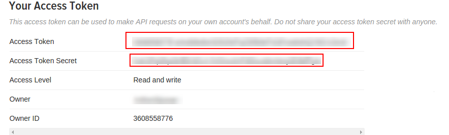
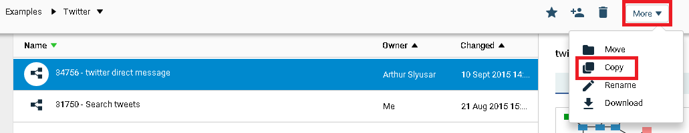
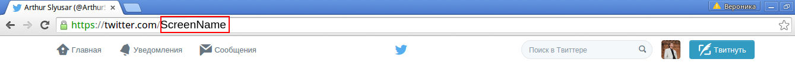
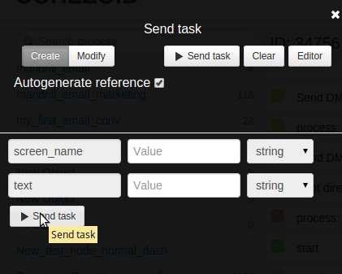
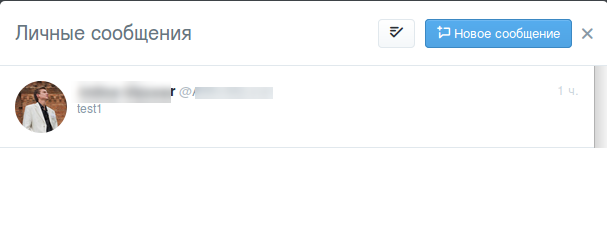
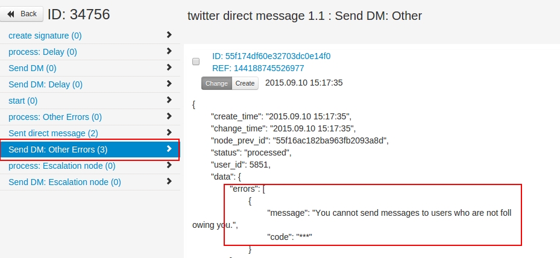

# Sending personal message to a subscriber on twitter

Create the Twitter application on web-site [https://apps.twitter.com](https://apps.twitter.com)

After creation you will get the key (`consumer_key`) and password (`consumer_secret`) of your application.

For sending a message to one subscriber you should use Access Token и Access Token Secret.

You can get the keys on tab Keys and Access Tokens.

## Process testing.

**1)** Clone the [process of sending direct messages to twitter](https://admin.corezoid.com/folder/conv/8494).

**2)** Go to the process and select the node “create signature”.

In the logic code, specify your signature parameters.

* **ver consumerSecret** = your Consumer Secret (API Secret)
* **var tokenSecret** = your Access Token Secret
* **var oauth_consumer_key** = your Consumer Key (API Key)
* **var oauth_token** = your Access Token

After entering the data, click **“Save”**

**3)** Go to the mode dashboard

Click **Add task** to add the request.

In the opened window specify the required parameters:

* **screen_name** - name of recipient of your message;

(**Attention!** Your readers only can receive personal messages from you.)

* **text**- message text for your recipient;

When all fields are specified, click on **Send task.**

If all fields are filled in correctly, your subscriber will receive the personal message:

If any parameters or data are not specified correctly, you will get an error message in the node Send DM other Errors:

 
