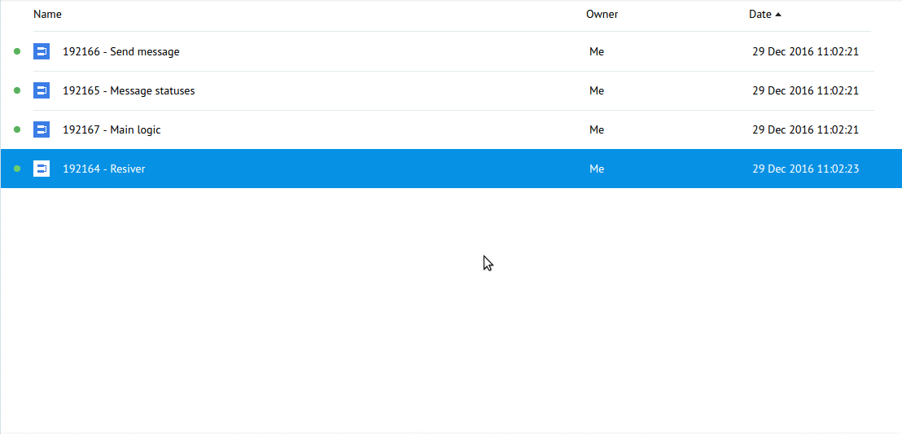

# Public Account "Get Weather"

Clone ["Viber Public Account "Get Weather" folder](https://admin.corezoid.com/folder/conv/109250) into your enviropment

##Process description

[**Resiver**](https://admin.corezoid.com/editor/106544/161790)

Receives webhook-s from Viber Public Account and distributes them according to received value of `"event"` parameter.

`"event": "message"` divides into types: picture, video, file, contact, url, location, text.

Received messages with `text` type are transferred to [**Main logic**]().

[**Main logic**](https://www.corezoid.com/admin/edit_conv/164960/106544)

Manages the logic of message sending.

Requests the weather, sends received air temperature or message about undefined city.

[**Send message**](https://admin.corezoid.com/editor/106544/164958)

By Viber Public Account token recevies account details (name and link for the avatar) for message sending.

Sends messages, distributes them by sending statuses.

Successful requests are trasferred to [Message statuses](https://admin.corezoid.com/editor/106544/164967) after receiving message end status.

[**Message statuses**](https://admin.corezoid.com/editor/106544/164967)

Distributes successful requests by the states:

"Sent", "Delivered", "Seen", "Not delivered, 14 days", "Not seen, 14 days", "failed - not delivered by Viber".

##Preparation

####Webhook

Connect [**Resiver**](https://admin.corezoid.com/editor/106544/161790) to the Viber Webhook:

* go to `Webhook` tab
* press `Connect to messenger`
* select `Viber`
* press `"Set Webhook"` and specify the token of your Public Account

####Welcome message

If necessary, set the welcome message for your Public Account:

* After selecting `Viber` press the `"Set Welcome message"` button
* choose the type of welcome message - text or a picture with text
* fill out required fileds

Welcome message is sent as a reply to the received webhook which contains `"event": "conversation_started"`.

This event indicates that user came to the chat with your Puclic Account for the first time (it means, there's no history) или когда чат открыт через deep link.

`"conversation_started"` не считается подпиской и не позволяет Public Account отправлять сообщения пользователям.

Но разрешает отправить одно приветственное.

##Integration with OpenWeatherMap

For user's comfort in [Main logic](https://www.corezoid.com/admin/edit_conv/164960/106544) there was a test key added for API OpenWeatherMap.

Чтобы получить свой ключ доступа к API OpenWeatherMap перейдите по [ссылке](http://openweathermap.org/register) и зарегистрируйтесь.

В узле `Get weather by city` замените тестовый ключ на полученный Вами в значении параметра `APPID`.

##Testing and launch

Just add required Public Account and start dialog.

Go to `View` mode [**Resiver**](https://admin.corezoid.com/editor/106544/161790) or [**Main logic**](https://www.corezoid.com/admin/edit_conv/164960/106544) in order to see request flow, its movement and distributing to the nodes.

