# Public Account "Order Lunch"

Clone [folder "Viber PA "Order Lunch"](https://admin.corezoid.com/folder/conv/124601) into your environment

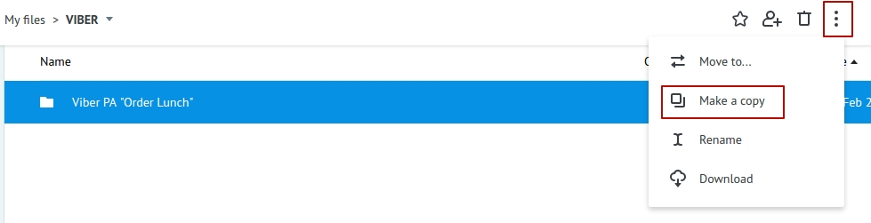

##Creation Public Account в Viber

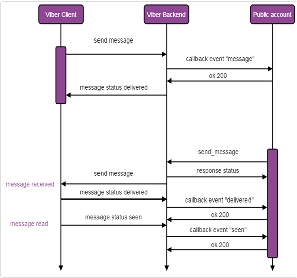

1. Create your **Public Account** in Viber, more details [here](https://developers.viber.com/public-accounts/index.html#setup).

2. Receive your `Public Account authentication token`. This is the unique ID which is used for verification of your **Public Account** in every request to API. 

After creation of Public Account, your **Account authentication token**  will appear in settings of the account **"Change the information"**. 

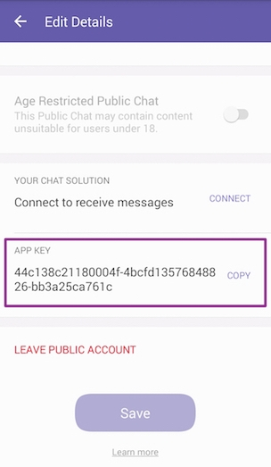

In the process [**Receiver**](https://admin.corezoid.com/editor/124601/207907) in `Set viber_token` node replace test key by the one that you received in `viber_token` parameter value.

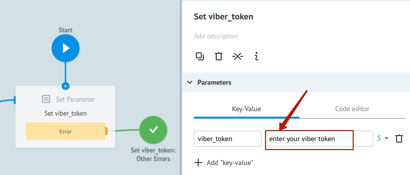

##Preparation

####Webhook

Connect [**Receiver**](https://admin.corezoid.com/editor/124601/207907) to Viber Webhook:

* go to `Webhook` tab
* press `Connect to messenger`
* select `Viber`
* press on `"Set Webhook"` and specify the token of your Public Account

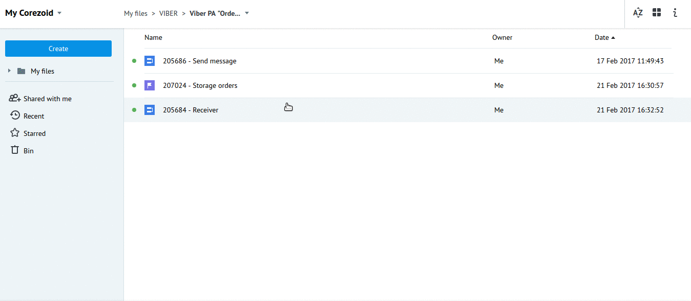

####Welcome message

If necessary, set the welcome message for your Public Account:

* after selection `Viber` press the `"Set Welcome message"`
* select the type of the welcome message - text or a picture with text
* fill out the required fields

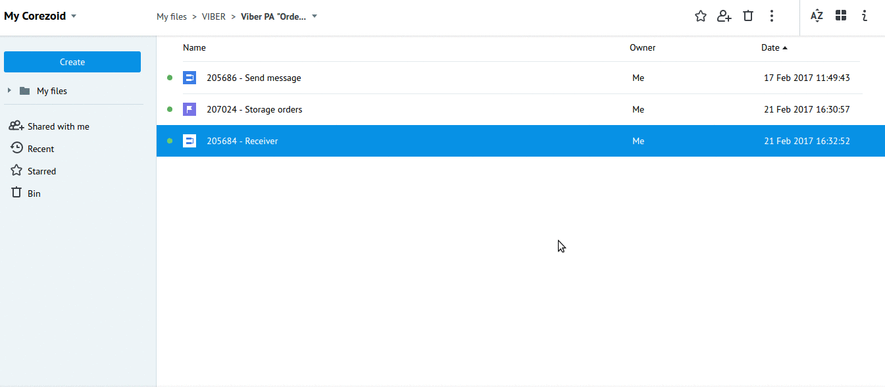

Welcome message is sent as a reply to the received webhook which contains `"event": "conversation_started"`.

This event indicates that user came to the chat with your Public Account for the first time (it means, there's no history) or when the chat was opened through deep link.

`"conversation_started"` is not considered as subscription and does not allow the Public Account to send messages to users

But it allows to send one welcome message.

##Process description

[**Receiver**](https://admin.corezoid.com/editor/124601/207907)

Receives webhooks from Viber Public Account and distributes it depending on received value of `"event"` parameter

`"event": "message"` divides into types: picture, video, file, contact, url, location, text.

Received messages with `text` type are transferred to [**Send message**](https://admin.corezoid.com/editor/124601/207908) using [Copy task logic](https://doc.corezoid.com/en/interface/nodes/copy.html).

Successful selection of pizza or sushi and orderings are transferred to the State Diagram [**Storage orders**](https://admin.corezoid.com/editor/124601/207906) through [Modify task logic](https://doc.corezoid.com/en/interface/nodes/logika_modify_task.html) in order to receive statistic about orders.

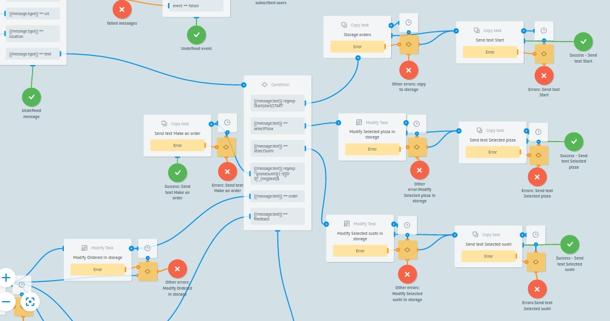

When receiving any command different from start **start**, sends appropriate message.

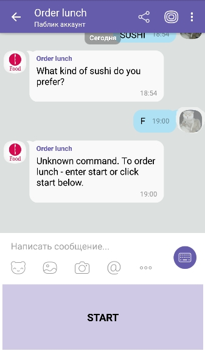

[**Send message**](https://admin.corezoid.com/editor/124601/207908)

By Viber Public Account token receives account details (message status, name and link to the avatar) for message sending.

Sends messages, distributes them by send statuses (`status`).

**State diagram** [**Storage orders**](https://admin.corezoid.com/editor/124601/207906)

Storage and distribution of orders over the states:

* order is made -"ordered pizza","ordered sushi"
* waiting 2 min for order confirmation - "waiting for ordering pizza","waiting for ordering sushi"
* order is not issued - "Pizza wasn't ordered for 2 min", "Sushi wasn't ordered for 2 min"
* received feedback from the client - "feedback received"

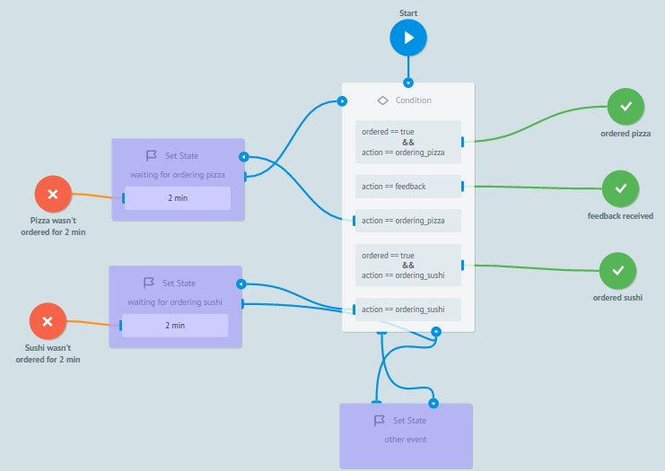

##Testing and launch

Just add required Public Account and start dialog with **start** command.

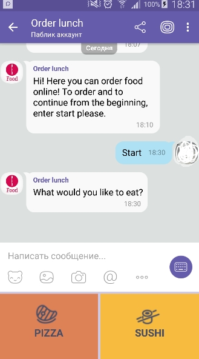

then, choose the food:

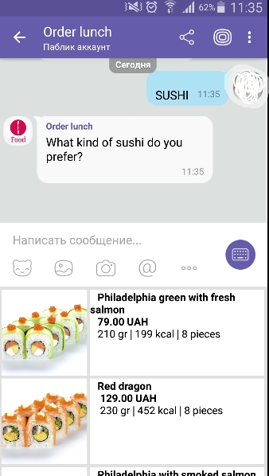

After choosing the food, you will be able to Issue the order or continue order or start the order over  and also Leave a feedback:

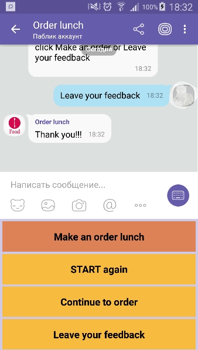

Go to `View` mode in process [**Receiver**](https://admin.corezoid.com/editor/124601/207907) or state diagram [**Storage orders**]((https://admin.corezoid.com/editor/124601/207906), in order to see request flow, its movement and its distribution by process nodes.

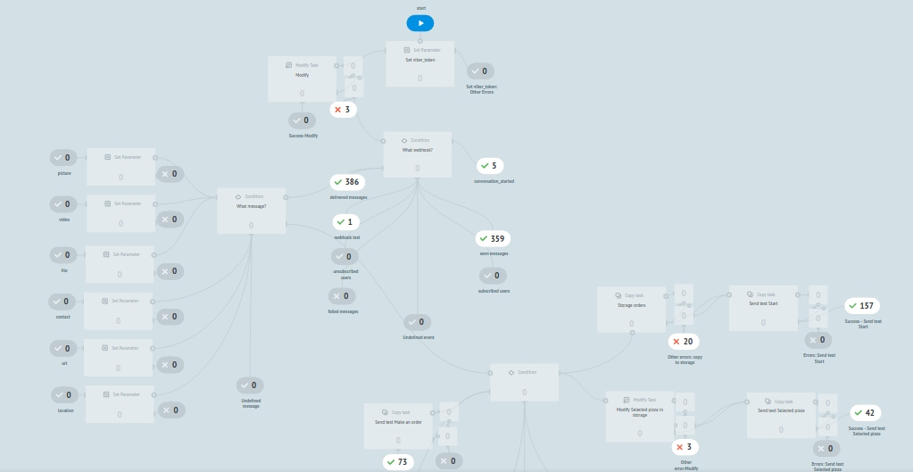
  
  
Go to dashboard **Dashboard View orders** to see the statisctics for orders in real time mode:
  
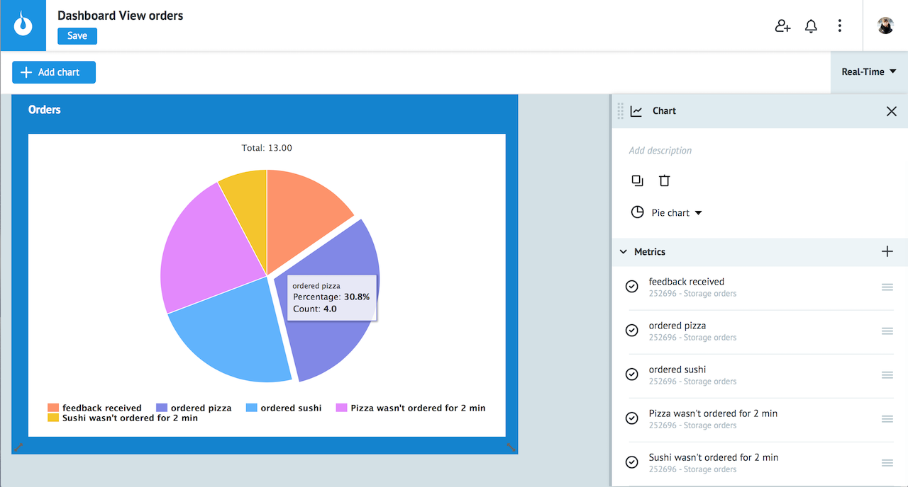
  
Final nodes from the state diagram **Storage orders** are selected as metrics for constructing this chart:

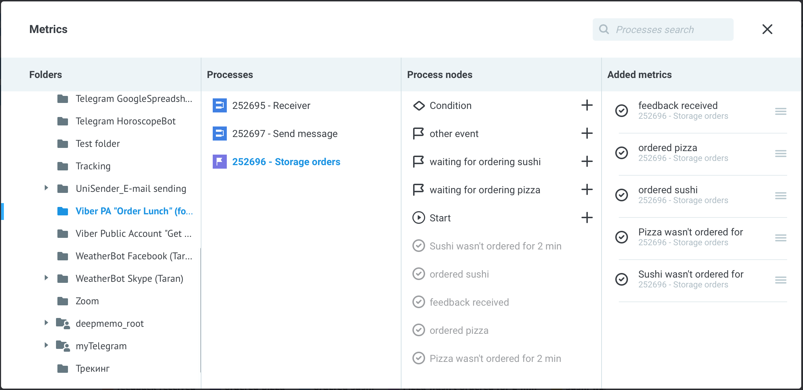
